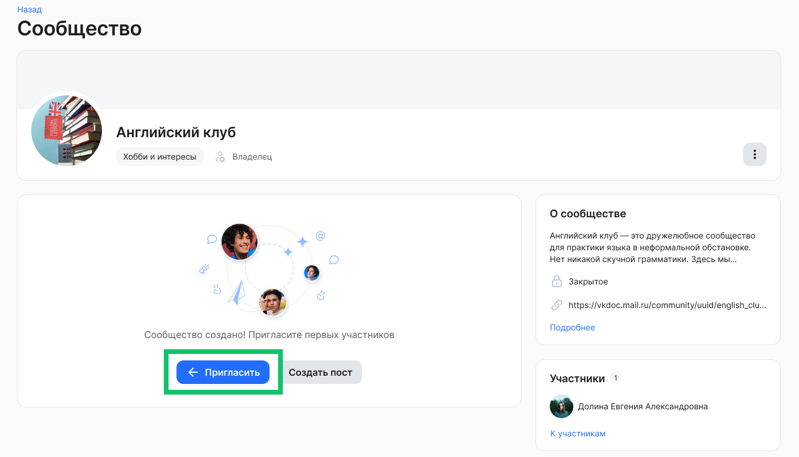
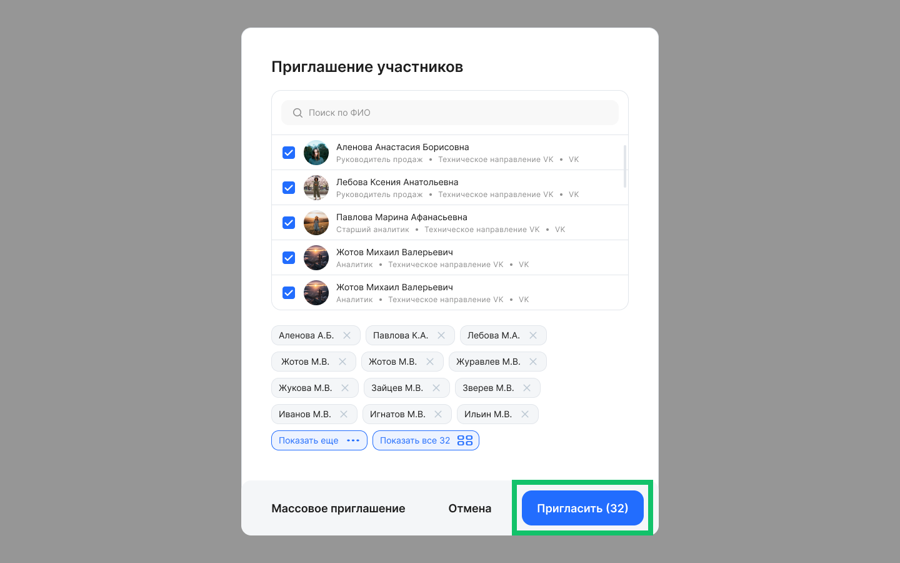
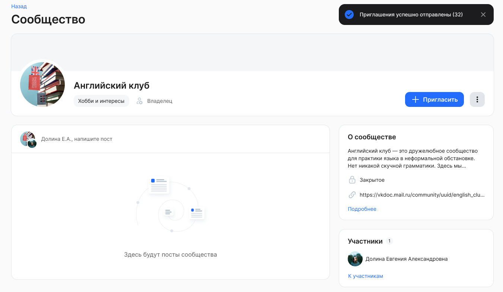

Владелец открытого/закрытого/скрытого сообщества может приглашать конкретных пользователей в своё сообщество.

Также участники открытого сообщества могут отправлять приглашения своим коллегам.

Чтобы отправить приглашение хотя бы одному пользователю, откройте страницу сообщества и нажмите кнопку **Пригласить**.

Если в сообществе будет опубликован хотя бы один пост, то кнопка **Пригласить** будет расположена в «шапке» сообщества.

На форме **Приглашение участников** выберите одного или нескольких пользователей из списка. Выбор пользователей возможен только из организаций/подразделений, на которое назначено сообщество.

О выбираемом пользователе доступна информация:

1. ФИО.  
2. Аватар.  
3. Организация/подразделение.  
4. Должность.  

Также нужного пользователя можно найти через поиск по ФИО.

На одного сотрудника может быть направлено несколько приглашений от разных сотрудников.

Если пользователь уже является участником сообщества, то направить приглашение ему нельзя.

