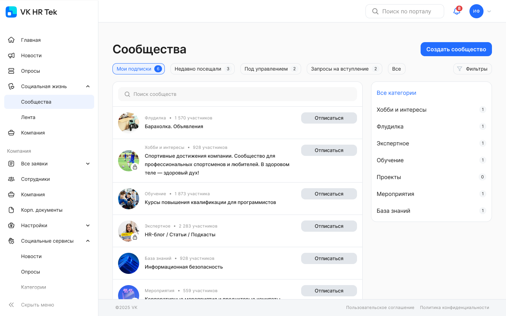
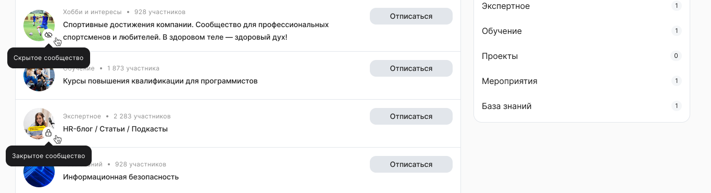
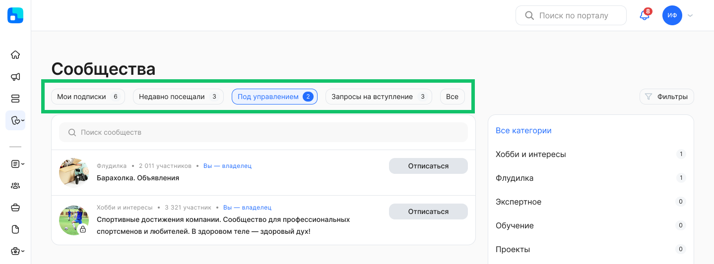
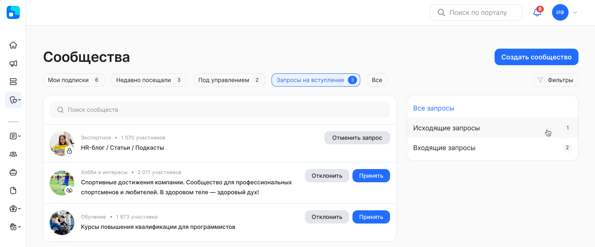
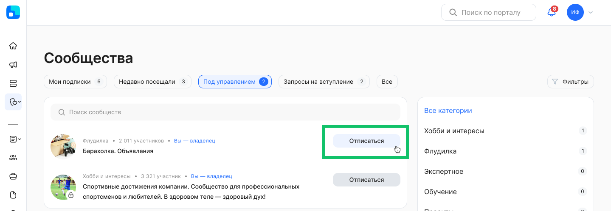
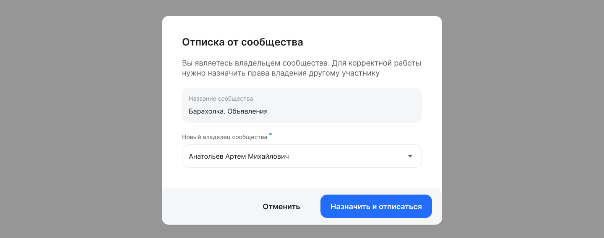
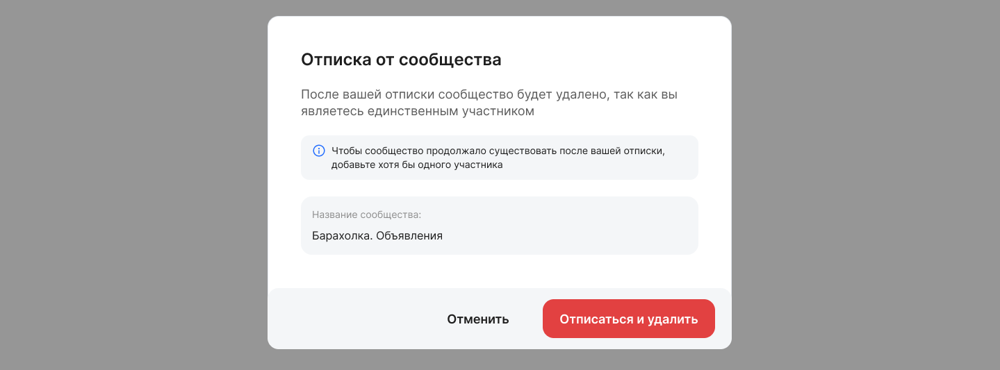
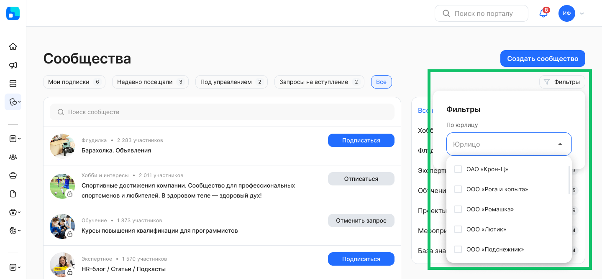
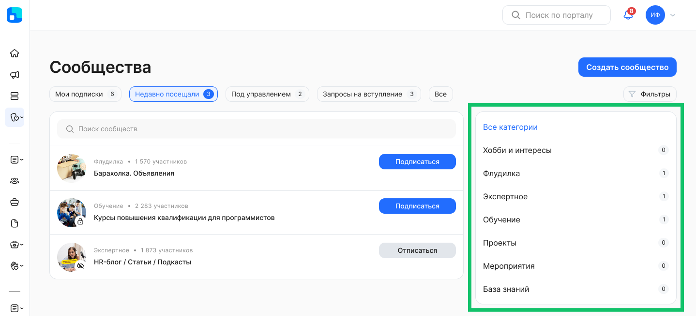

В разделе **Социальные жизнь → Сообщества** отображаются только те сообщества, которые доступны пользователю в рамках установленного ему аккаунта и/или юрлица.

Каждая запись в списке содержит следующие сведения:

* Название сообщества.  
* Название категории, которая была присвоена сообществу.  
* Число участников сообщества.  
* Обложка сообщества.  
* Признак закрытого сообщества  — отображается в списке, для вступления нужно подать заявку. Можно открыть страницу закрытого сообщества, но для просмотра доступны только описание и аватар  
* Признак скрытого сообщества  — отображается в списке только у участников этого сообщества.  
* Кнопка для подписки на открытое сообщество, отписки от сообщества или управления запросами на вступление в сообщество.  

## **Быстрые фильтры**

Для просмотра списка сообществ можно воспользоваться быстрыми фильтрами:

* **Мои подписки**. Сообщества выводятся в порядке посещения — выше выводятся те, которые посетили последними.   
* **Недавно посещали**. Выводятся сообщества, которые пользователь посетил за последние 30 дней.    
* **Запросы на вступление**. Сообщества выводятся в порядке совершения действия. Выше те, в которые раньше подали заявку/пригласили.   
* **Все**. Сообщества раскладываются по количеству участников — от большего к меньшему.

Быстрый фильтр **Под управлением** доступен только пользователю, который является администратором (владельцем) сообщества.

 

## **Запросы на вступление**

При переходе к списку **Запросы на вступление** отобразятся исходящие и входящие запросы.

Администратор сообщества может пригласить пользователя в сообщество любого типа: открытое, закрытое, скрытое. Участник сообщества может приглашать других пользователей в открытое сообщество. Пользователь может принять или отклонить входящие запросы на вступление.  

Если пользователь отправил исходящий запрос на вступление в закрытое сообщество, то он может отменить свой запрос. 

## **Отписка от сообщества владельцем**

Если владелец хочет отписаться от своего сообщества, то он должен назначить нового владельца.

Если в сообществе состоял только один участник, которым был владелец, то после отписки сообщество будет удалено. Чтобы сообщество продолжало существовать, добавьте хотя бы одного участника перед отпиской. 

## Применение фильтров

Для вашего удобства предусмотрена настройка отображения списка сообществ. Нажмите  кнопку **Фильтры**. Откроются поля для редактирования фильтра с заполнением и выбором значений из выпадающего списка.

Для просмотра сообществ доступен фильтр **По юрлицу**, если у пользователя есть доступ к нескольким компаниям. Если доступ есть только к одной компании, то фильтр будет отсутствовать.

В момент применения фильтров происходит поиск сообществ и список автоматически обновляется.

Для выхода из формы установки фильтра нажмите на любое место на странице за пределами этой формы. Список сообществ на странице будет отображаться с учетом настроенного фильтра.

Также сообщества можно фильтровать по категориям, выбрав одну из списка. По умолчанию выбрано значение **Все категории**.

В зависимости от выбранного фильтра считается количество сообществ в каждой категории и выводится в счётчик. Выводятся только активные категории, к которым привязано хотя бы одно сообщество.

Если была выбрана определенная категория, то при переключении быстрых фильтров (**Мои подписки**, **Недавно посещали** и др.) она сбрасывается до значения «Все категории».