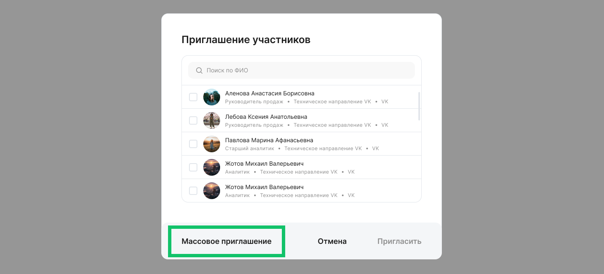
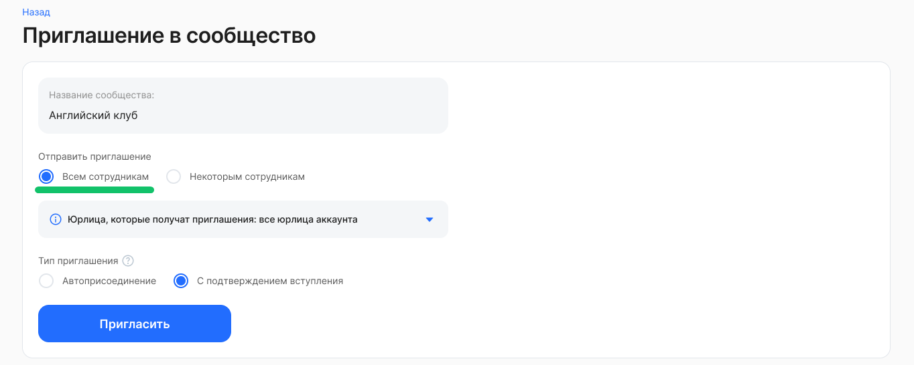
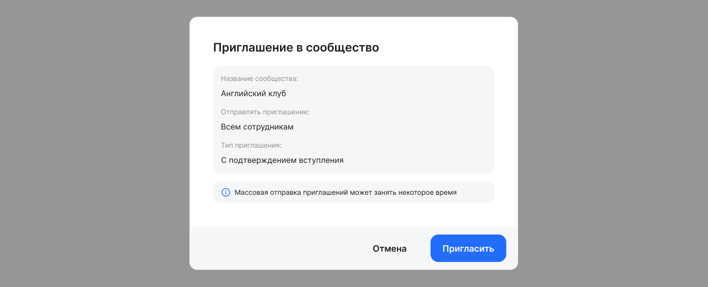
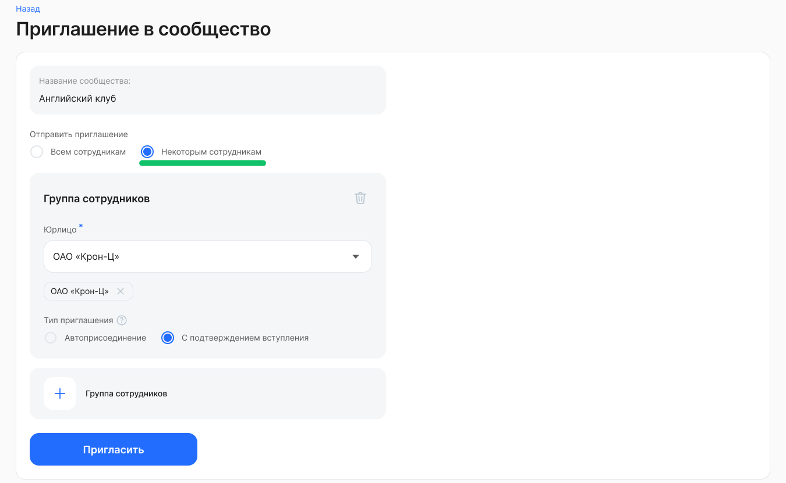

Владельцы сообществ, пользователи с ролью «Администратор модуля Портал» или «Менеджер сервиса Сообщества» могут массово приглашать сотрудников компании/аккаунта в сообщество. Для этого откройте страницу сообщества, нажмите кнопку **Пригласить** и на форме **Приглашение участников** нажмите кнопку **Массовое приглашение**.

На странице **Приглашение в сообщество** задайте настройки:

* **Отправить приглашение**. Выберите один из вариантов: *Всем сотрудникам* или *Некоторым сотрудникам.* При выборе варианта *Всем сотрудникам* приглашения получат сотрудники из всех компаний аккаунта или из всех компаний, на которое назначено сообщество (если сообщество не на аккаунт, а на список компаний).  
* **Тип приглашения**. Предусмотрены два типа приглашения:  
    * **Автоприсоединение** — пользователь автоматически вступает в сообщество (становится участником сообщества).   
    * **С подтверждением вступления** — пользователь должен подтвердить, хочет ли он вступать в сообщество. Опция выбрана по умолчанию.

Если требуется отправить приглашения сотрудникам из определенных компаний, то для настройки **Отправить приглашение** выберите вариант *Некоторым сотрудникам.* 

В блоке **Группа сотрудников**, в поле **Юрлицо** выберите название компании из списка. Доступен выбор компаний только из тех юрлиц, на которые назначено сообщество.

Если сообщество доступно только конкретным подразделениям, то массовое приглашение будет недоступно. Возможность массового приглашения появится, только если сообщество доступно хотя бы одному юрлицу или аккаунту. 

Если ранее пользователь выбранной организации или сообщества уже был добавлен в качестве участника, он не должен повторно добавляться в сообщество.