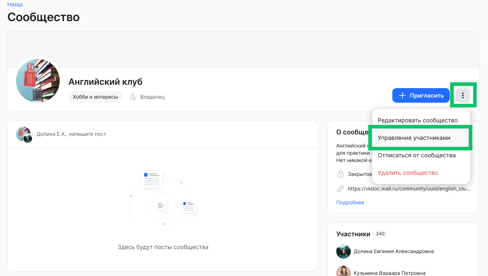
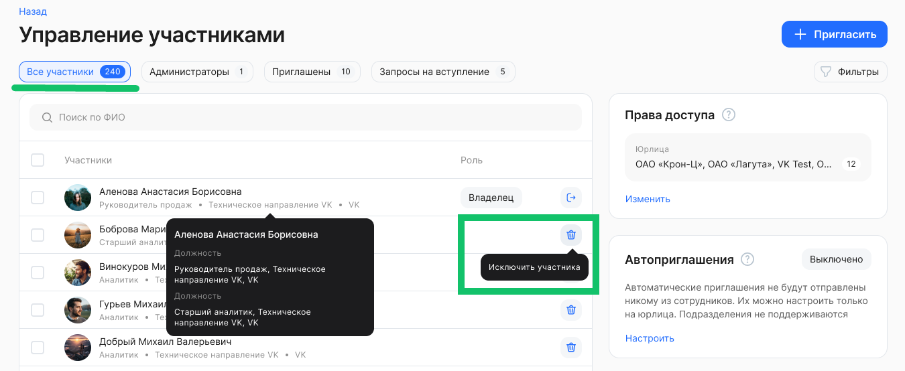
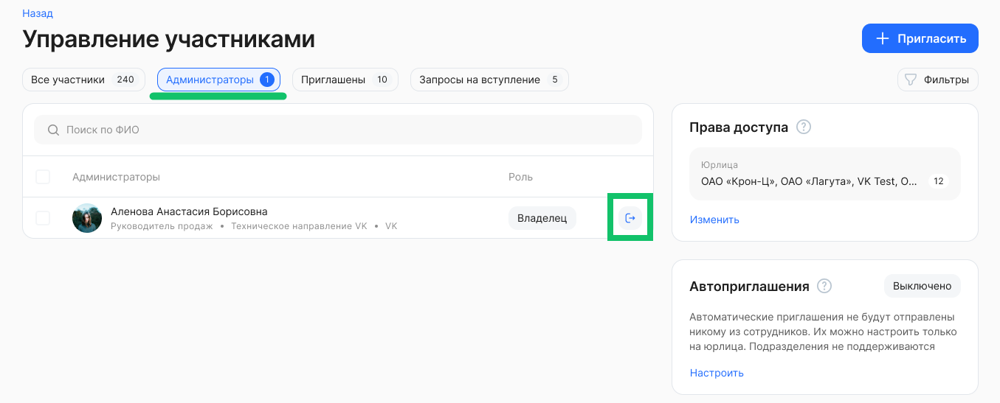
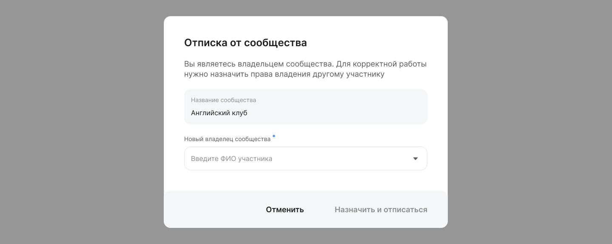
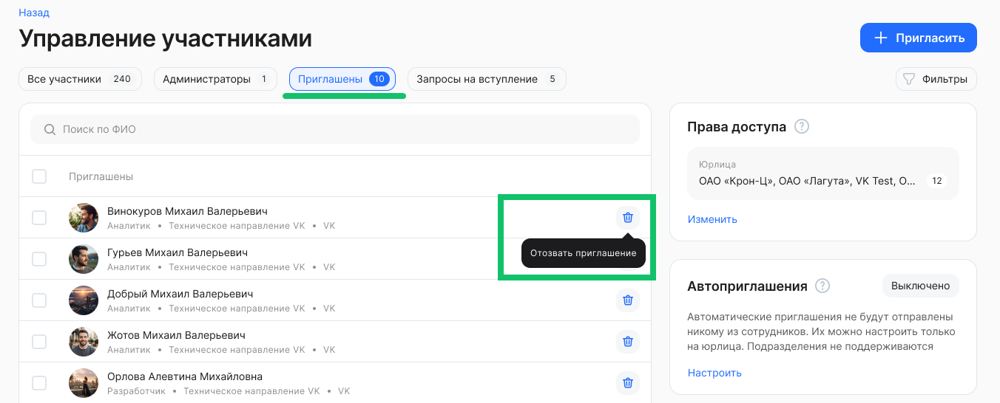
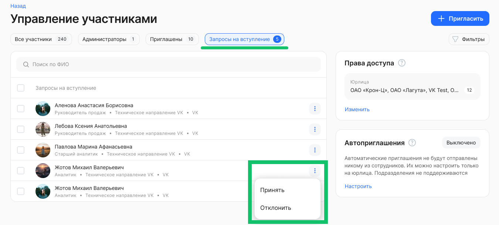

Форма управления участниками сообщества доступна только владельцу сообщества и Администратору модуля Портал. Чтобы перейти к этой форме, откройте страницу сообщества и нажмите кнопку **Управление участниками**.

На форме управления участниками предусмотрены следующие разрезы отображения информации:

* Все участники.   
* Администраторы.  
* Приглашены.  
* Запросы на вступление.

## **Список «Все участники»**

В списке **Все участники** отображаются все действующие участники сообщества — сотрудники, которые приняли приглашение на вступление/им одобрили вступление или вступили в сообщество самостоятельно (для открытых сообществ). Уволенные сотрудники не отображаются.

Список можно отфильтровать по юрлицу и роли.

По каждому участнику отображается следующая информация:

* Аватар.  
* ФИО.  
* Организация/Подразделение.  
* Должность.  
* Статус приглашения.  
* Роль.

Владелец/Администратор модуля Портал могут удалить пользователя из списка участников.

## **Список «Администраторы»**

В списке **Администраторы** отображаются сотрудники, имеющие права на управление конкретным сообществом, пока это только владелец сообщества. Уволенные сотрудники не отображаются.

Владелец может покинуть сообщество. Если владелец хочет отписаться от своего сообщества, то он должен назначить нового владельца.

## **Список «Приглашены»** 

В списке **Приглашены** отображаются сотрудники, которым были отправлены приглашения на вступление в сообщество. Отображаются все приглашения, в том числе, которые были направлены обычными участниками сообщества (для открытых сообществ). Приглашения уволенных сотрудников не отображаются.

На одного пользователя может быть отправлено несколько приглашений.

По пользователю отображается только одна запись о приглашении, даже если по нему несколько приглашений. Если хотя бы одно приглашение по пользователю отозвано, то отзываются все остальные.

Владелец сообщества может отозвать приглашение в сообщество. Сотрудник с отозванным приглашением исчезнет из данного списка.

## **Список «Запросы на вступление»**

В списке **Запросы на вступление** отображаются сотрудники, подавшие запросы на вступление в сообщество (для закрытых сообществ). Запросы уволенных сотрудников не отображаются.

Владелец сообщества может принять или отклонить запрос.

После принятия запроса сотрудник переместится в список участников.

После отклонения запроса сотрудник исчезнет из списка безвозвратно.

