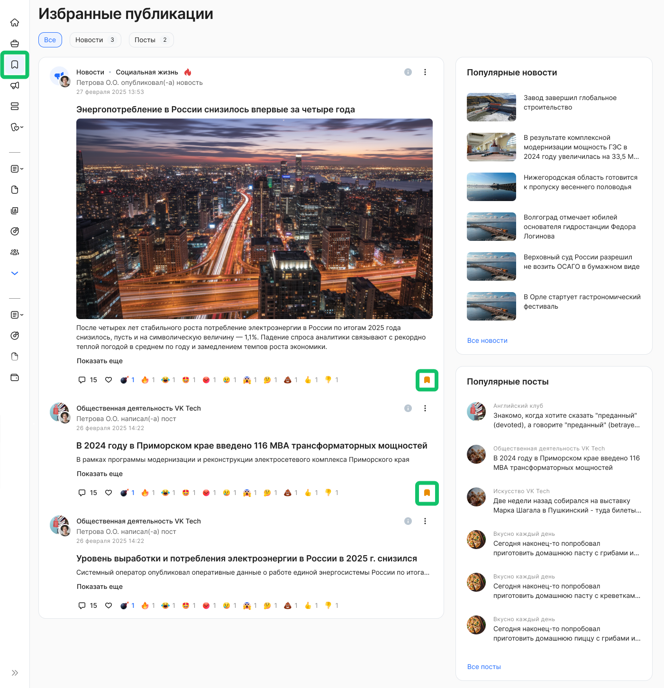
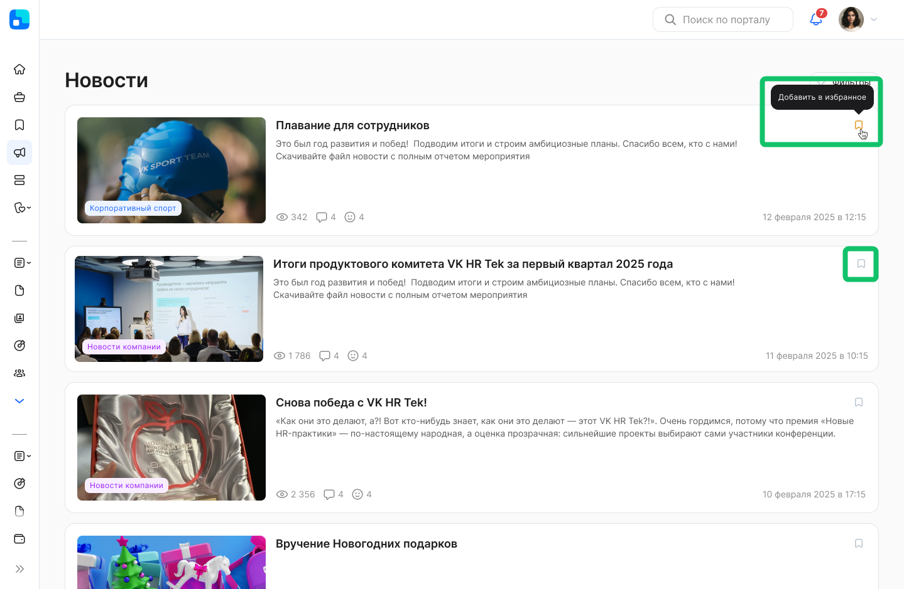
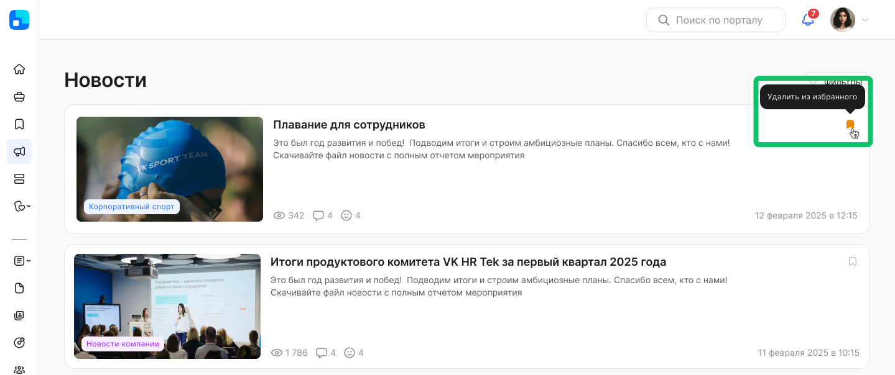
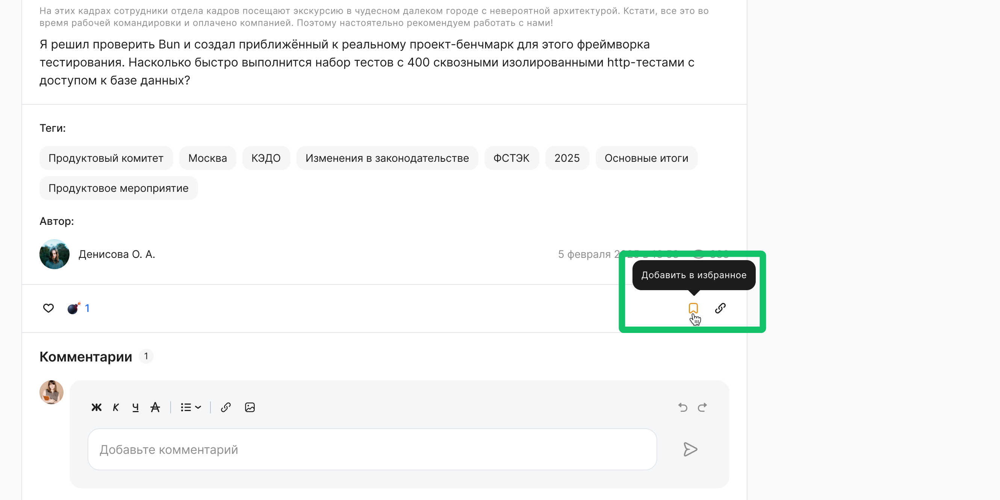
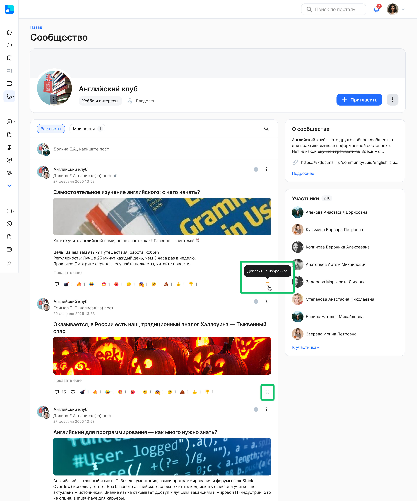
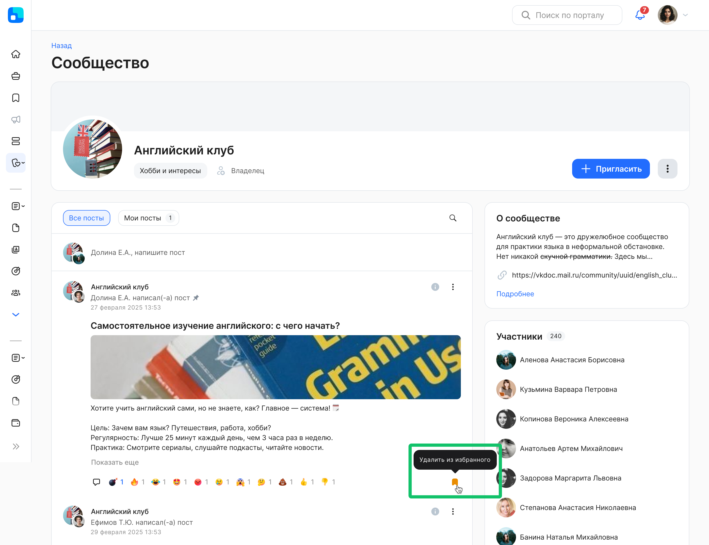
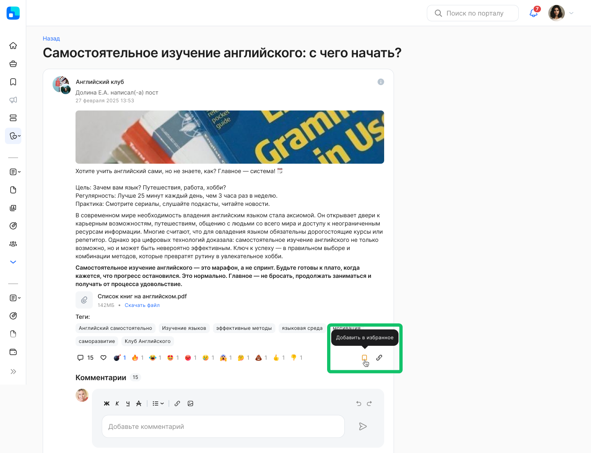

Раздел **Избранное** позволяет пользователям быстро возвращаться к важным новостям и постам, снижая время на повторный поиск и повышая вовлечённость в корпоративный контент.

Пользователь может добавлять и убирать из избранного новости и посты. Видимость раздела зависит от того, включены ли на аккаунте/компании сервисы **Новости** и/или **Сообщества**. 

Гибкая видимость по включённым сервисам (Новости/Сообщества) и правам доступа обеспечивает корректное соблюдение настроек компании и безопасности.

В разделе также доступен блок рекомендаций: подборки формируются по топ-3 категориям объектов, которые пользователь добавлял в избранное. Если данных недостаточно — показываются популярные публикации за последние 30 дней. Из рекомендаций исключаются уже просмотренные и уже добавленные в избранное объекты.  

Дополнительно блок рекомендаций помогает открывать релевантные публикации (по интересам пользователя или по популярности), увеличивая охват и просмотры.

## Добавление новостей в «Избранное»

Чтобы добавить новость в избранные публикации, перейдите к списку новостей в разделе **Новости** и нажмите кнопку  в карточке необходимой новости.

Для удаления новости из избранного нажмите кнопку  в списке новостей или в разделе избранных публикаций. 

Также добавить или удалить избранную новость можно на странице самой новости.

## Добавление постов в «Избранное»

Чтобы добавить пост в избранные публикации, перейдите к списку постов в выбранном сообществе и нажмите кнопку  в карточке необходимого поста.

Для удаления поста из избранного нажмите кнопку  в списке постов или в разделе избранных публикаций.

Также добавить или удалить избранный пост можно на странице самого поста.

