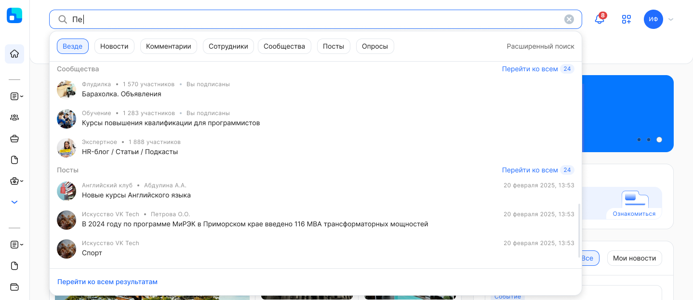
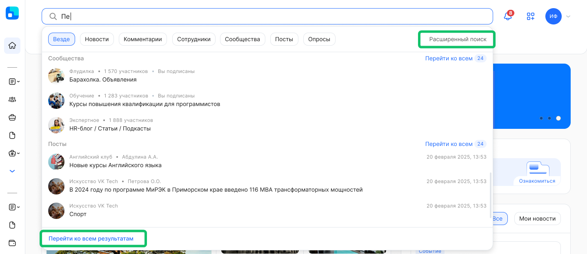
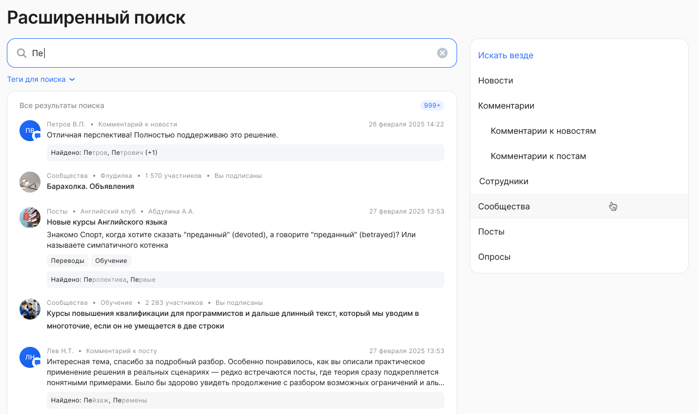
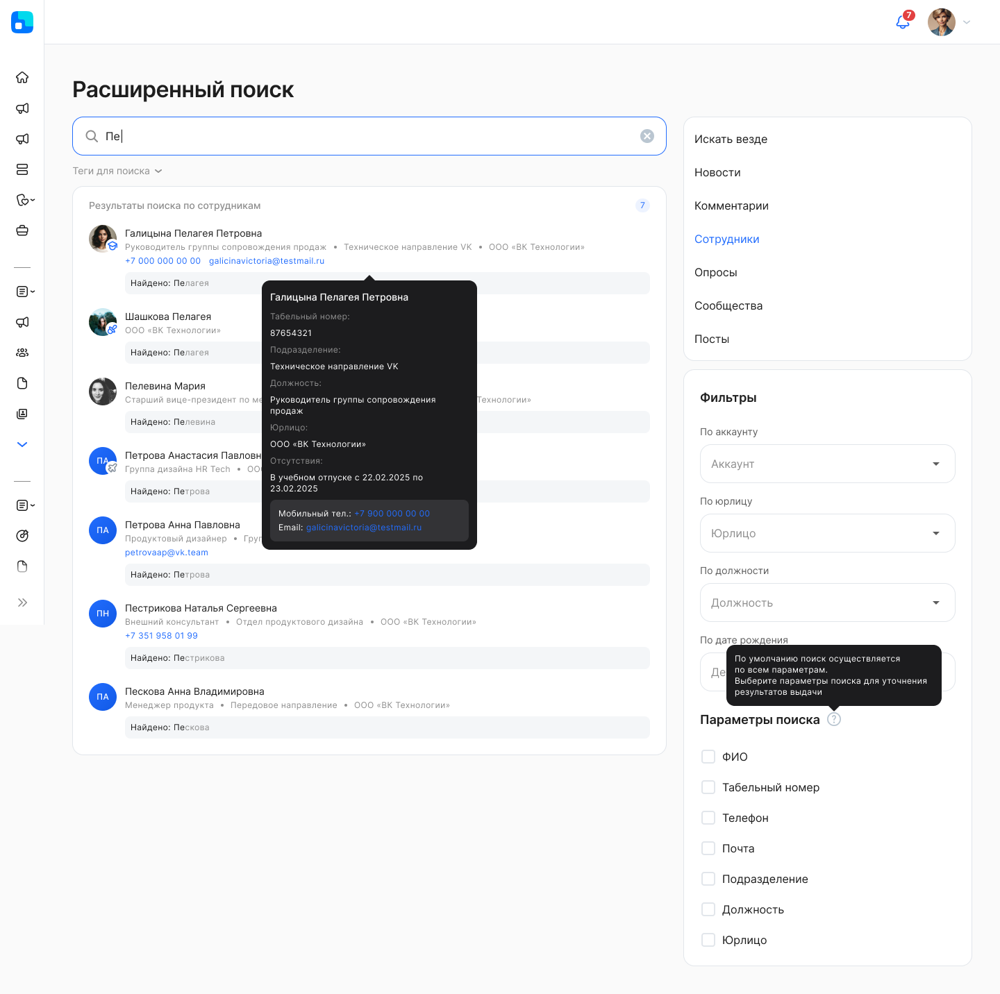

## Поисковая строка

Поисковая строка отображает краткое описание результатов в соответствии с заданным поисковым запросом пользователя. 

Пользователь вводит значение в поисковой строке и может сбросить введённое значение через кнопку . Максимальное количество вводимых символов в поисковую строку — 255.

 

 

Поиск осуществляется по следующим элементам:

1. **Новости**. Чтобы найти новость, в поисковой строке пользователь может ввести:  
* заголовок,   
* анонс,   
* текст,   
* автора (ФИО). Поиск по автору осуществляется только для тех новостей, у которых автор не скрыт.   
2. **Комментарии.** Чтобы найти *комментарий к новости*, в поисковой строке пользователь может ввести:  
* текст,   
* автора (ФИО).

Чтобы найти *комментарий к посту*, в поисковой строке пользователь может ввести:  
* текст:
    * ФИО упомянутого сотрудника (поиск по ФИО),
    * подписи к изображениям,
    * ссылки: текст ссылки и адрес ссылки,
* автора (ФИО).  
3. **Сотрудники**. Поиск по сотрудникам доступен только при включенной ролевой модели, подробнее в [статье](/ru/release_notes/saas/20260500Core#poisk_po_kollegam_56caf3f3). Чтобы найти сотрудника, в поисковой строке пользователь может ввести:  
* ФИО,
* Табельный номер,
* Телефон,
* Почта,
* Подразделение,
* Должность, 
* Юрлицо.
4. **Сообщества**. Чтобы найти сообщество, в поисковой строке пользователь может ввести:  
* название,  
* описание.
5. **Посты**. Чтобы найти сообщество, в поисковой строке пользователь может ввести:  
* название,  
* текст.
6. **Опросы**. Чтобы найти опрос, в поисковой строке пользователь может ввести:  
* название,  
* описание,  
* автора (ФИО). Поиск по автору осуществляется только для тех опросов, у которых автор не скрыт.

Поиск новостей и комментариев работает только для опубликованных новостей.

Поиск по пользователям зависит от настроек ролевой модели, в блоке **Общее - Данные сотрудников в оргструктуре компании**.

В результатах поиска отображаются: 

**Новости**

* наименование,   
* дата и время публикации,  
* категория,  
* обложка.

**Комментарии**

* фото пользователя, оставившего комментарий,  
* ФИО пользователя,  
* дата и время публикации комментария,  
* информация о том, к какому объекту был оставлен комментарий,  
* часть комментария.

**Сотрудники**

* фото пользователя,  
* ФИО,
* телефон,
* почта,   
* должность.

**Сообщества**
* наименование,   
* категория,
* количество участников,
* статус подписки (если есть подписка),  
* аватар (обложка).

**Посты**
* название поста,   
* наименование сообщества,
* ФИО автора, разместившего пост,  
* дата и время публикации,
* аватар сообщества (обложка).

**Опросы**

* наименование,   
* дата и время публикации,  
* категория,  
* обложка.

В результатах поиска информация отображается с учётом прав доступа пользователя. 

Результаты поиска отсортированы по дате в порядке устаревания (от более ранних к более поздним).

Пользователь может перейти к найденному объекту из результатов в поисковой строке или на странице расширенного поиска.

Поисковая строка и страница расширенного поиска не отображается для уволенных сотрудников.

## Расширенный поиск

Чтобы перейти на страницу расширенного поиска, нажмите кнопку **Расширенный поиск**. Откроется страница без введённого пользователем поискового запроса и результатов поиска.

Чтобы перейти на отдельную страницу расширенного поиска и просмотра его результатов, нажмите кнопку **Перейти ко всем результатам** в конце поисковой выдачи.

 

После перехода на страницу расширенного поиска доступен выбор поиска:

1. **Искать везде**. Отображается по умолчанию после перехода.  
2. Искать по конкретному типу объекта:  
- **Новости.**  
- **Комментарии.**  
    - **Комментарии к новостям.**
    - **Комментарии к постам.**
- **Сотрудники.** Поиск по сотрудникам доступен только при включенной ролевой модели, подробнее в [статье](/ru/release_notes/saas/20260500Core#poisk_po_kollegam_56caf3f3). 
- **Сообщества.**
- **Посты.**
- **Опросы.**

 

Пользователь вводит значение в поисковой строке и может сбросить введённое значение через кнопку . Максимальное количество вводимых символов в поисковую строку — 255.

Чтобы найти новость/опрос/пост по тегу, в поле **Теги для поиска** выберите один или несколько тегов. Если укажите несколько тегов для поиска объектов, то в таком случае найдутся новости/опросы/посты, в которых встретился хотя бы один тег из выборки.

Если поиск был осуществлен по объекту **Сотрудники**, то результаты поиска можно отфильтровать по параметрам:

* по аккаунту — доступен, если у пользователя есть доступ к нескольким аккаунтам;  
* по юрлицу — доступен, если у пользователя есть доступ к нескольким компаниям;  
* по должности — выберите хотя бы одну должность, которая есть в выбранном аккаунте/юрлице;
* по дате рождения. 

 

По умолчанию поиск по сотрудникам осуществляется по всем параметрам. Для уточнения результатов выдачи выберите следующие параметры поиска:

* ФИО,
* Табельный номер,
* Телефон,
* Почта,
* Подразделение,
* Должность, 
* Юрлицо.

Поиск в целом работает так: область поиска сужается при добавлении любого из параметров поиска или всех параметров сразу: 

- значение поисковой строки,   
- выбранные теги,  
- типы объектов поиска (все, новости, комментарии, пользователи, сообщества, посты, опросы).  
      

Если у пользователя нет прав доступа к определенным объектам, то результаты поиска по этим объектам будут недоступны пользователю. 

В результаты поиска не попадают удалённые объекты (неопубликованные, удалённые новости/опросы, скрытый автор).