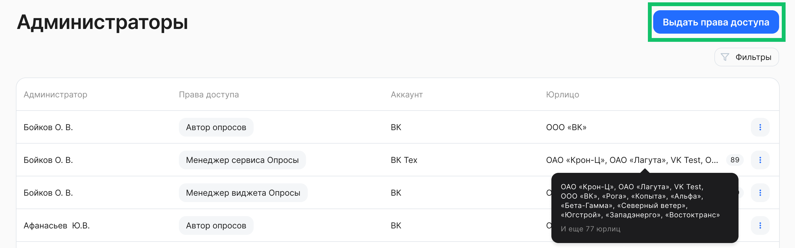
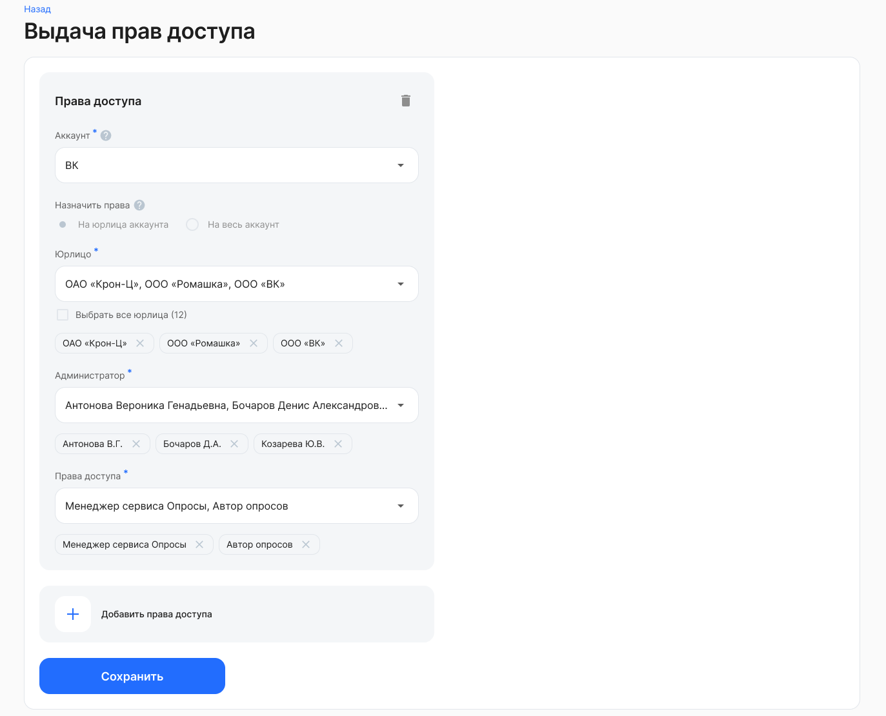
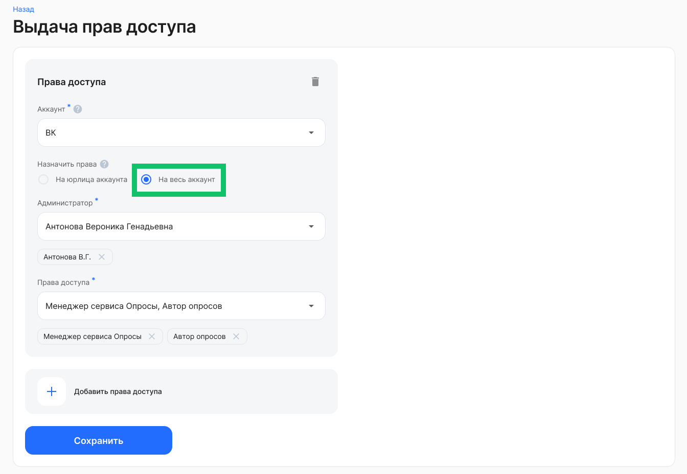
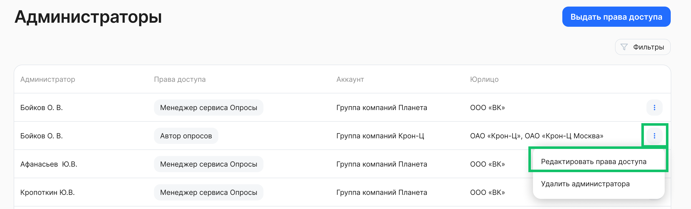
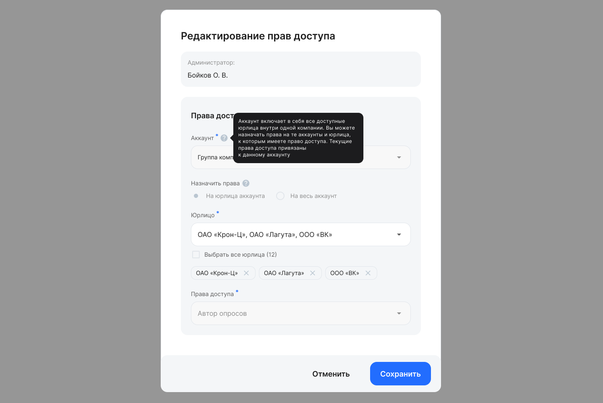
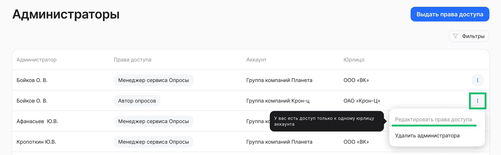
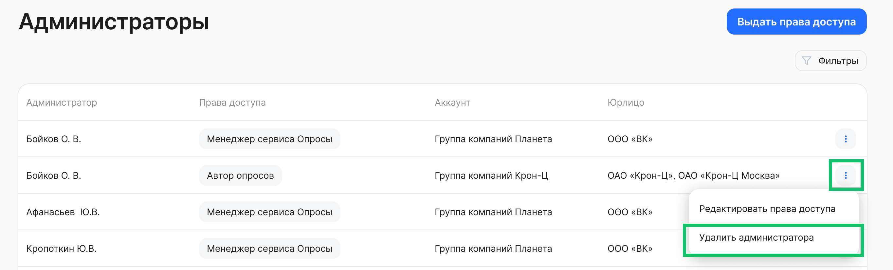

В сервисе «Опросы» появились две специализированные роли:

* **Менеджер сервиса Опросы** — этот пользователь отвечает за настройку доступа к опросам в разделе **Социальные сервисы → Опросы**. Он может назначать других сотрудников авторами или менеджерами сервиса «Опросы», не имея полных прав «Администратора модуля Портал».  
* **Автор опросов** — сотрудник, который может создавать и публиковать опросы в разделе **Социальные сервисы → Опросы**, а также просматривать результаты опроса и создавать категории. Роль подходит для руководителей отделов, PR-менеджеров или HR-специалистов, ответственных за сбор обратной связи от коллектива.

Назначение всех вышеперечисленных ролей пользователей и управление правами доступа к сервису «Опросы» осуществляется в разделе **Социальные сервисы →** **Администраторы**.

Доступ к разделу имеют пользователи с ролями «Администратор модуля Портал» и «Менеджер сервиса Опросы».

## Выдача прав доступа

Пользователи с ролями «Администратор модуля Портал» и «Менеджер сервиса Опросы» могут выдавать права только тем аккаунтам и компаниям, к которым у этих пользователей есть доступ.  
Выполните действия:

1. Перейдите в раздел **Социальные сервисы →** **Администраторы**.  
2. Нажмите кнопку **Выдать права доступа**.

### Назначение прав доступа на юрлица

На форме **Выдача прав доступа** выполните действия:

1. Выберите тип социального сервиса **Опросы** при наличии доступа к более чем одному сервису.  
2. Выберите наименование аккаунта, если у вашего пользователя есть доступ к нескольким аккаунтам.  
3. В настройке **Назначить права** выберите вариант **На юрлица аккаунта**. Права будут применены только к выбранным юрлицам.    
4. Выберите наименование юрлица, если у вашего пользователя есть доступ к нескольким компаниям.  
5. В поле **Администратор** выберите ФИО одного или нескольких пользователей.  
6. В поле **Права доступа** выберите одну или несколько ролей для выбранных пользователей.  
7. При необходимости добавьте ещё один блок с правами доступа.   
8. Сохраните внесённые данные.

### Назначение прав доступа на весь аккаунт

На форме **Выдача прав доступа** выполните действия:

1. Выберите тип социального сервиса **Опросы**.  
2. Выберите наименование аккаунта, если у вашего пользователя есть доступ к нескольким аккаунтам.  
3. В настройке **Назначить права** выберите вариант **На весь аккаунт**. Права будут применены на текущие и новые юрлица аккаунта.    
4. В поле **Администратор** выберите ФИО одного или нескольких пользователей.   
5. В поле **Права доступа** выберите одну или несколько ролей для выбранных пользователей.  
6. При необходимости добавьте ещё один блок с правами доступа.   
7. Сохраните внесённые данные.

## Редактирование прав доступа

Чтобы отредактировать уже назначенные права доступа, вернитесь к списку администраторов и напротив нужного администратора выберите действие **Редактировать права доступа**.

Чтобы изменить список компаний, к которым у выбранного администратора будет доступ, выполните действия:

1. На форме **Редактирование прав доступа** для настройки **Назначить права** оставьте вариант **На юрлица аккаунта**.   
2. В поле **Юрлицо** добавьте или удалите наименование компании.  
3. Сохраните изменения.

 

Чтобы расширить права доступа на весь аккаунт, для настройки **Назначить права** выберите вариант **На весь аккаунт** и сохраните изменение. 

 

Редактирование прав доступа будет запрещено в случаях, если администратору выданы права доступа на одну компанию или на весь аккаунт.
    

Чтобы изменить права доступа для выбранного администратора, сначала удалите права доступа у этого администратора, а затем добавьте права доступа с новыми настройками. 

## Удаление прав доступа

Чтобы удалить ранее назначенные права доступа, вернитесь к списку администраторов и напротив нужного администратора выберите действие **Удалить права доступа**. 

 

Подтвердите удаление прав доступа у выбранного администратора.

