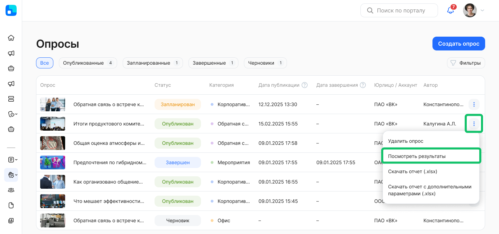
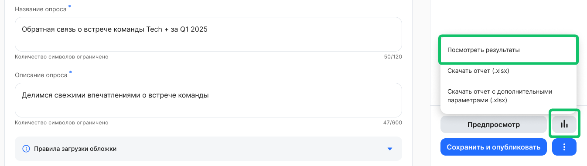
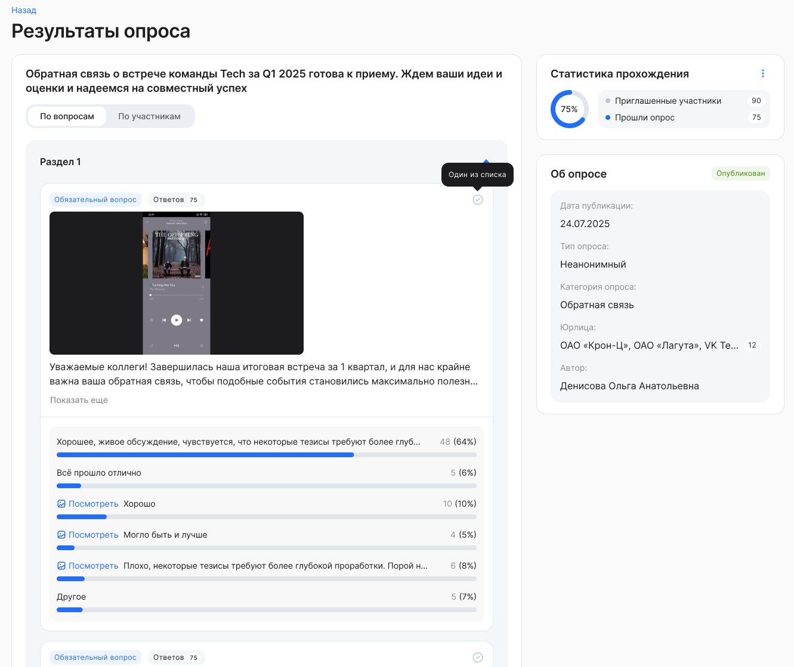
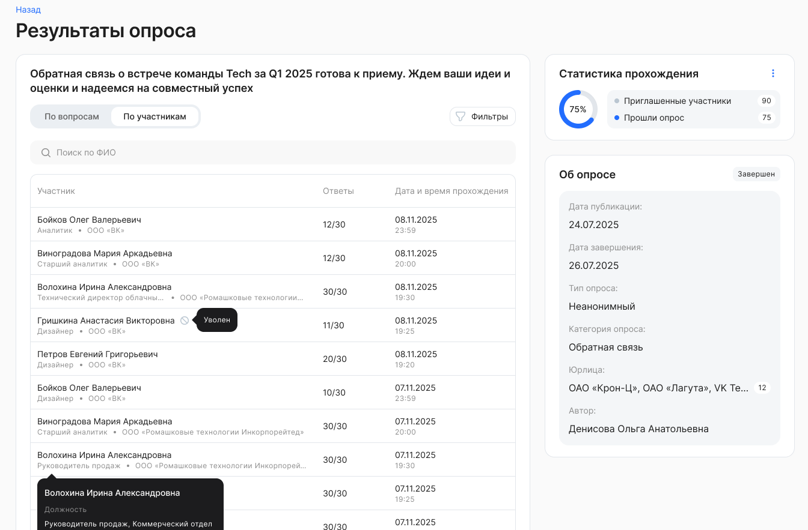
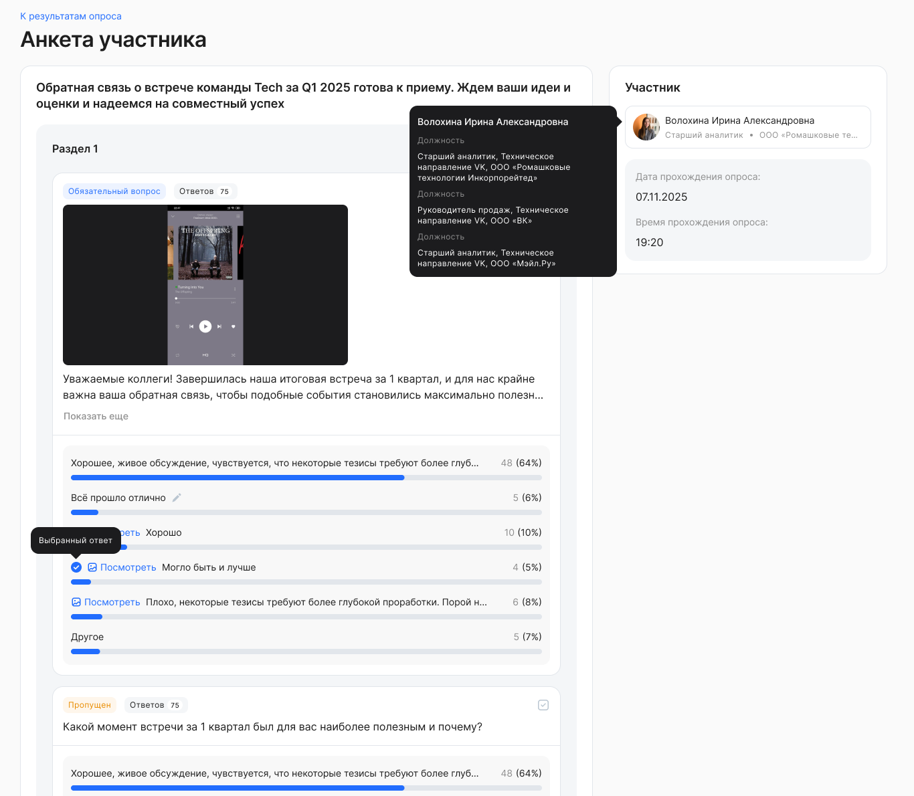
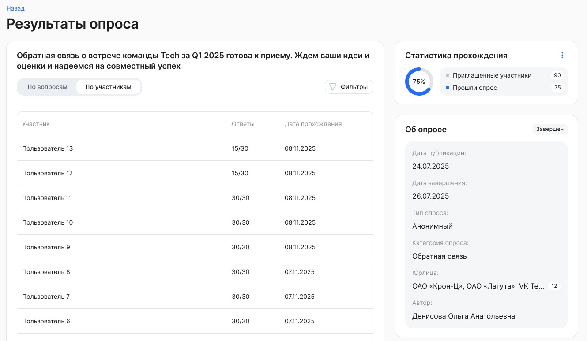
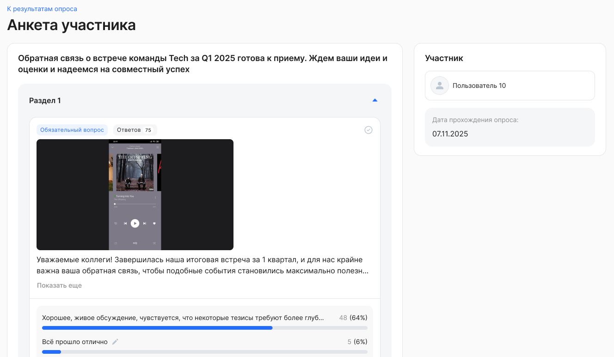
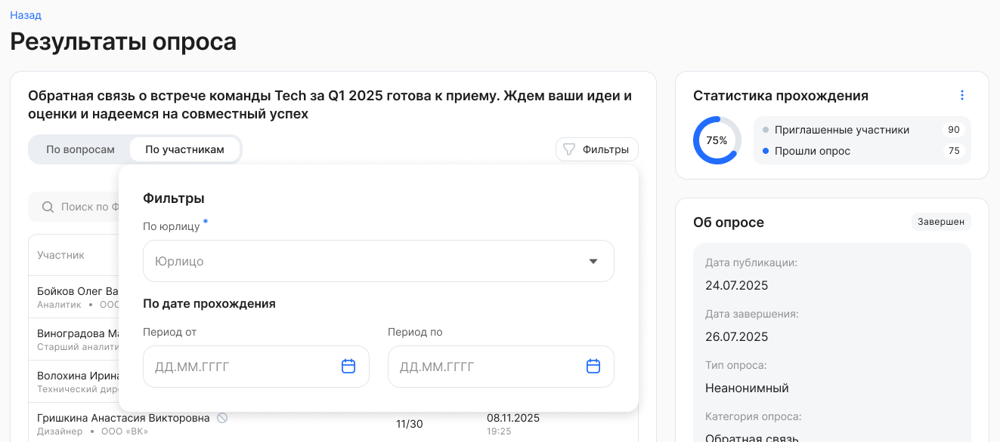

Просмотр аналитики по прохождению опроса доступен по опубликованным и завершенным опросам. 

Чтобы просмотреть аналитику по результатам опроса, перейдите в раздел **Социальные сервисы → Опросы** и напротив опроса нажмите кнопку  **→** **Посмотреть результаты**.

На форме редактирования опроса также можно перейти к просмотру результатов опроса.  

При открытии аналитики по незавершенному опросу доступна статистика прохождения опроса всеми пользователями на дату и время открытия просмотра результатов.

При открытии аналитики по завершенному опросу доступна статистика прохождения опроса всеми пользователями на дату и время завершения опроса.

В результатах опроса отображается следующая общая информация по опросу:

* **Статистика прохождения**. Количество участников, приглашенных в опрос и прошедших опрос, и процент от общей приглашенной аудитории. В общем числе и в числе прошедших считаются ответы уволенных сотрудников, только если они успели пройти опрос.  
* **Об опросе**. Дата публикации, тип опроса: анонимный или неанонимный, категория опроса, юрлица, автор, дата завершения (если опрос завершен).

Под заголовком опроса расположены вкладки, которые показывают результаты:

* по каждому вопросу;  
* по конкретным участникам (и по уволенным сотрудникам, прошедшим опрос).

## **Статистика по вопросам**

Результаты по каждому вопросу выводятся в виде диаграмм (статистика). Вопросы отображаются в разрезе разделов опроса, к которым они относятся.

По каждому вопросу отображается следующая информация:

* Вопрос.  
* Общее количество ответов на конкретный вопрос.  
* Тип вопроса.  
* Обязательность вопроса.  
* Статистика ответов.

В случае если текст вопроса был изменен, отображается актуальный текст вопроса.

В случае если текст ответа был изменен, отображается старый вариант ответа и новый. По новому варианту ведётся своя аналитика. 

## Статистика по участникам

Для просмотра ответов в разрезе каждого пользователя, прошедшего опрос, перейдите на вкладку **По участникам** **→** строка в таблице с именем пользователя.

По каждому прохождению опроса выводится следующая информация:

1. ФИО пользователя, давшего ответы:  
   1. Если опрос неанонимный (т.е. в настройках опроса в поле **Анонимный опрос** установлено значение **Нет**), то отображается ФИО пользователя, прошедшего опрос.  
   2. Если опрос анонимный (т.е. в настройках опроса в поле **Анонимный опрос** установлено значение **Да**), то вместо ФИО отображается «Пользователь 1..N».  
2. Дата/Время прохождения опроса.  
3. Вопросы и ответы конкретного пользователя. Ответы сгруппированы по разделам. Если пользователь не ответил на какой-либо из вопросов, то вопрос будет отмечен как пропущенный.

В случае если текст вопроса был изменен, отображается актуальный текст вопроса.

В случае если текст ответа был изменен, отображается старый вариант ответа — тот вариант, который выбрал пользователь.

Пример результатов анонимного опроса
 

## **Применение фильтров**

Для неанонимного опроса можно отфильтровать результаты прохождения по следующим параметрам:

* **По юрлицу.** В случае если к вашему аккаунту привязано несколько юридических лиц, то в этом фильтре можно выбрать все юрлица или одно из них.   
* **По дате прохождения.** Выбор любой даты из открывшегося календаря. При этом нет необходимости указывать весь период, можно выбрать одну дату либо начала, либо окончания периода. 

Для анонимного опроса фильтр **По юрлицу** отсутствует. 