Чтобы пользователь смог создать опрос, ему должны быть назначены роли «Автор опроса» и «Администратор модуля Портал».

## Заполнение описания опроса

Чтобы создать опрос, перейдите в раздел **Социальные сервисы → Опросы**, нажмите кнопку **Создать опрос** и в случае если Автору опроса доступно управление в нескольких группах аккаунтов — выберите аккаунт, от лица которого будет опубликован опрос. 

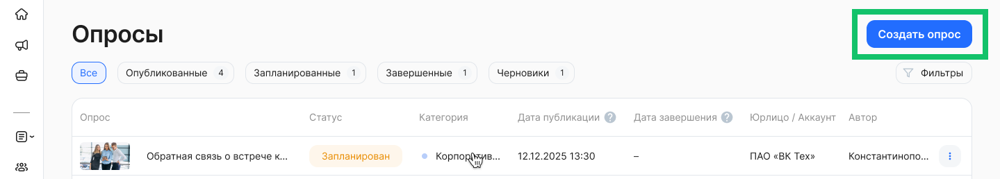

 

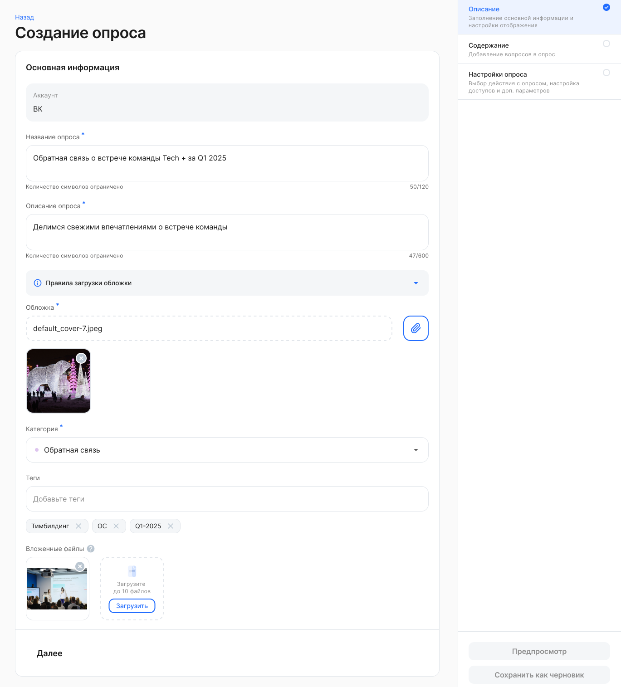

 

В блоке **Основная информация** заполните следующие поля:

* **Название опроса**. Обязательное поле. Название не должно превышать 120 символов.  
* **Описание опроса**. Обязательное поле. Описание не должно превышать 600 символов.  
* **Обложка**. Обязательное поле. Чтобы загрузить обложку, нажмите кнопку . Далее выделите нужную область загружаемого изображения и сохраните изменения.

<info>

Правила загрузки обложки: 
- Допустимые форматы изображений: JPEG, PNG, HEIF, WEBP, DMG 
- Изображение не должно превышать 10 МБ. 
- Соотношение сторон обложки 16:9. 
- Минимальный размер изображения 918 х 516 пикселей. 

</info>

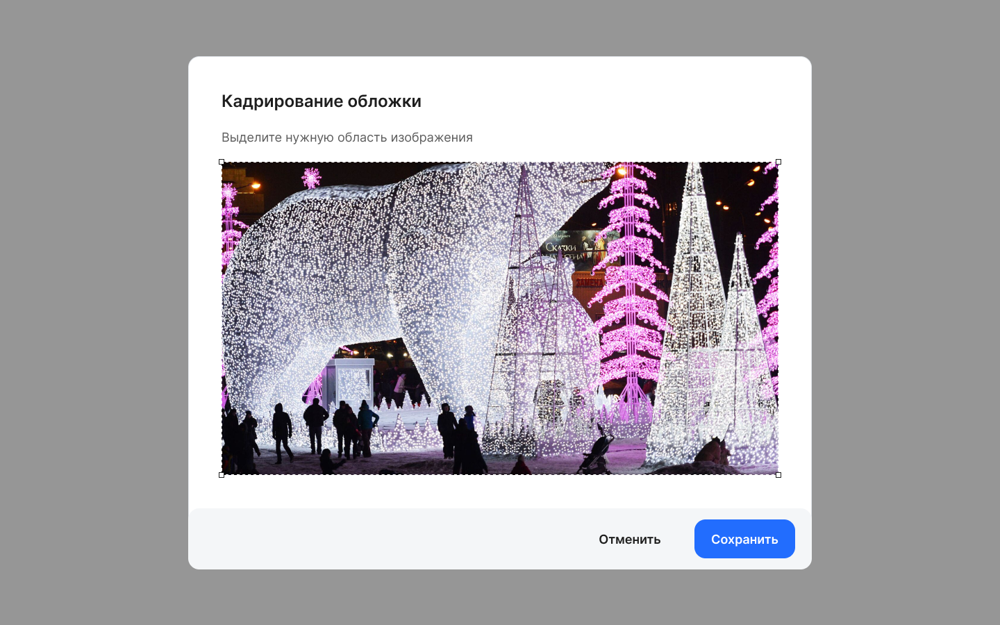

 

* **Категория**. Обязательное поле. Выберите одну категорию из выпадающего списка.  
* **Теги**. Необязательное поле. Выберите из ранее созданных или придумайте новые теги — ключевые слова, с помощью которых пользователи будут ориентироваться в теме опроса.   
* **Вложенные файлы**. Необязательное поле. Загрузите до 10 файлов весом до 10 МБ.

<info>

Ограничения по добавлению файла: 
- Типы файлов: PDF, DOCX, XLSX, CSV 
- Файл не должен превышать 10 МБ. 
- Количество: до 10 файлов. 

</info>

Нажмите кнопку **Далее** для заполнения содержания опроса и добавления вопросов и вариантов ответов в опрос.

## Заполнение содержания опроса

На странице **Содержание** добавьте вопрос и варианты ответов в первый раздел опроса. При необходимости добавьте еще один раздел, нажав кнопку после всех блоков с вопросами или в боковой панели. 

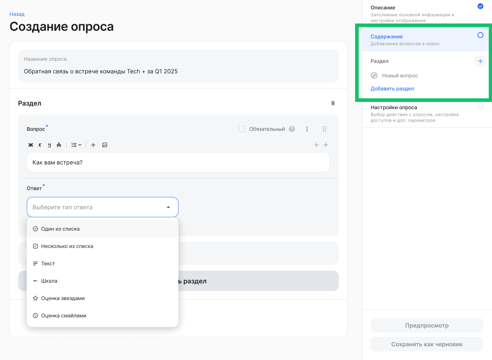

 

В поле **Вопрос** введите название вопроса. Если вопрос является обязательным для прохождения опроса, то включите опцию **Обязательный** рядом с полем **Вопрос**. Если обязательный вопрос останется без ответа, то опрос нельзя будет завершить или перейти к следующему разделу.

Чтобы добавить следующий вопрос, нажмите кнопку **Добавить вопрос** после блока с вопросом и настройками вариантов ответов.

В раздел опроса возможно добавить следующие типы вопросов с вариантами ответов:

* **Один из списка** – выбор одного варианта ответа:  
  * В качестве вариантов ответов может быть текст, изображение, текст с изображением.  
  * В настройках опроса может быть добавлен вариант **Свой вариант ответа**. При выборе данного варианта у участника опроса появится текстовое поле с возможностью ввести свой ответ. Ограничение на количество символов — 300\.

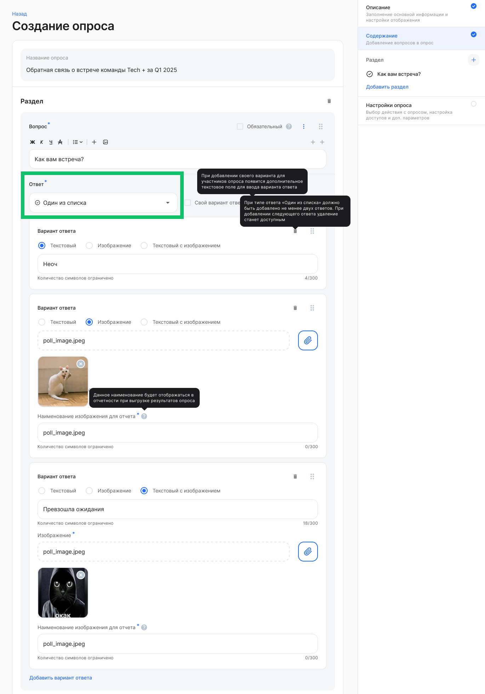

 

* **Несколько из списка** – выбор нескольких вариантов ответа:  
  * В качестве вариантов ответов может быть текст, изображение, текст с изображением.  
  * В настройках опроса может быть добавлен вариант **Свой вариант ответа**. При выборе данного варианта у участника опроса появится текстовое поле с возможностью ввести свой ответ. Ограничение на количество символов — 300.

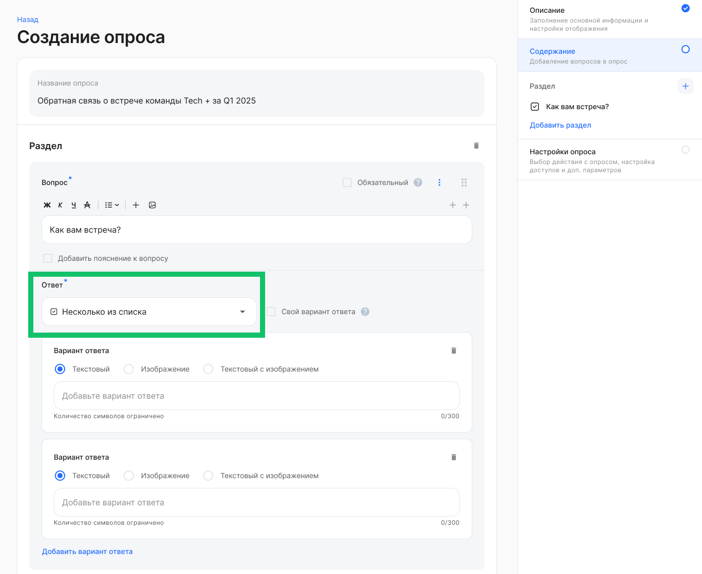

 

* **Текст** — вариант ответа со свободным вводом текста. Администратор может указать ограничение на количество символов в ответе.

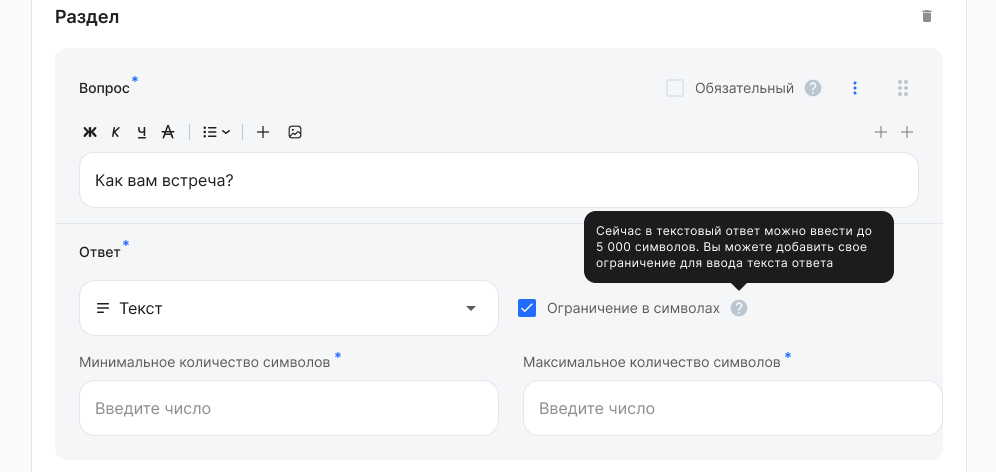

 

* **Шкала** — возможность указать целочисленное значение на шкале с установленными минимальными, максимальными значениями. Также можно заполнить подписи к начальному и конечному значению.

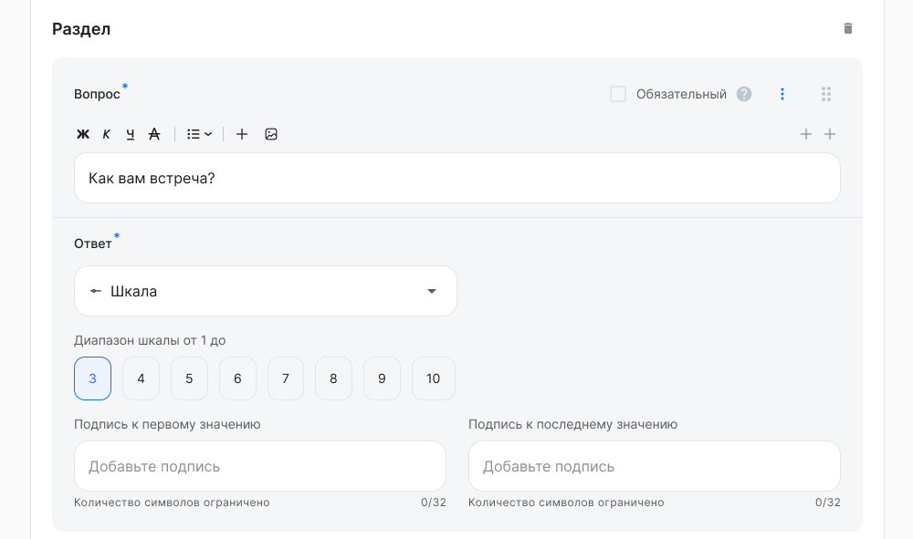

 

* **Оценка звездами** – выбор оценки, визуально представленной звездами. Установите количество звезд, которые будут отображаться в опросе. 

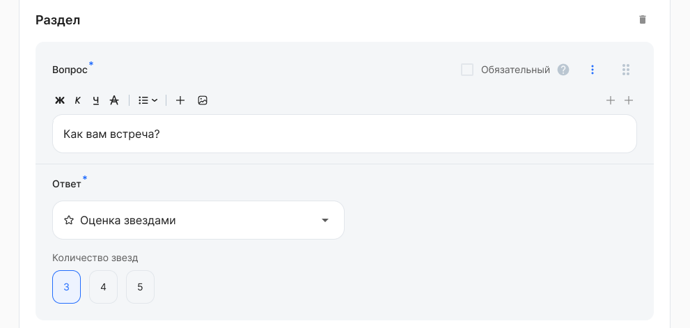

 

* **Оценка смайлами** — выбор оценки, визуально представленной заранее заданными смайлами.

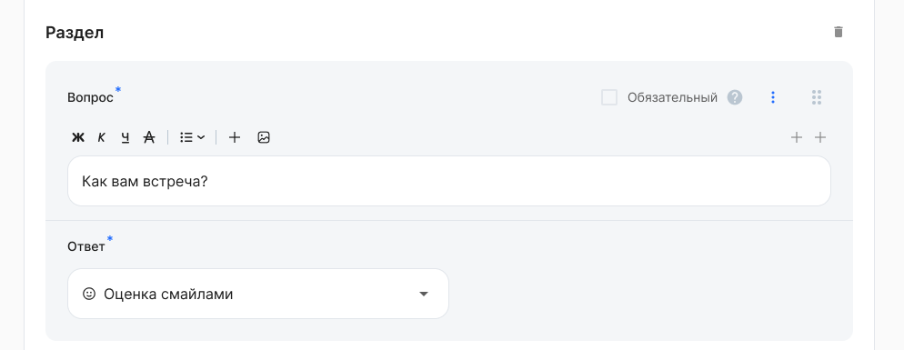

 

Возможно выполнить следующие действия с вопросами:

* Добавить дополнительное описание. Для этого нажмите кнопку  в блоке вопроса и выберите пункт **Добавить пояснение к вопросу**.  
* Скопировать блок вопроса. Для этого нажмите кнопку  в блоке вопроса и выберите пункт **Дублировать**. При дублировании вопроса система создаст новый вопрос, автоматически копируя содержимое исходного вопроса: текст вопроса, тип, варианты ответов, настройки обязательности и комментария, и расположит дубликат следующим в списке.   
* Удалить вопрос. Для этого нажмите кнопку  в блоке вопроса и выберите пункт **Удалить**. Чтобы удаление стало доступно, в опрос нужно добавить хотя бы два вопроса.

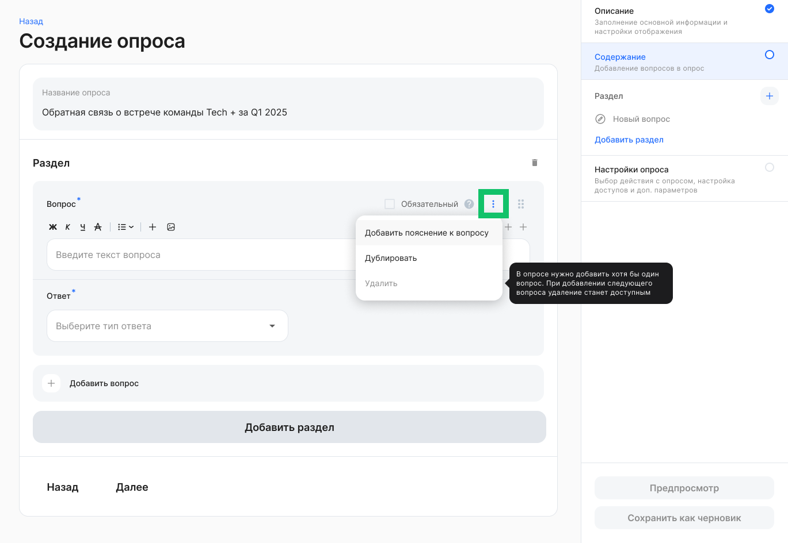

 

Для перемещения разделов внутри опроса воспользуйтесь стрелками «вниз» или «вверх».

Чтобы переместить вопрос внутри раздела, нажмите кнопку  и не отпускайте кнопку до тех пор, пока не перенесёте на нужное место.

Аналогично перемещение с кнопкой  работает для вариантов ответов. 

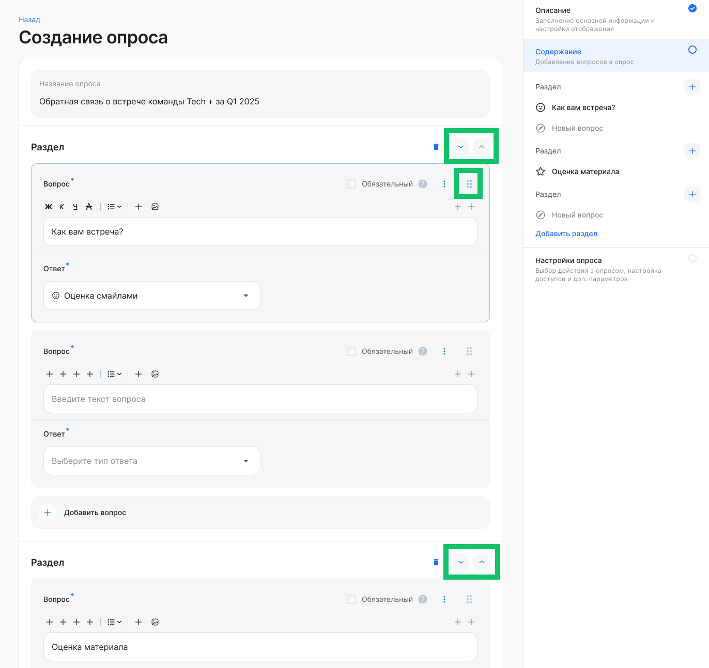

 

В боковой панели дублируются наименования вопросов с группировкой по разделам. И при нажатии на вопрос в панели происходит центровка на вопросе в опросе. Это удобно, если нужно быстро перейти к разделу или вопросу при их многообразии. 

Чтобы просмотреть добавляемый опрос так, как увидят его участники опроса, нажмите кнопку **Предпросмотр** в конце страницы создания опроса. Функция будет доступна после выпуска релиза 2026.03.

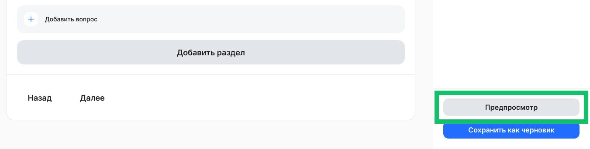

## Настройки опроса

После заполнения описания и содержания опроса перейдите к настройкам публикации на странице **Настройки опроса**.  

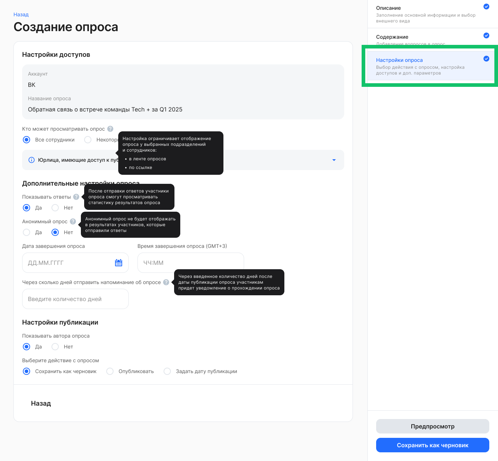

 

В блоке **Настройки доступов** настройте следующие параметры:

* **Кто может просматривать опрос**. Настройка ограничивает отображение опроса у выбранных подразделений и сотрудников в ленте опросов и по ссылке.  
  * При выборе варианта **Все сотрудники** опрос будет доступен всем сотрудникам в подразделениях компаний, доступ к которым разрешен Администратору.  
  * Если был выбран вариант **Некоторые сотрудники**, то опрос станет доступен только отдельным **группам сотрудников** в компании или в отдельных подразделениях, доступ к которым разрешен Администратору.

  В зависимости от доступа Администратора в блоке **Группа сотрудников** выберите:

* **Юрлицо**. Выберите одну компанию из списка. Если Администратор имеет доступ только к одному юрлицу, то поле будет заполнено автоматически.   
* **Тип оргструктуры**. Доступны варианты для выбора:  
  * **Все.** Опрос будет доступен сотрудникам всех подразделений компании вне зависимости от типа оргструктуры.  
  * **Юридическая.** В поле **Подразделение** выберите одно подразделение. Если требуется добавить доступ для еще одного подразделения, то добавьте новый блок с группой сотрудников. Если надо назначить доступ на всю оргструктуру, то выберите верхнее в иерархии подразделение.  
  * **Управленческая.** В поле **Подразделение** выберите одно подразделение. Если требуется добавить доступ для еще одного подразделения, то добавьте новый блок с группой сотрудников. Если надо назначить доступ на всю оргструктуру, то выберите верхнее в иерархии подразделение.

  При необходимости добавьте еще один блок с группой сотрудников.

  Если добавлено больше одного блока **Группа сотрудников**, то любой из блоков станет доступен для удаления. Для этого нажмите кнопку . 

    

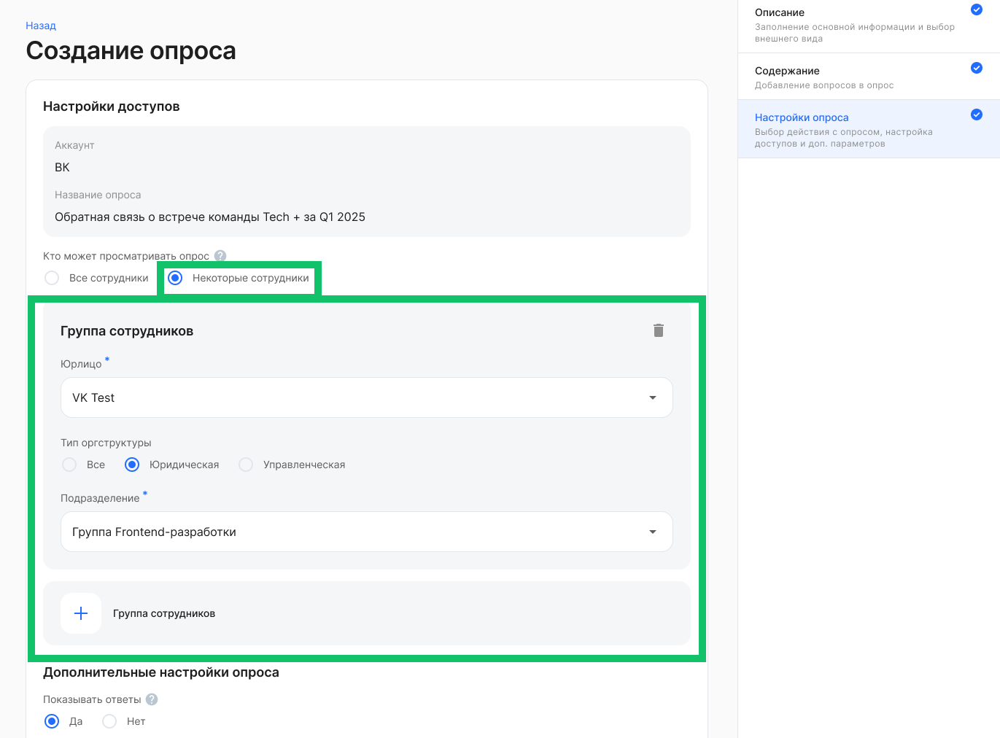

 

В блоке **Дополнительные настройки опроса** настройте следующие параметры:

* **Показывать ответы**. Выберите один из вариантов: *Да* или *Нет.* Если выбрано *Да*, то после отправки ответов участники опроса смогут просмотреть статистику результатов опроса. Функция будет доступна после выпуска релиза 2026.03.  
* **Анонимный опрос**. Выберите один из вариантов: *Да* или *Нет.* Если выбрано *Да*, то анонимный опрос будет скрывать ФИО, компанию и подразделение участников, которые отправили ответы.  
* **Дата и время завершения опроса**. Необязательный параметр. Укажите дату в формате ДД.ММ.ГГГГ и время ЧЧ:ММ по МСК.  
* **Через сколько дней отправить напоминание об опросе**. Необязательный параметр. Введите количество дней. Через введенное количество дней после даты публикации опроса участникам придет уведомление о необходимости пройти опрос.

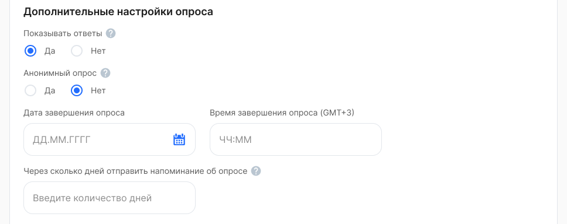

 

В блоке **Настройки публикации** настройте следующие параметры:

* **Показывать автора опроса**. По умолчанию выбран вариант **Да**. В этом случае ФИО автора будет отображаться после описания опроса.  
* **Выберите действие с опросом**. Для выбора доступно три варианта:   
  * **Сохранить как черновик**. После сохранения опрос появится только в разделе **Социальные сервисы → Опросы** и будет доступен автору опроса и другим администраторам, у которых есть доступ к этому опросу.

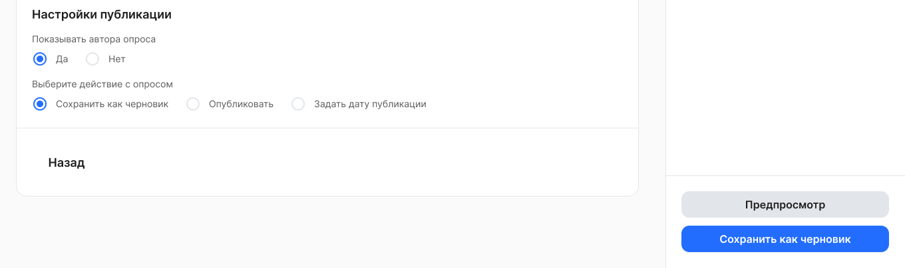

 

* **Опубликовать**. Возможность публикации на портале как нового (создаваемого) опроса, так и ранее сохраненного черновика. После публикации опрос отображается в пользовательском разделе **Опросы**.

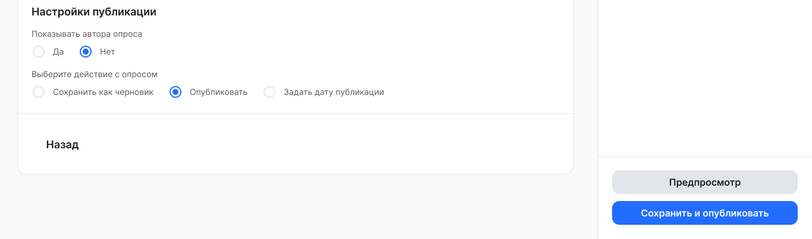

 

* **Задать дату публикации**. Возможность отложенной публикации опроса. Для отложенной публикации указывается дата и время публикации. При наступлении указанной даты и времени опрос отображается в разделе **Опросы**.   
  Допустимо указывать прошедшие дату и время. В этом случае опрос будет опубликован задним числом и появится в разделе **Опросы** сразу же после нажатия кнопки **Сохранить и опубликовать**.

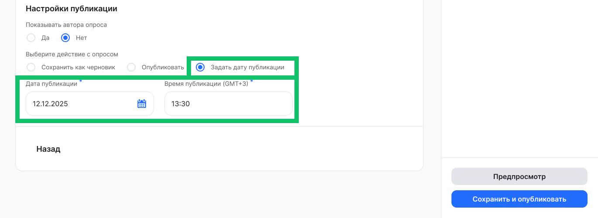