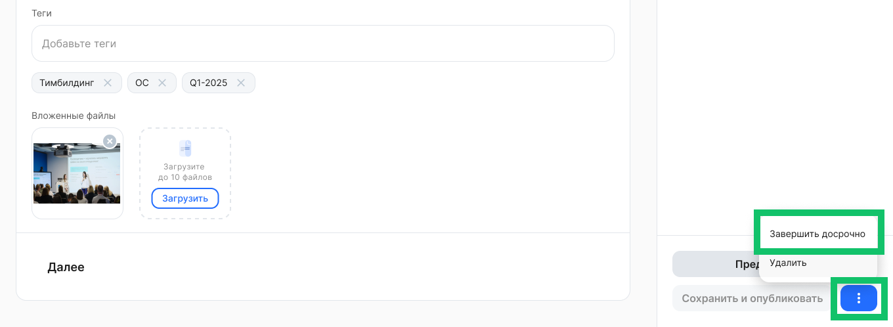
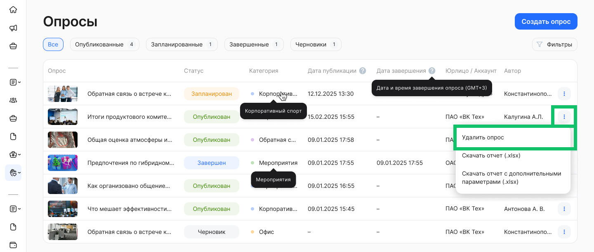
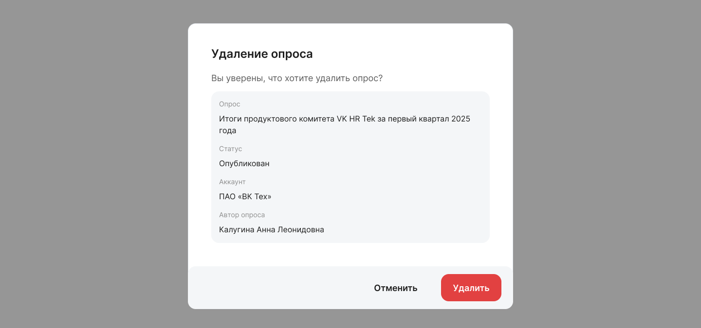
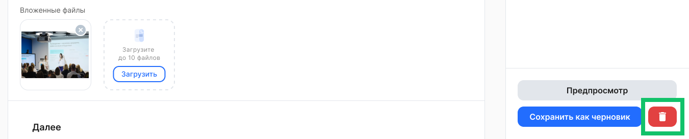
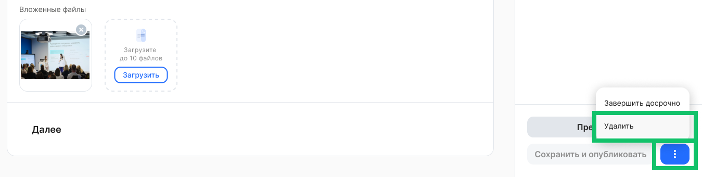

## Редактирование опроса

Чтобы перейти к редактированию опроса, нажмите на строку необходимого опроса в списке раздела **Социальные сервисы → Опросы**.

Можно редактировать черновики, опубликованные и запланированные опросы. В черновиках и запланированных опросах можно изменить любой параметр, заполненный еще на этапе создания опроса.

В опубликованном опросе, который еще не был завершён, запрещено редактировать следующие параметры:
- признак анонимности,
- тип ответа на вопрос,
- признак обязательности вопроса,
- количество символов в ответе (от и до) в типе ответа на вопрос,
- сотрудники, юрдица или подразделения, которые могут просматривать опрос,
- порядок расположения всех полей опроса.

Также возможно досрочно закрыть прохождение действующего опроса для сотрудников. Для этого перейдите на страницу редактирования опубликованного опроса и нажмите кнопку  и **Завершить досрочно**.  

## Удаление опроса

В разделе **Социальные сервисы → Опросы** можно удалить опрос двумя способами:

1. Перейдите к списку опросов и напротив опроса, который хотите удалить, нажмите кнопку  и **Удалить**. Подтвердите удаление.

 

 

2. **Для черновика и запланированного опроса:**  
   Откройте страницу редактирования опроса, который хотите удалить, нажмите кнопку . Подтвердите удаление.

 

**Для опубликованного опроса:**  
Откройте страницу редактирования опроса, который хотите удалить, нажмите кнопку  и **Удалить**.   

