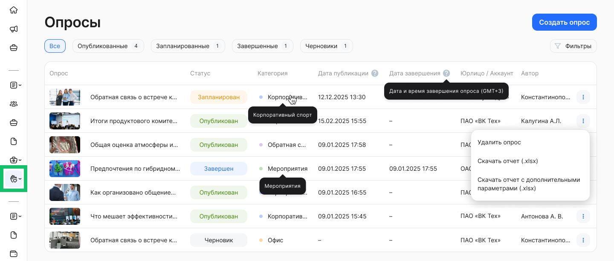
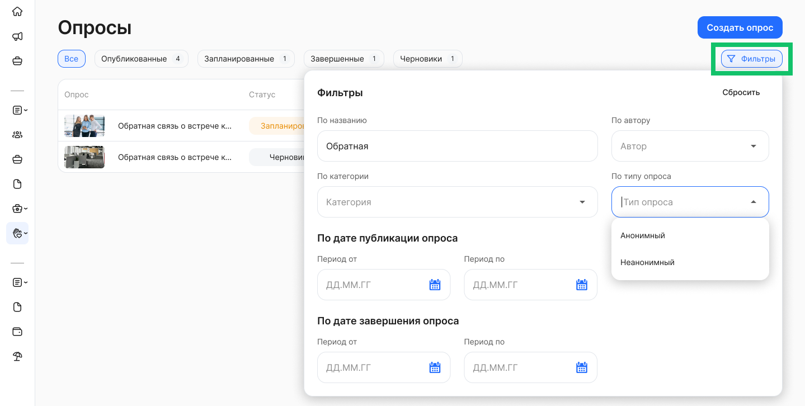

Чтобы получить доступ к разделу **Социальные сервисы → Опросы**, представителю компании должна быть выдана роль **Администратор модуля Портал** и/или **Автор опросов**. Подробнее о назначении роли см. в статье [Роли сотрудников в компании](/ru/admin_actions/settings/groups).

В разделе **Опросы** отображаются только те опросы, которые доступны пользователю в рамках установленного ему аккаунта и/или юрлица.

В разделе доступны списки для просмотра, редактирования и удаления:

* опубликованных опросов,  
* запланированных для публикации опросов,  
* черновиков опросов,  
* завершенных опросов.

 

Каждая запись в списке содержит следующие сведения:

* **Опрос**. Название опроса.   
* **Статус**. У опроса может быть один из трёх статусов в зависимости от того, как он был настроен и сохранен. Возможные статусы: *Опубликован, Запланирован, Черновик, Завершен*.   
* **Категория**. Название категории, которая была присвоена опросу.  
* **Дата публикации**. Дата и время публикации по МСК.  
* **Дата завершения**. Дата и время завершения опроса по МСК.  
* **Юрлицо/Аккаунт**. Наименование компании или группы компаний, для сотрудников которой доступен опрос.  
* **Автор**. Фамилия и инициалы сотрудника, который создал первую версию опроса и сохранил его. 

Чтобы просмотреть полное название опроса, категории или другого значения из списка, наведите курсор на это название. 

## Применение фильтров

Для вашего удобства предусмотрена настройка отображения списка опросов. Нажмите  кнопку **Фильтры**. Откроются поля для редактирования фильтра с заполнением и выбором значений из выпадающего списка.

 

Для опросов доступны следующие фильтры:

* **По названию** — введите слово от одного символа или фразу для поиска.  
* **По категории** — выбор одного или нескольких значений из предложенного списка с возможностью текстового поиска по категориям.  
* **По автору** — выбор одного или нескольких значений из предложенного списка с возможностью текстового поиска по авторам.  
* **По типу опроса** — выбор одного значения из списка: *Анонимный* или *Неанонимный*.  
* **По дате публикации опроса** — выбор любой даты из открывшегося календаря. При этом нет необходимости указывать весь период: можно выбрать дату, до или после которой были опубликованы опросы.  
* **По дате завершения опроса** — выбор любой даты из открывшегося календаря. При этом нет необходимости указывать весь период: можно выбрать дату, до или после которой были завершены опросы. 

В момент применения фильтров происходит поиск опросов и список автоматически обновляется.

При необходимости вы можете сбросить любой из установленных параметров:

* если параметр предполагает одно значение, то нажмите  справа от этого значения;  
* если параметр предполагает множественный выбор, то откройте список вариантов и снимите галочки у соответствующих чекбоксов;  
* для сброса даты кликните на дату и нажмите **Сбросить** внизу открывшегося календаря.

Чтобы сбросить сразу все параметры фильтра, нажмите кнопку **Сбросить** в правом верхнем углу формы.

Для выхода из формы установки фильтра нажмите на любое место на странице за пределами этой формы. Список опросов на странице будет отображаться с учетом настроенного фильтра.