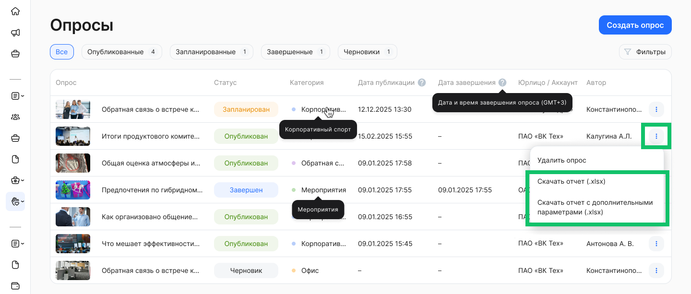
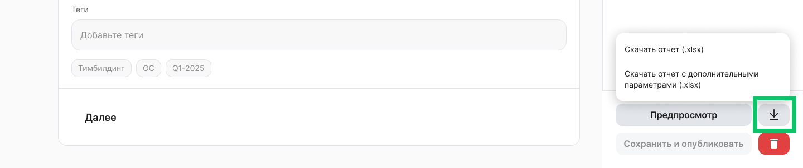
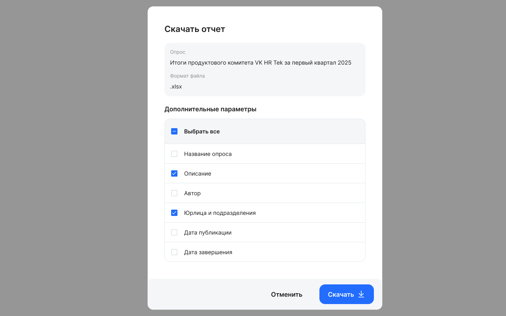
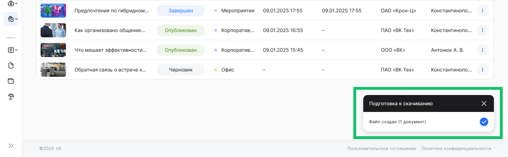

Выгрузка отчета с результатами о прохождении опроса доступна для опубликованных опросов (не черновиков).

Наименование выгружаемого файла имеет формат: 

```[Дата и время выгрузки файла] [Наименование опроса].xlsx```

Чтобы скачать отчет, перейдите в раздел **Социальные сервисы → Опросы** и напротив опроса, отчет по которому хотите выгрузить, нажмите кнопку   и либо **Скачать отчет (.xlsx)**, либо **Скачать отчет с дополнительными параметрами (.xlsx)**.



<br>

На форме редактирования опроса также можно выгрузить результаты опроса.  



<br>

Если выбрана опция **Скачать отчет с дополнительными параметрами (.xlsx)**, то откроется форма с выбором дополнительной информации об отчете, которую пользователь хочет выгрузить:

1. **Название опроса**.  
2. **Описание опроса**.  
3. **Автор опроса** — ФИО пользователя, создавшего опрос.  
4. **Юрлица и поздразделения** — сведения об аудитории, перечень организаций и подразделений, на которые назначен опрос:  
   1. Если опрос назначен на всю организацию, то выводится только ее наименование (ООО «Ромашка»),  
   2. Если опрос назначен на организацию и конкретное подразделение, то выводится наименование организации и подразделение (ООО «Ромашка»/Отдел кадров),  
   3. Если опрос назначен на несколько организаций И/ИЛИ подразделений, то они выводятся через запятую ( ООО «Ромашка», ООО «Лютик»/Отдел кадров, ОАО «Кактус»),  
   4. Если опрос назначен на весь аккаунт, то выводится название аккаунта (Цветы и цветочки).  
5. **Дата публикации** — DD.MM.YYYY.  
6. **Дата завершения опроса** — DD.MM.YYYY. Если опрос еще не завершен, то поле не будет доступно для выбора.



<br>

Если дополнительные параметры выбраны, то они выводятся на отдельной первой вкладке xlsx-файла. Наименование вкладки — «Описание». 

Если ни один из дополнительных параметров не выбран, то вкладка «Ответы на опрос» становится первой и единственной.

Нажмите кнопку **Скачать**. Файл с результатами опроса будет выгружен на ваш компьютер.



<br>

Возможны два варианта выгрузки результатов:

* если в настройках опроса поле «Анонимный опрос» стоит в значении «Нет» — отображать ФИО и организацию/подразделение пользователя, прошедшего опрос,  
* если в настройках опроса поле «Анонимный опрос» стоит в значении «Да» — не отображать ФИО и организацию/подразделение пользователя, прошедшего опрос.

Наименование вкладки с ответами — «Ответы на опрос».

Выгрузка состоит из следующих полей:

| ФИО | Организация/подразделение | Дата/Время прохождения опроса | Наименование вопроса 1 | Наименование вопроса 2 | ... | Наименование вопроса N |
| ----- | ----- | ----- | ----- | ----- | ----- | ----- |
| **Неанонимный опрос:** Фамилия Имя Отчество пользователя, который прошел опрос  | **Не анонимный опрос:** Отображается организация/подразделение пользователя. В случае если пользователь относится к нескольким организациям, выводится через запятую. **Пример:** ООО «Ромашка»/Отдел кадров, ООО «Лютик»/Отдел кадров | DD.MM.YYYY HH:MM:SS **Пример:** 05.08.2025 17:57:07 | Ответ на вопрос 1 | Ответ на вопрос 2 | ... | Ответ на вопрос N |
| **Анонимный опрос:** Пользователь 1 .. N  | **Анонимный опрос:** Ячейка не заполнена | DD.MM.YYYY HH:MM:SS **Пример:** 05.08.2025 17:57:07 | Ответ на вопрос 1 | Ответ на вопрос 2 |  | Ответ на вопрос N |

По каждому пользователю, прошедшему опрос, создается новая строка в xlsx-файле.

В случае если вопрос не обязательный и на него не был дан ответ, ячейка с ответом останется пустой.

В случае если текст вопроса был изменен автором опроса, в опросе/выгрузке будет отображаться актуальный текст вопроса.

В случае если текст ответа был изменен автором опроса, а пользователь уже ответил ранее, то в выгрузке будет отображаться старый вариант ответа, на который дал ответ пользователь до обновления текста ответа. 