Для прохождения опроса нажмите кнопку **Начать опрос** на странице опроса.

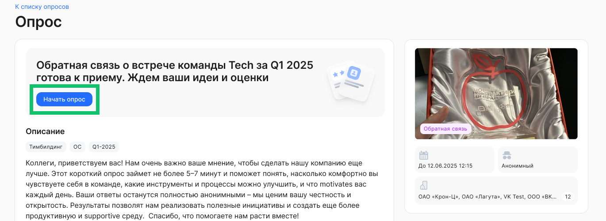

## Разделы опроса

На странице прохождения опроса отображается общая информация:

* Название опроса.  
* Разделы с вопросами и вариантами ответов.  
* Прогресс прохождения. Показывает количество вопросов, на которые пользователь оставил ответы.  
* Вложенные файлы – если есть.

Опрос может состоять из одного или нескольких разделов. В каждом разделе может быть один или более вопросов.

При переходе к опросу отображается первый раздел опроса и его вопросы с возможными вариантами ответов.

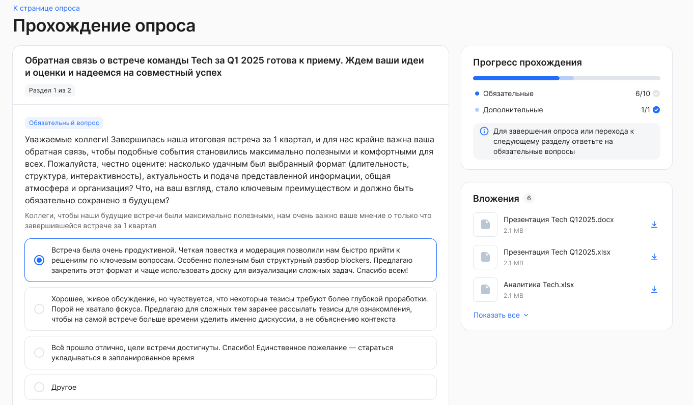

 

Пользователю доступны следующие возможности навигации по разделам опроса:

* Переключение к следующему разделу – если в опросе больше одного раздела и данный раздел не является последним. Пользователь не может перейти к следующему разделу, если он не дал ответ на обязательный вопрос (если такие были в разделе). 

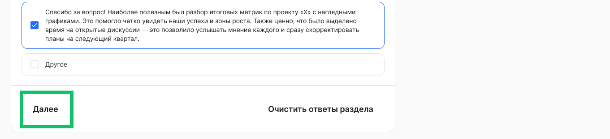

 

* Переключение к предыдущему разделу – если в опросе больше одного раздела и данный раздел не является первым.

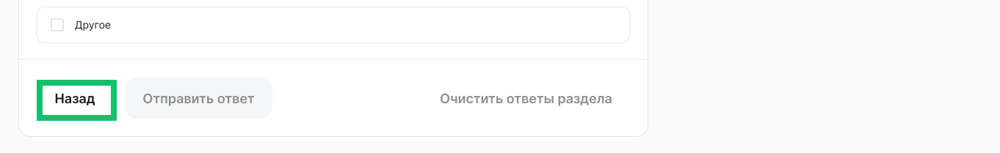

 

Также пользователю доступны:

* Возможность сбросить все оставленные ранее варианты ответов в рамках одного раздела. При сбросе ответов не происходит сохранение в БД, только при переходе к следующему разделу/завершению опроса.

 

* Возможность завершить прохождение опроса – доступна на форме последнего раздела опроса. Пользователь не может завершить опрос, если он не дал ответ на обязательный вопрос в рамках последнего раздела.

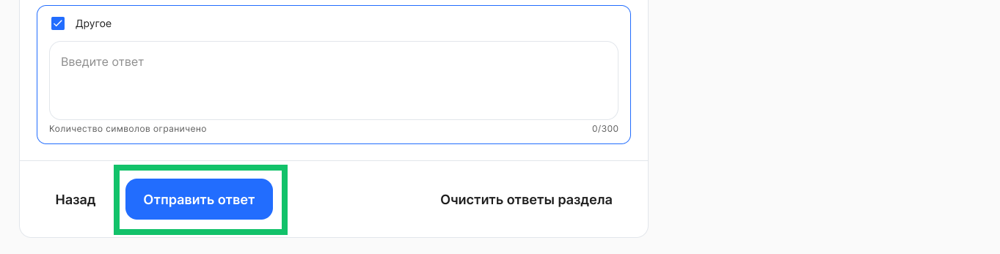

## Вопросы и ответы в опросе

Вопросы отображаются в группировке по разделам.

В рамках каждого вопроса может быть дополнительное пояснение к вопросу.

В разделе опроса возможны следующие типы вопросов с вариантами ответов:

* Один из списка – выбор одного варианта ответа:  
  * В качестве вариантов ответов может быть текст, изображение, текст с изображением.  
  * В настройках опроса может быть добавлен вариант *Другое*. При выборе данного варианта появится текстовое поле с возможностью ввести свой ответ. Ограничение на количество символов — 300.

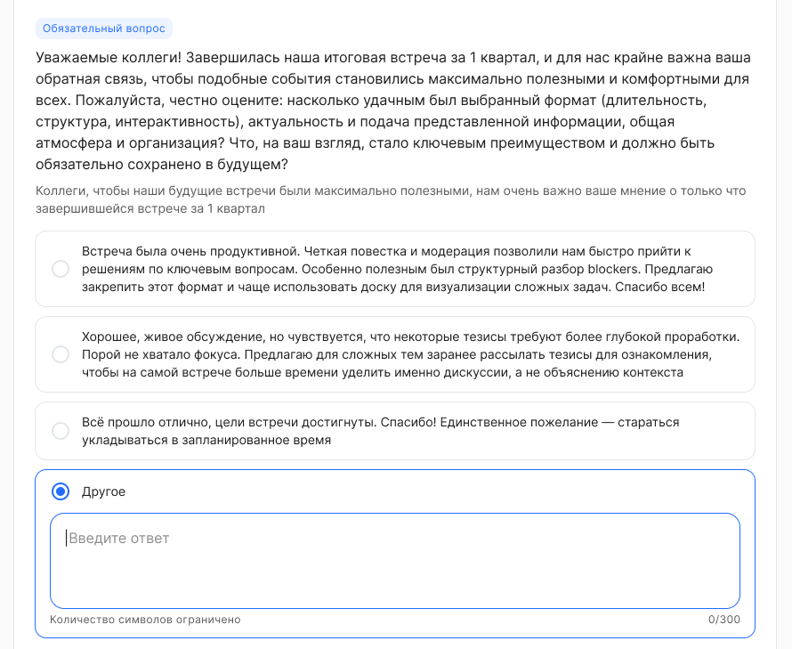

 

* Несколько из списка – выбор нескольких вариантов ответа:  
  * В качестве вариантов ответов может быть текст, изображение, текст с изображением.  
  * В настройках опроса может быть добавлен вариант *Другое*. При выборе данного варианта появится текстовое поле с возможностью ввести свой ответ. Ограничение на количество символов — 300\.

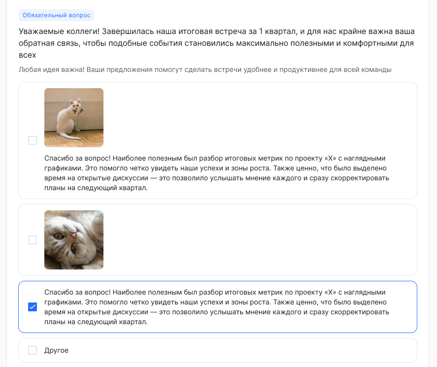

 

* Текст — вариант ответа со свободным вводом текста. Администратор может указать ограничение на количество символов в ответе.

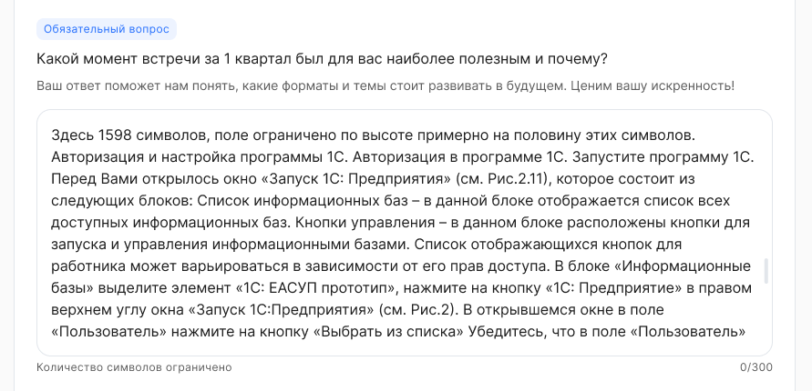

 

* Шкала — возможность указать целочисленное значение на шкале с установленными минимальными, максимальными значениями. Также отображаются подписи к начальному и конечному значению (если указаны при создании вопроса).

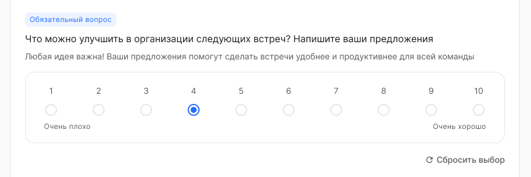

 

* Оценка со звездами – выбор оценки, визуально представленной звездами.

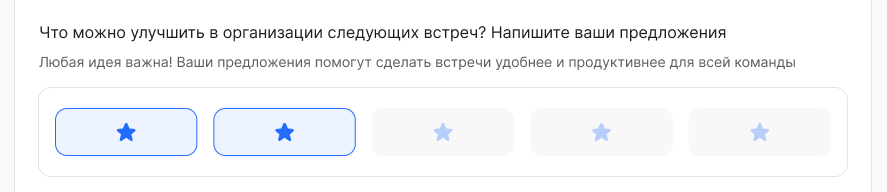

 

* Оценка со смайлами — выбор оценки, визуально представленной заранее заданными смайлами.

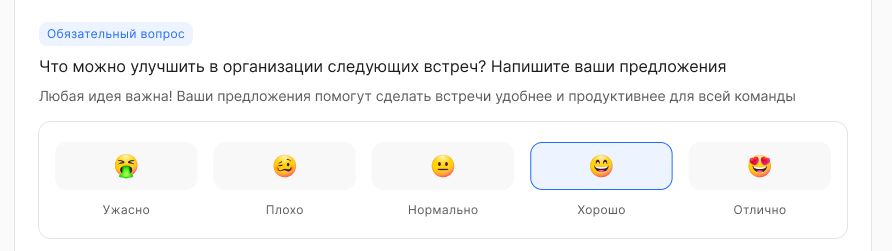

## Завершение прохождения опроса

На последней форме прохождения опроса (последний раздел) пользователь может завершить прохождение опроса.

Ответы пользователя сохраняются по мере прохождения опроса — в разрезе каждого раздела.

После завершения появится информационное сообщение о завершении опроса.

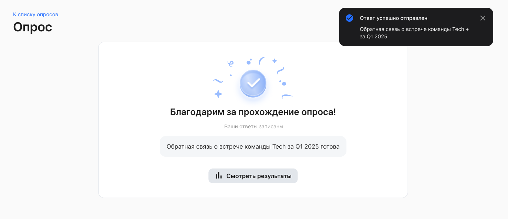