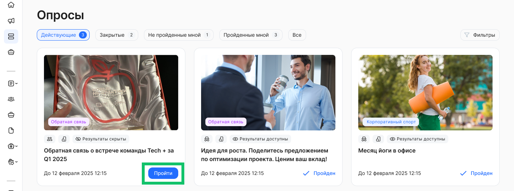
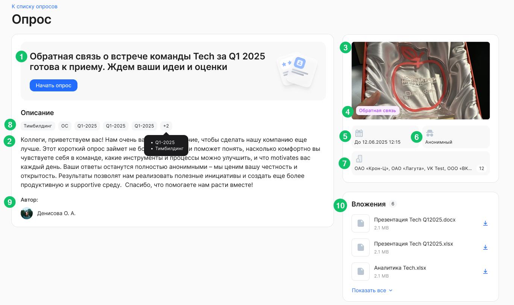
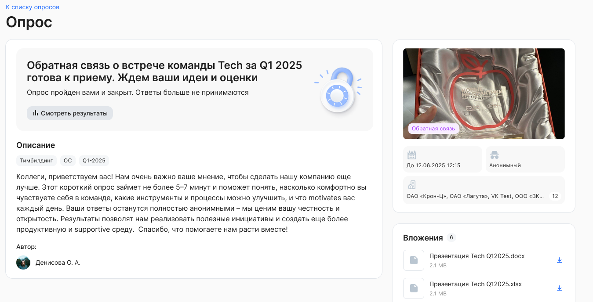

## Опрос не завершен и пользователь ранее не проходил опрос

При нажатии на любую область опроса в разделе **Опросы** произойдёт переход на страницу выбранного опроса. 

В случае перехода к опросу по прямой ссылке, если у пользователя нет прав доступа к этому опросу, появится сообщение об отсутствии прав доступа.

Пользователь может пройти опрос только один раз.

Если пользователь начал прохождение опроса, но не завершил, это не считается за прохождение опроса. Прохождение – это подтверждение пользователем завершения прохождения опроса путем нажатия на кнопку отправки ответов.

Если пользователь прекратил проходить опрос, не завершив его:

1. Пользователю должен быть доступен опрос для прохождения.  
2. Если в рамках прохождения опроса пользователь заполнил данные по какому-либо разделу, то они сохраняются (при переходе к следующему разделу опроса). При повторном открытии опроса пользователь видит заполненные им ранее данные.

Чтобы перейти к прохождению необходимого опроса, нажмите кнопку **Пройти** в карточке опроса. Если опрос был уже пройден и ответы по нему были отправлены, то в карточке будет установлен статус *Пройден*.

 

На странице опроса отображается следующая информация: 

1. Название.  
2. Описание.  
3. Обложка.  
4. Категория.  
5. Планируемая дата завершения опроса в формате «До ДД месяц ГГГГ ЧЧ:ММ». Например, «До 11 октября 2024 13:55» — если автором опроса указана конкретная дата завершения опроса.  
6. Анонимный – если автором опроса указан признак, что опрос анонимный  
7. Юрлица, на которые назначен опрос.  
8. Теги. Может быть как несколько тегов в опросе, так и отсутствовать.  
9. Автор опроса. Если включена соответствующая настройка для опроса, то в опросе будет указано ФИО автора с аватаром.  
10. Вложенные файлы (могут отсутствовать).

## Опрос завершен или пользователь ранее уже проходил опрос

Если опрос был завершен или пользователь проходил опрос ранее, на форме опроса появится следующая информация:

* Название.  
* Описание.  
* Категория.  
* Вложенные файлы – если есть.  
* Теги – если есть.  
* Анонимный – если автором опроса указан признак, что опрос анонимный.  
* ФИО пользователя, создавшего опрос – если стоит настройка отображать данную информацию.  
* Информация, что опрос завершен и дата/время завершения.  
* Результаты прохождения опроса – если включена соответствующая настройка.   

