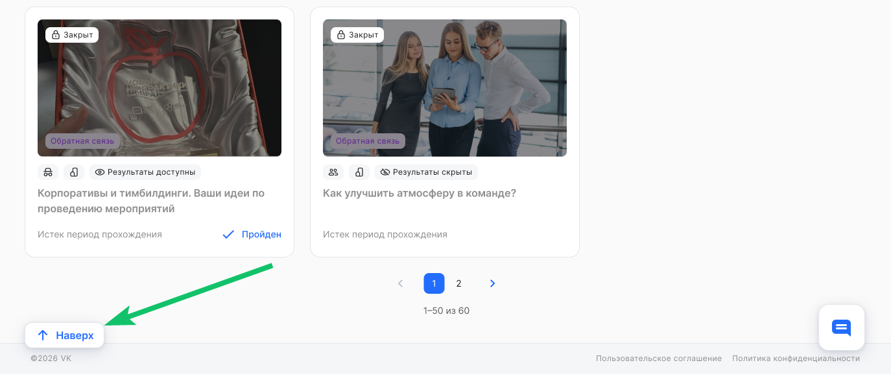
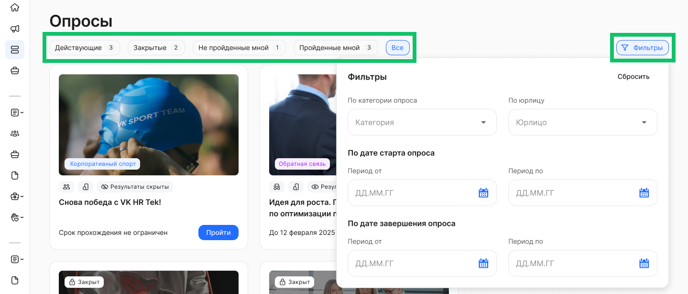

Раздел **Опросы** состоит из опросов, которые можно пройти на отдельной странице.

 

Опросы отсортированы по новизне публикации.

В разделе отображаются только те опросы, которые доступны пользователю по правам доступа. Видимость опроса настраивается на уровне аккаунта/компании/подразделения.

По каждому опросу в списке отображается следующая информация (блок краткой информации):  

1. Обложка опроса.  
2. Категория опроса.  
3. Заголовок опроса.  
4. Дата и время окончания опроса в формате «До ДД месяц ГГГГ ЧЧ:ММ». Например, «До 11 октября 2024 13:55» (может отсутствовать).  
5. Признак, что опрос завершен — если статус *Закрыт.*  
6. Признак, что пользователь ранее прошел опрос.  
7. Значок, что доступен просмотр результатов опроса.   
8. Организация(ии), на которую назначен опрос.  
9. Анонимный/ Неанонимный опрос.

 

Если на одной странице находится более 50 опросов, то список будет разделён на несколько отдельных страниц.

Пользователю доступны следующие действия в разделе **Опросы**:

1. Фильтрация опросов по категории, дате начала и окончания опроса, организации.  
2. Просмотр страницы интересующего опроса — при нажатии на любую область опроса в списке  произойдёт переход на страницу выбранного опроса.  
3. Возврат к началу списка опросов. Если количество опубликованных опросов в разделе больше, чем предусмотрено отображением на одной странице, и пользователь прокручивает список опросов, то можно быстро вернуться к началу списка с помощью кнопки **Наверх**.

## Применение фильтров 

Список опросов может отображаться в следующих разрезах:

1. **Действующие** — опросы, доступные пользователю по правам доступа, **И** те, которые **НЕ** были завершены.  
2. **Закрытые** — опросы, доступные пользователю по правам доступа, **И** те, которые были завершены.  
3. **Не пройденные мной** — опросы, доступные пользователю по правам доступа, **И** те, которые **НЕ** были завершены **И** текущий пользователь не проходил опрос.  
4. **Пройденные мной** — опросы, доступные пользователю по правам доступа, **И** те, которые текущий пользователь ранее прошел.  
5. **Все** — все опросы, доступные пользователю по правам доступа.

По каждому разрезу отображается количество опросов.

 

Пользователь может фильтровать общий список опросов по следующим параметрам:

* **По категории** **опроса** — выбор одного или нескольких значений из предложенного списка с возможностью текстового поиска по категориям.  
* **По юрлицу** — выбор одного или нескольких значений из предложенного списка с возможностью текстового поиска по юрлицу.  
* **По дате старта опроса** — выбор любой даты из открывшегося календаря. При этом нет необходимости указывать весь период: можно выбрать дату, до или после которой были опубликованы опросы.  
* **По дате завершения опроса** — выбор любой даты из открывшегося календаря. При этом нет необходимости указывать весь период: можно выбрать дату, до или после которой были завершены опросы. 

Пользователь может сбросить выбранные фильтры, если нажмёт кнопку **Сбросить** или наведёт курсор на поле со значениями и нажмёт на кнопку .

При переходе в конкретный опрос и затем при возврате обратно в список опросов по кнопке **Назад**, параметры фильтрации сохраняются.