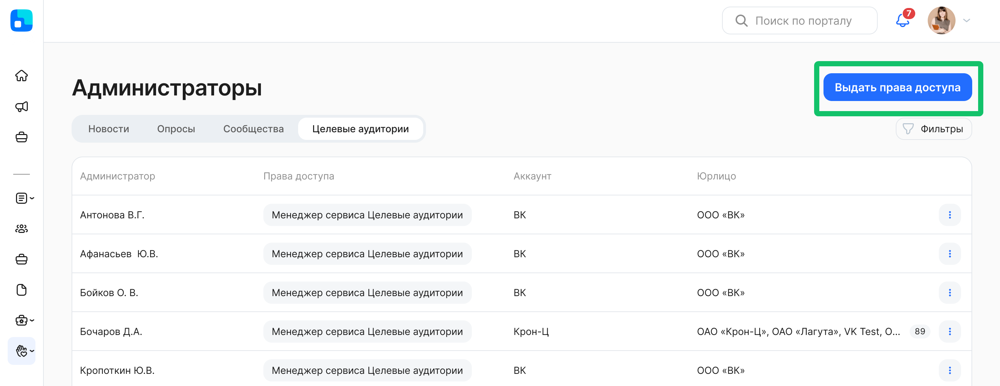
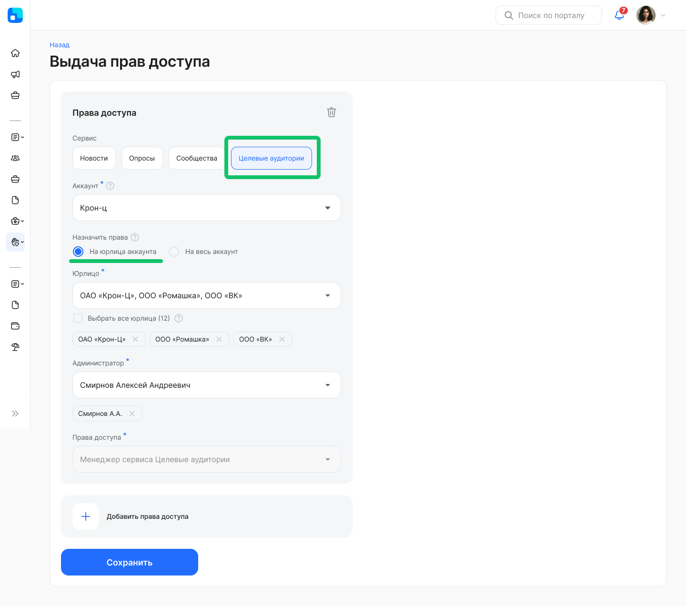
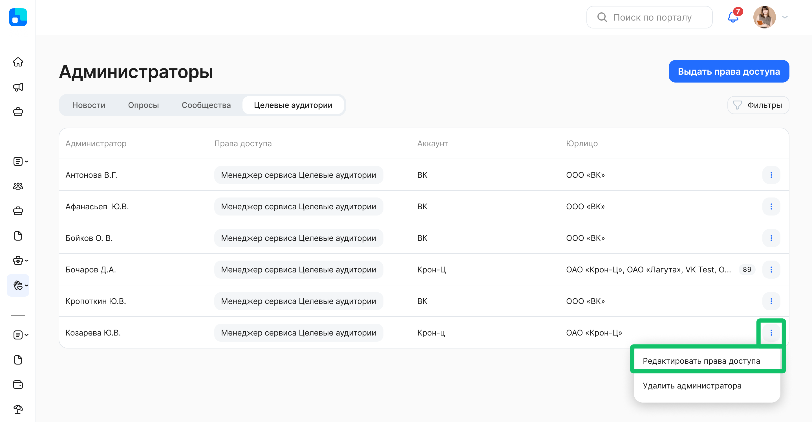
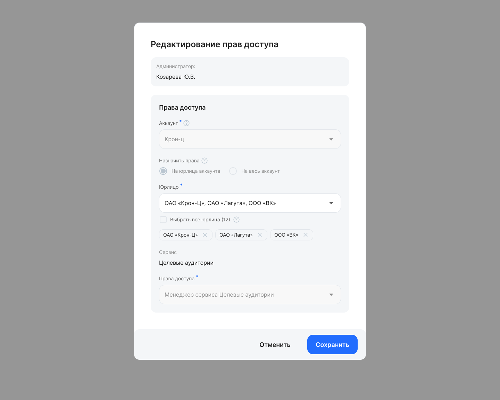
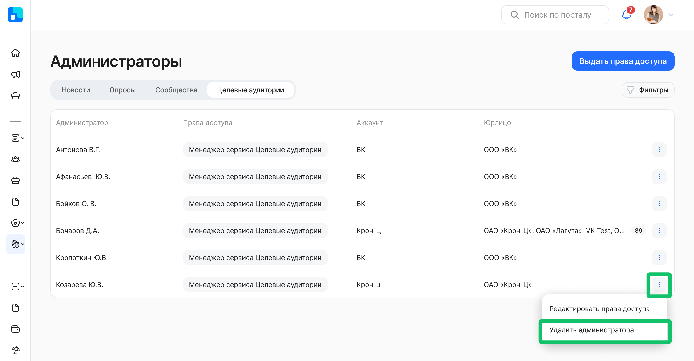

Чтобы работать в сервисе «Целевые аудитории», пользователю должна быть назначена роль **Менеджер сервиса Целевые аудитории** и/или **Администратор модуля Портал**.

Назначение роли **Менеджер сервиса Целевые аудитории** и управление правами доступа к сервису «Целевые аудитории» осуществляется в разделе **Социальные сервисы →** **Администраторы**.

## Выдача прав доступа

Пользователи с ролями **Администратор модуля Портал** и **Менеджер сервиса Целевые аудитории** могут выдавать права только тем аккаунтам и компаниям, к которым у этих пользователей есть доступ.

Выполните действия:
1. Перейдите в раздел **Социальные сервисы →** **Администраторы**.  
2. Нажмите кнопку **Выдать права доступа**.

### Назначение прав доступа на юрлица

На форме **Выдача прав доступа** выполните действия:

1. Выберите тип социального сервиса **Целевые аудитории** при наличии доступа к более чем одному сервису.  
2. Выберите наименование аккаунта, если у вашего пользователя есть доступ к нескольким аккаунтам.  
3. В настройке **Назначить права** выберите вариант **На юрлица аккаунта**. Права будут применены только к выбранным юрлицам.  
4. Выберите наименование юрлица, если у вашего пользователя есть доступ к нескольким компаниям.  
5. В поле **Администратор** выберите ФИО одного или нескольких пользователей.  
6. В поле **Права доступа** по умолчанию установлена роль **Менеджер сервиса Целевые аудитории**.  
7. При необходимости добавьте ещё один блок с правами доступа.  
8. Сохраните внесённые данные.

### Назначение прав доступа на весь аккаунт

На форме **Выдача прав доступа** выполните действия:

1. Выберите тип социального сервиса **Целевые аудитории** при наличии доступа к более чем одному сервису.  
2. Выберите наименование аккаунта, если у вашего пользователя есть доступ к нескольким аккаунтам.  
3. В настройке **Назначить права** выберите вариант **На весь аккаунт**. Права будут применены на текущие и новые юрлица аккаунта.  
4. В поле **Администратор** выберите ФИО одного или нескольких пользователей.  
5. В поле **Права доступа** по умолчанию установлена роль **Менеджер сервиса Целевые аудитории**.  
6. При необходимости добавьте ещё один блок с правами доступа.  
7. Сохраните внесённые данные.

## Редактирование прав доступа

Чтобы отредактировать уже назначенные права доступа, вернитесь к списку администраторов и напротив нужного администратора выберите действие **Редактировать права доступа**.

Чтобы изменить список компаний, к которым у выбранного администратора будет доступ, выполните действия:

1. На форме **Редактирование прав доступа** в поле **Юрлицо** добавьте или удалите наименование компании.  
2. Сохраните изменения.

Редактирование прав доступа будет запрещено в случаях:

* если у администратора есть доступ только к одному юрлицу аккаунта,  
* если у администратора есть права доступа на весь аккаунт.

Чтобы изменить права доступа для выбранного администратора, сначала удалите права доступа у этого администратора, а затем добавьте права доступа с новыми настройками.

## Удаление прав доступа

Чтобы удалить ранее назначенные права доступа, вернитесь к списку администраторов и напротив нужного администратора выберите действие **Удалить администратора**.

Подтвердите удаление прав доступа у выбранного администратора. 

