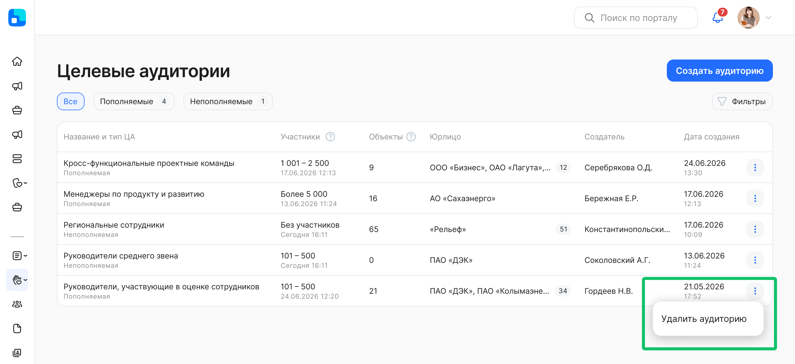
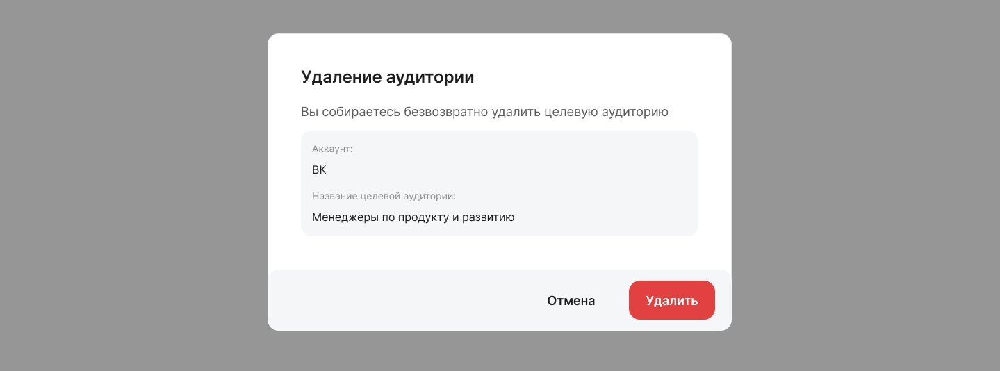
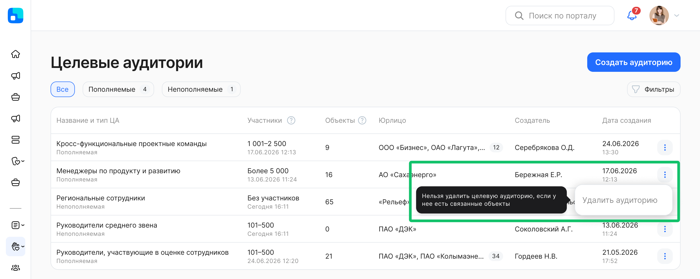

Перейдите к списку ЦА и напротив записи, которую хотите удалить, нажмите кнопку  и **Удалить аудиторию**. Подтвердите удаление.

Если ЦА уже была назначена хотя бы на один объект социального сервиса (новость или опрос), эту ЦА удалить нельзя. Чтобы удаление этой ЦА стало доступно, при редактировании объекта замените в нем эту ЦА на любую другую или измените на другую настройку видимости объекта. 

