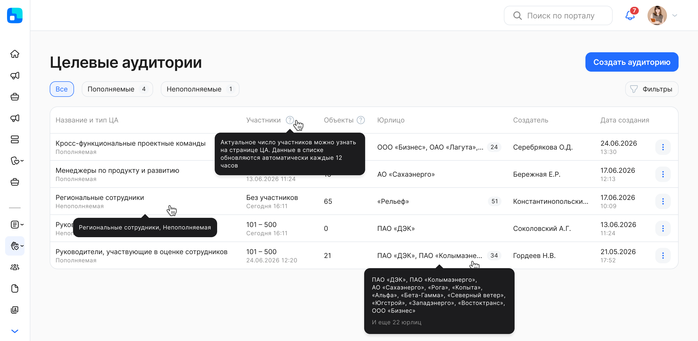
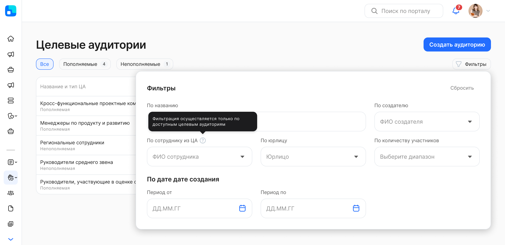

Раздел **Целевые аудитории** состоит из списка целевых аудиторий (ЦА). При нажатии на строку с целевой аудиторией происходит переход на страницу редактирования ЦА.  

По каждой ЦА в списке отображается следующая информация:  

1. **Название и тип ЦА**. Возможные типы: пополняемая и непополняемая.   
2. **Участники**. Количество участников в составе ЦА на момент последнего пересчета состава (при переходе на страницу редактирования ЦА всегда видно актуальное количество участников и их список, т.е. число участников в листинге и при просмотре настроек ЦА могут отличаться).  
3. **Объекты**. Число новостей и опросов, доступ к которым ограничен с помощью ЦА.   
4. **Юрлицо**. Все юрлица, выбранные в настройках ЦА.   
5. **Создатель**. ФИО создавшего ЦА в формате «Иванов И. И.»   
6. **Дата создания**. Дата создания ЦА в формате ДД.ММ.ГГГГ ЧЧ:ММ. 

Список целевых аудиторий можно отфильтровать по следующим параметрам:

* **По названию.** Укажите хотя бы один символ в поле.  
* **По сотруднику из ЦА.** Выбор ФИО одного сотрудника, который входит в доступные ЦА.  
* **По создателю.** Выбор ФИО пользователя, который создал ЦА в КЭДО.  
* **По юрлицу.** В случае если к вашему аккаунту привязано несколько юридических лиц, то в этом фильтре можно выбрать все юрлица или одно из них.   
* **По количеству участников.** Выбор одного диапазона: без участников, 1 - 100, 101 - 500 и т.д.   
* **По дате создания.** Выбор любой даты из открывшегося календаря. При этом нет необходимости указывать весь период, можно выбрать одну дату либо начала, либо окончания периода. 

