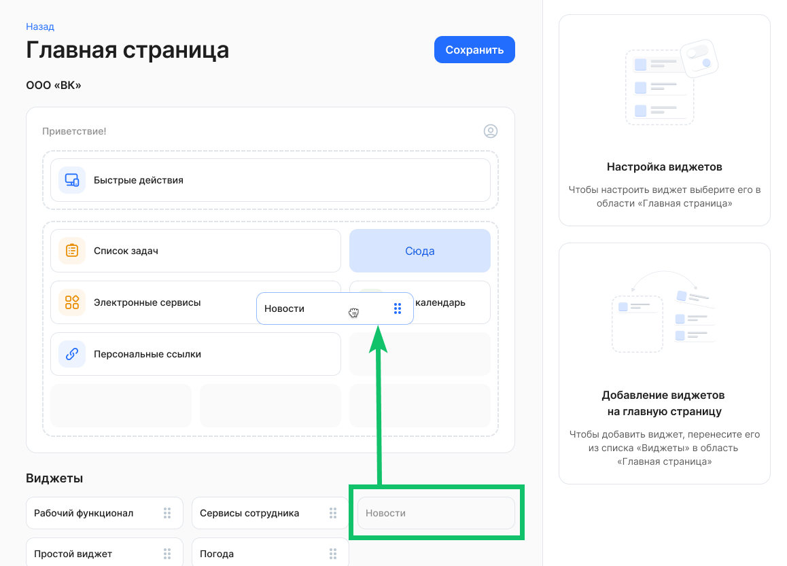
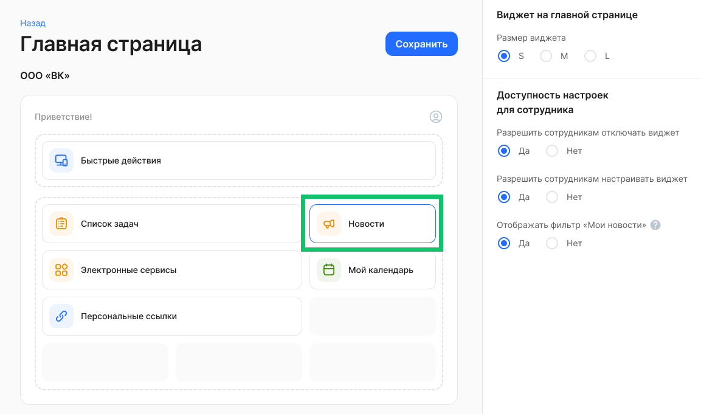
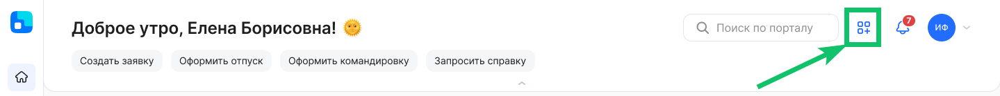
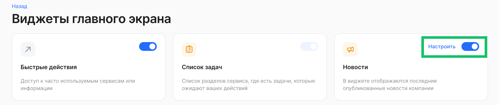
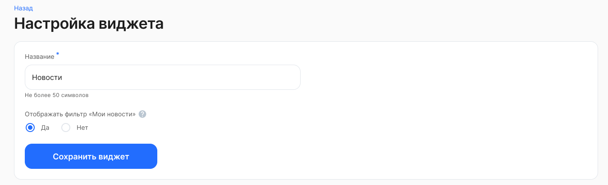
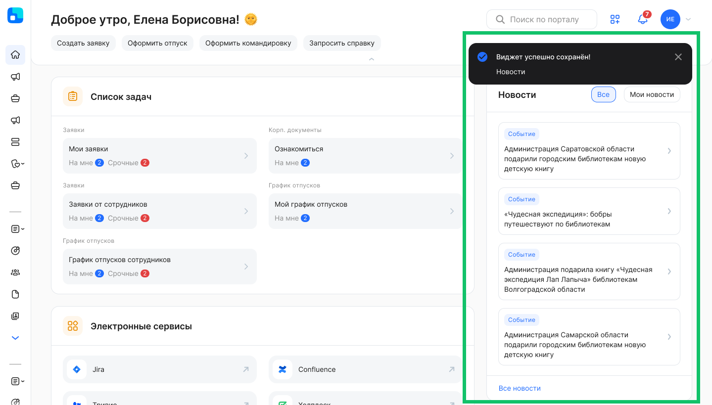

Виджет доступен для размещения на главной странице только в тех компаниях/аккаунтах, в которых включен сервис «Новости».

## Инструкция администратора

Для корректной настройки виджета пользователю должны быть добавлены роли «Администратор» и «Администратор главной страницы».

Для настройки расположения виджетов на главной странице:

* в рамках компании: перейдите в раздел **Настройки компании → Виджеты на главной странице** и нажмите кнопку **Настроить**;  
* в рамках аккаунта: перейдите в раздел **Настройки → Настройки аккаунта**, в блоке **Настройка интерфейса → Виджеты на главной странице** нажмите кнопку **Настроить**.

Для настройки виджета **Все новости**:

1. Перенесите виджет **Все новости** из блока **Виджеты для размещения** на основную область размещения виджетов.

2. Нажмите на виджет **Все новости** и выберите размер виджета и значения для настроек доступности:  
* Разрешить сотрудникам отключать виджет.  
* Разрешить сотрудникам настраивать виджет.  
* Отображать фильтр «Мои новости». При включенной опции в виджете появится возможность просматривать новости по фильтрам «Мои фильтры» и «Все».  
3. Сохраните изменения.

## Инструкция сотрудника

Если Администратор КЭДО включил возможность настраивать виджет **Все новости** сотрудникам, то:

1. Перейдите в раздел **Виджеты главного экрана**. Для этого нажмите кнопку .

2. Если для сотрудников была включена настройка отключать виджет, то переведите переключатель в активное или неактивное состояние.  
3. Если для сотрудников была включена возможность настраивать виджет, то нажмите кнопку **Настроить**.

4. На странице настройки виджета укажите название виджета (не более 50 символов) и включите/отключите отображение фильтра «Мои новости» на виджете.

5. Сохраните настройки виджета.

