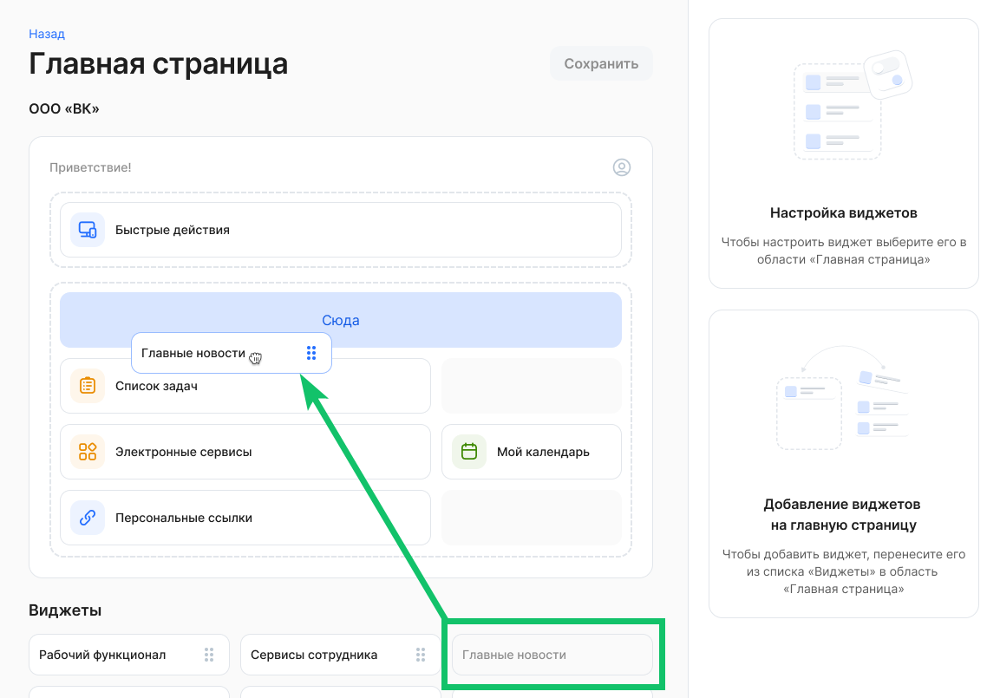
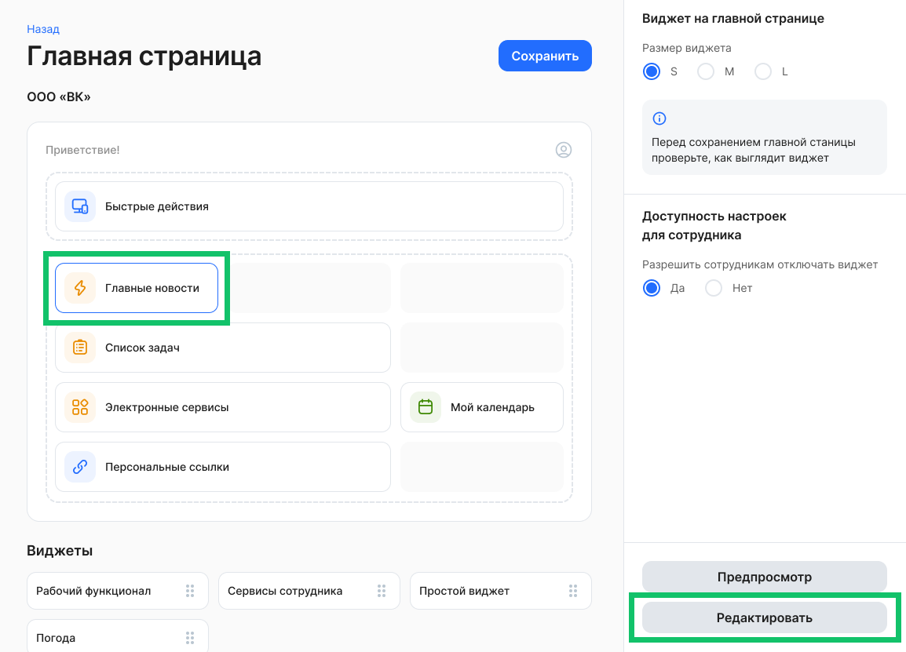
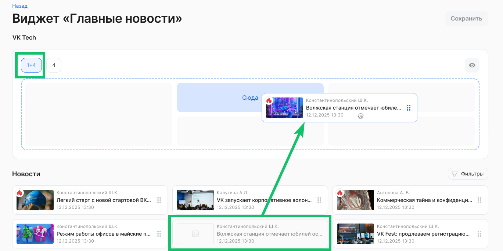
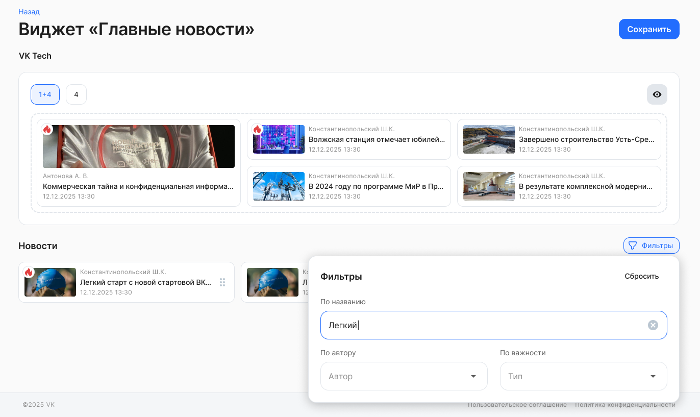
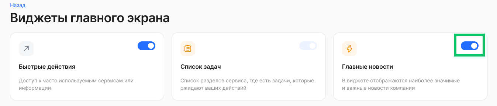
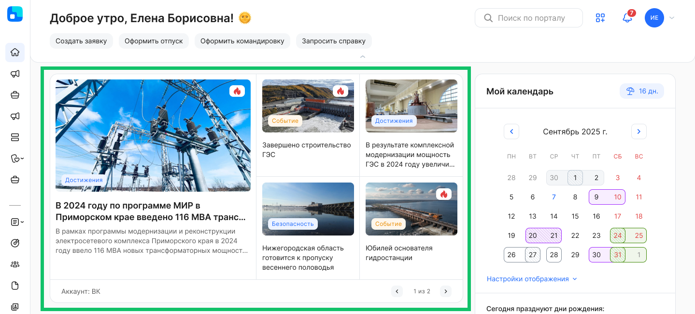

Виджет доступен для размещения на главной странице только в тех компаниях/аккаунтах, в которых включен сервис «Новости».

## Инструкция администратора

Для корректной настройки виджета пользователю должны быть добавлены роли «Администратор» и «Администратор главной страницы».

Для настройки расположения виджетов на главной странице:

* в рамках компании: перейдите в раздел **Настройки компании → Виджеты на главной странице** и нажмите кнопку **Настроить**;  
* в рамках аккаунта: перейдите в раздел **Настройки → Настройки аккаунта**, в блоке **Настройка интерфейса → Виджеты на главной странице** нажмите кнопку **Настроить**.

Для настройки общих параметров виджета **Главные новости**:

1. Перенесите виджет **Главные новости** из блока **Виджеты для размещения** на основную область размещения виджетов.

2. Нажмите на виджет **Главные новости** и выберите размер виджета и значение для настройки «Разрешить сотрудникам отключать виджет».  
3. Сохраните изменения.

Чтобы настроить контент виджета, пользователю должна быть дополнительно назначена роль «Редактор виджета Главные новости». 

Для управления контентом виджета:

1. Нажмите кнопку **Редактировать** на странице настройки виджетов или через пункт меню **Контент виджетов**, в виджете **Главные новости**.

2. В редакторе виджета выберите вариант размещения новостей:   
* **1+4 —** отображение одной крупной новости и 4-х маленьких,  
* **4** — отображение 4-х новостей одного размера.  
3. Перенесите выбранный объект из блока **Новости** на основную область размещения. Список новостей, который доступен для добавления на виджет, зависит от того, в каких рамках настроен виджет:   
- если это аккаунт — то новости, которые доступны пользователю в рамках аккаунта,  
- если это компания — то новости, которые доступны пользователям для этой компании.

4. Чтобы быстрее найти объекты в блоке **Новости** воспользуйтесь фильтрами:  
* по названию,  
* по автору,  
* по важности.   
5. Чтобы предварительно просмотреть как виджет будет отображен на главной странице, нажмите кнопку . Кнопка станет доступна после добавления хотя бы одного элемента на область размещения.   
6. После заполнения всех пустых ячеек на области размещения и перестановки элементов сохраните изменения. 

## Инструкция сотрудника

Если Администратор КЭДО включил возможность настраивать виджет **Главные новости** сотрудникам, то:

1. Перейдите в раздел **Виджеты главного экрана**. Для этого нажмите кнопку .

2. Если для сотрудников была включена настройка отключать виджет, то переведите переключатель в активное или неактивное состояние.

3. После включения виджет появится на главной странице. 

