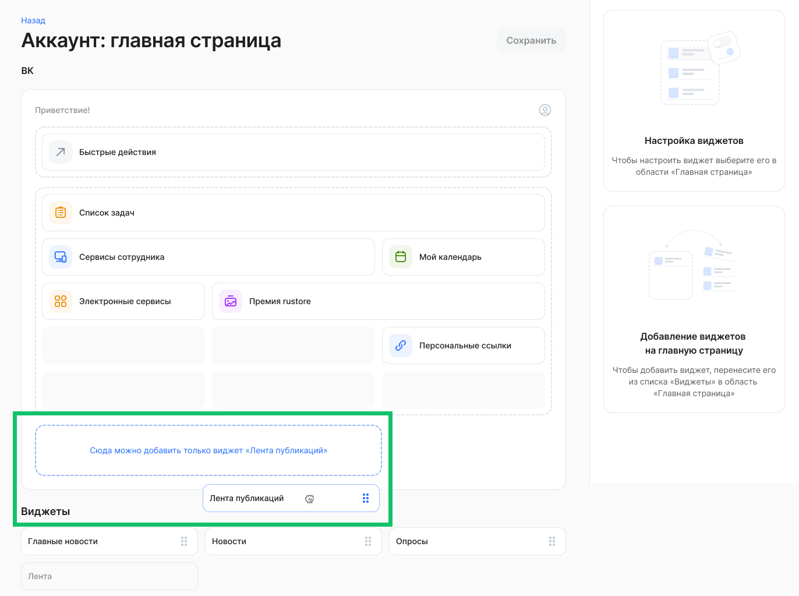
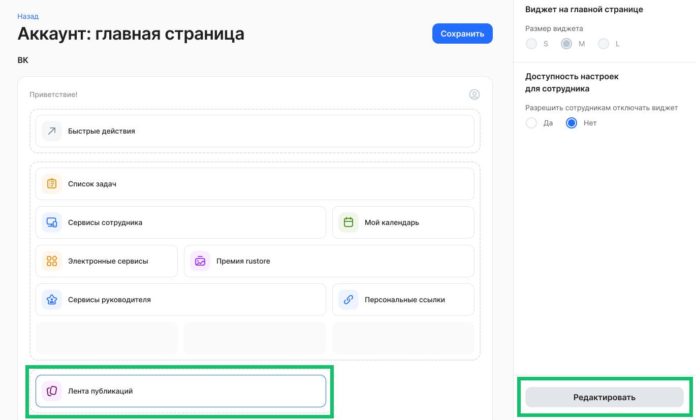
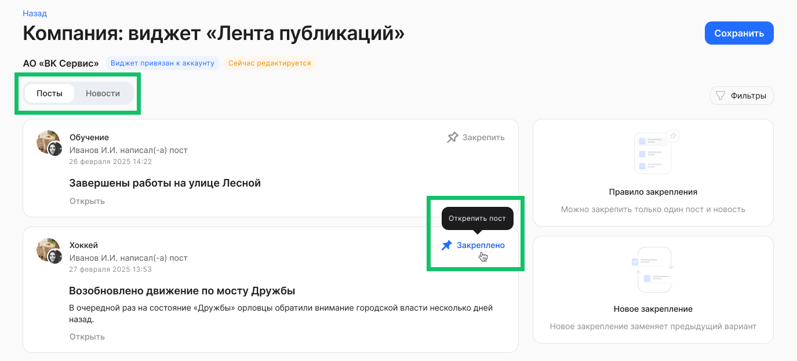
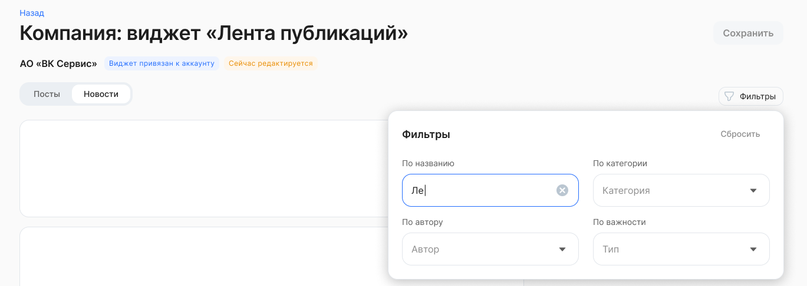
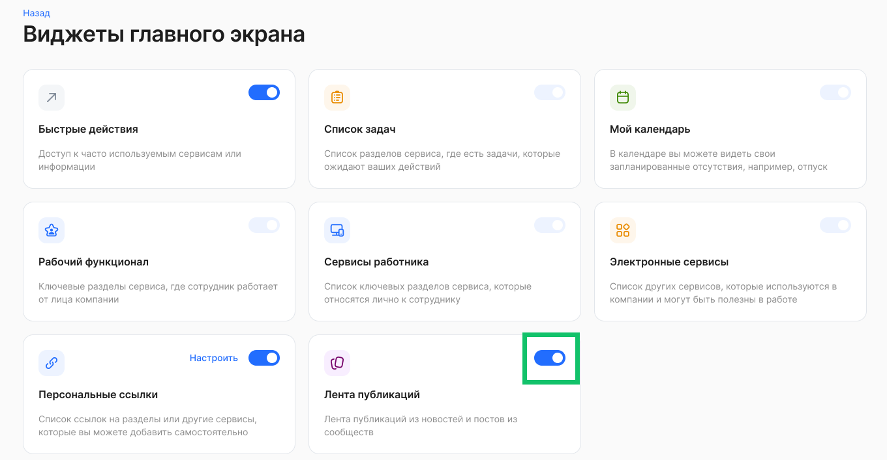
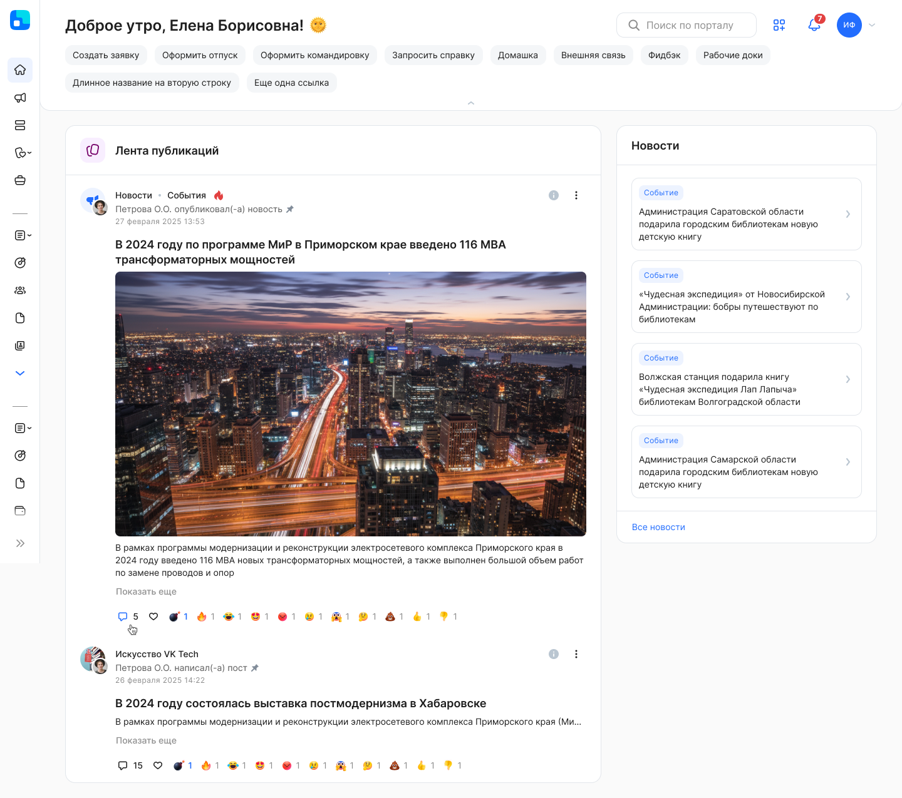

Виджет доступен для размещения на главной странице только в тех компаниях/аккаунтах, в которых включен сервис «Сообщества».

## Инструкция администратора

Для корректной настройки виджета пользователю должны быть добавлены роли «Администратор» и «Администратор главной страницы».

Для настройки расположения виджетов на главной странице:

* в рамках компании: перейдите в раздел **Настройки компании → Виджеты на главной странице** и нажмите кнопку **Настроить**;  
* в рамках аккаунта: перейдите в раздел **Настройки → Настройки аккаунта**, в блоке **Настройка интерфейса → Виджеты на главной странице** нажмите кнопку **Настроить**.

Для настройки общих параметров виджета **Лента публикаций**:

1. Перенесите виджет **Лента публикаций** из блока **Виджеты для размещения** на основную область размещения виджетов.

2. Нажмите на виджет **Лента публикаций** и выберите значение для настройки «Разрешить сотрудникам отключать виджет».  
3. Сохраните изменения.

Чтобы настроить контент виджета, пользователю должна быть дополнительно назначена роль «Редактор ленты публикаций». 

Для управления контентом виджета:

1. Нажмите кнопку **Редактировать** на странице настройки виджетов или в пункте меню **Контент виджетов**, на виджете **Лента публикаций**.

2. В редакторе виджета выберите объект, который хотите закрепить в виджете:   
* **Посты**.   
* **Новости**.

Список постов и новостей, который будет отображен на виджете, зависит от того, в каких рамках настроен виджет: 

- если это аккаунт — то посты и новости, которые доступны пользователю в рамках аккаунта,  
- если это компания — то посты и новости, которые доступны пользователям для этой компании.  
3. В выбранном объекте нажмите кнопку **Закрепить**. Если нужно открепить объект, нажмите кнопку **Закреплено** или на другом объекте нажмите кнопку **Закрепить**.  
Можно закрепить только один пост и новость. Новое закрепление заменит предыдущий вариант.

4. Чтобы быстрее найти пост или новость воспользуйтесь фильтрами:  
* по названию,  
* по автору,  
* по категории,  
* по важности.   
5. Сохраните изменения. 

## Инструкция сотрудника

Если Администратор КЭДО включил возможность настраивать виджет **Лента публикаций** сотрудникам, то:

1. Перейдите в раздел **Виджеты главного экрана**. Для этого нажмите кнопку .

2. Если для сотрудников была включена настройка отключать виджет, то переведите переключатель в активное или неактивное состояние.

3. После включения виджет появится на главной странице.

В ленте отображаются:

* новости, которые доступны пользователю в рамках аккаунта или компании;  
* все посты, доступные пользователю сообществ, на которые он подписан.

Лента публикаций может содержать следующие варианты закрепленных объектов: только или одну новость, или один пост, или одну новость и один пост вместе. 

