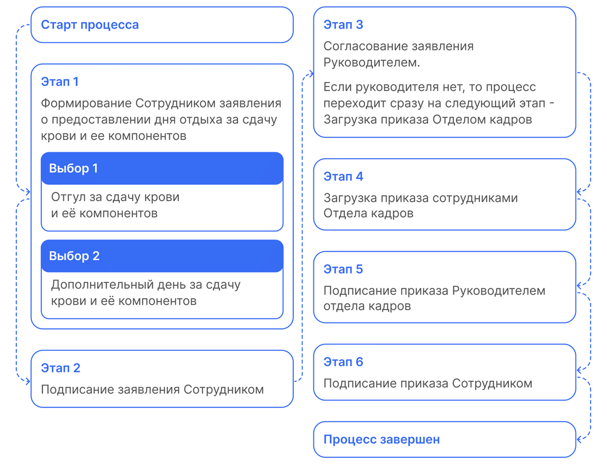
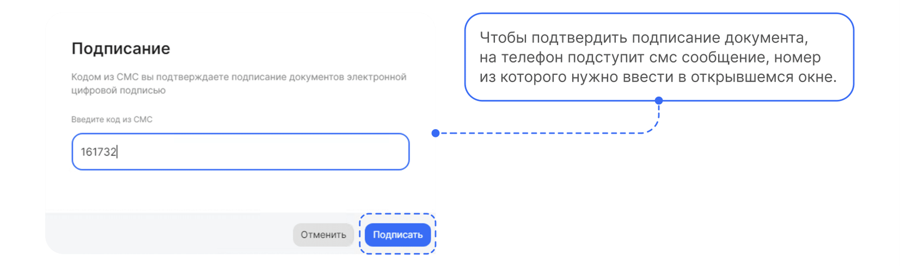
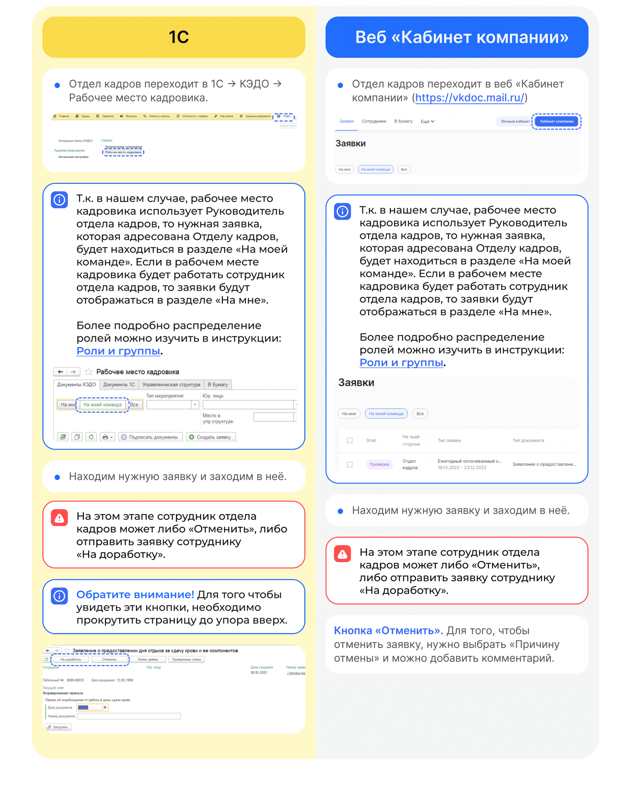
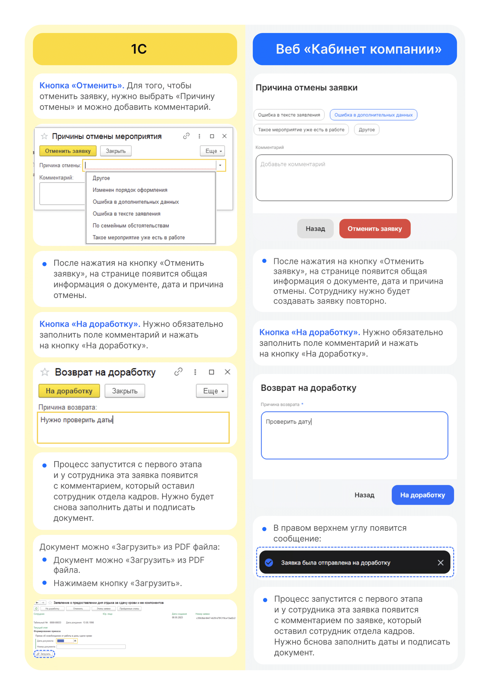
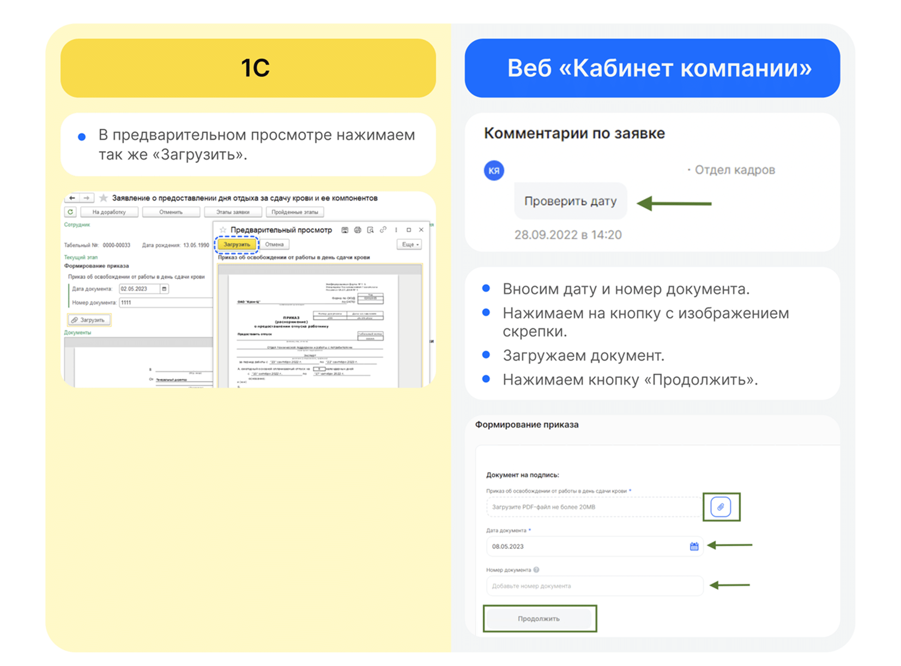
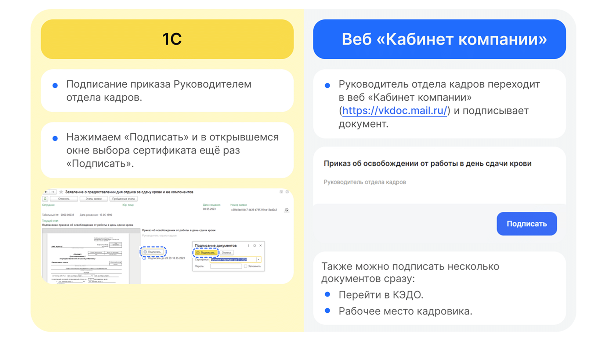
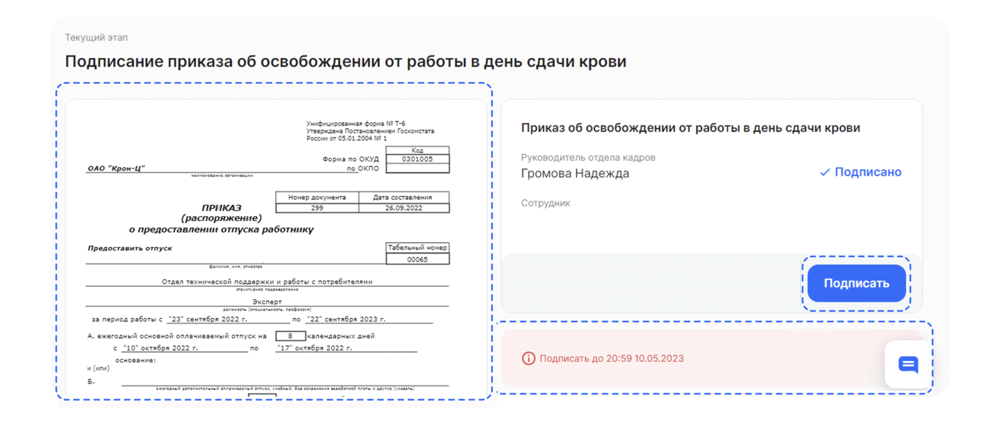

# Процесс «Заявление о предоставлении дня отдыха за сдачу крови и ее компонентов»

## Старт процесса

Чтобы подать заявление о предоставлении дня отдыха за сдачу крови и ее компонентов, Сотрудник:
1. Переходит в **Сервисы сотрудника** веб-сервиса, в раздел **Заявки**.
2. Нажимает кнопку **Создать заявку**.

3. Выбирает **Заявление о предоставлении дня отдыха за сдачу крови и ее компонентов**.
3. Нажимает **Подтвердить**.

## Этап 1. Формирование Сотрудником заявления о предоставлении дня отдыха за сдачу крови и ее компонентов

<info>

На этом этапе сотрудник выбирает компенсацию за отработанный день (дни). Нужно выбрать одну из кнопок **Отгул за сдачу** или **Доп. день отдыха**.

</info>

### Выбор 1. Отгул за сдачу крови и её компонентов

1. Сотрудник нажимает кнопку **Отгул за сдачу**. 

2. Формируется заявление об освобождении от работы в день сдачи крови. Сотрудник выбирает дату сдачи крови и нажимает кнопку **Перейти к предпросмотру**. Также на этом этапе можно отменить заявку.

<info>

Нужно выбрать только будущую дату, иначе заявка отменится по дедлайну

</info>

3. Если нужно отредактировать дату дня сдачи крови, нажимает **Редактировать**.

4. Проверяет сформированное заявление и нажимает **Продолжить** справа внизу.

### Выбор 2. Дополнительный день за сдачу крови и её компонентов

1. Формируется заявление о предоставлении дополнительного дня. Сотрудник заполняет необходимые поля в форме заявления.

2. Сотрудник переходит к предпросмотру заявления, проверяет сформированный документ, нажимает **Продолжить**.

## Этап 2. Подписание заявления Сотрудником 

Сотрудник подписывает заявление.

1. Сотрудник нажимает **Подписать**.

2. Вводит код из СМС (если требуется подписание через УНЭП) и нажимает кнопку **Подписать**.

3. На странице появляется сообщение о том, что заявление подписано и заявка перешла на следующий этап.

## Этап 3. Согласование заявления Руководителем

<warn>

Если руководителя нет, то бизнес-процесс переходит сразу на следующий этап — Загрузка приказа Отделом кадров.

На данном этапе сотрудник с ролью **Отдел кадров** ознакомляется с документами и нажимает кнопку **Подтвердить**, либо может **Отменить заявку**. В случае отмены заявки, процесс стартует с первого этапа формирования заявления сотрудником.

</warn>

1. Руководитель переходит в **Сервисы компании**, в раздел **Заявки**.
2. Открывает нужную заявку.
3. Нажимает **Подтвердить**.

## Этап 4. Загрузка приказа сотрудниками Отдела кадров

Отдел кадров может работать с заявкой и в 1С, и в **Сервисaх компании** веб-сервиса VK HR Tek.

## Этап 5. Подписание приказа Руководителем отдела кадров

## Этап 6. Подписание приказа Сотрудником

1. Сотруднику поступает уведомление на телефон о том, что нужно подписать документ.
2. Сотрудник переходит в **Сервисы сотрудника** в веб-сервисе, в раздел **Заявки**.
3. Открывает заявку.
4. Нажимает **Подписать**.

Чтобы подтвердить подписание документа, на телефон подступит СМС-сообщение (если УНЭП), код из которого нужно ввести в открывшемся окне и нажать кнопку **Подписать**.
