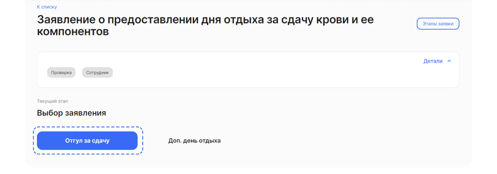

# Процесс «Заявление о предоставлении дня отдыха за сдачу крови и ее компонентов»

## Старт процесса

Чтобы подать заявление о предоставлении дня отдыха за сдачу крови и ее компонентов, Сотрудник:
1. Переходит в **Сервисы сотрудника веб-сервиса VK HR Tek**, в раздел **Заявки**.
2. Нажимает кнопку **Создать заявку**.

3. Выбирает **Заявление о предоставлении дня отдыха за сдачу крови и ее компонентов**.
3. Нажимает **Подтвердить**.

## Этап 1. Формирование Сотрудником заявления о предоставлении дня отдыха за сдачу крови и ее компонентов

<info>

На этом этапе сотрудник выбирает компенсацию за отработанный день (дни). Нужно выбрать одну из кнопок **Отгул за сдачу** или **Доп. день отдыха**.

</info>

### Выбор 1. Отгул за сдачу крови и её компонентов

1. Сотрудник нажимает кнопку **Отгул за сдачу**. Также на этом этапе можно отменить заявку.

2. Формируется заявление об освобождении от работы в день сдачи крови. Нужно выбрать дату сдачи крови и нажимаем кнопку **Перейти к просмотру**.

<info>

Нужно выбрать только будущую дату, иначе заявка отмениться по дедлайну.

</info>

3. Если нужно отредактировать дату дня сдачи крови, нажимает **Редактировать**.

4. Проверяет сформированное заявление и нажимает **Продолжить** справа внизу.

### Выбор 2. Дополнительный день за сдачу крови и её компонентов

1. Формируется заявление о предоставлении дополнительного дня.

2. Проверяет сформированный документ, нажимаем **Продолжить**.

### Этап 2. Подписание заявления Сотрудником 

Теперь нужно подписать заявление.

1. Сотрудник нажимает **Подписать**.

2. Вводит код из смс и нажимаем кнопку **Подписать**.

3. На странице появляется сообщение о том, что заявление подписано и заявка перешла на следующий этап.

## Этап 3. Согласование заявления Руководителем

1. Руководитель переходит в **Сервисы компании**, в раздел **Заявки**.

<warn>

На данном этапе сотрудник с ролью **Отдел кадров** ознакомляется с документами и нажимает кнопку **Подтвердить** либо может **Отменить заявку**. В случае отмены заявки, процесс стартует
с первого этапа формирования заявления сотрудником.

</warn>

2. Открывает нужную заявку.
3. Нажимает **Подтвердить**.

## Этап 4. Загрузка приказа сотрудниками Отдела кадров

Отдел кадров может работать с заявкой и в 1С, и в **Сервисaх компании веб-сервиса VK HR Tek**.

## Этап 5. Подписание приказа Руководителем отдела кадров

## Этап 6. Подписание приказа Сотрудником

1. Сотруднику поступает уведомление на телефон о том, что нужно подписать документ.
2. Сотрудник переходит в **Сервисы сотрудника в веб-сервисе**, в раздел **Заявки**.
3. Открывает заявку.
4. Нажимает **Подписать**.

Чтобы подтвердить подписание документа, на телефон подступит смс-сообщение, код из которого нужно ввести в открывшемся окне и нажать кнопку **Подписать**.
