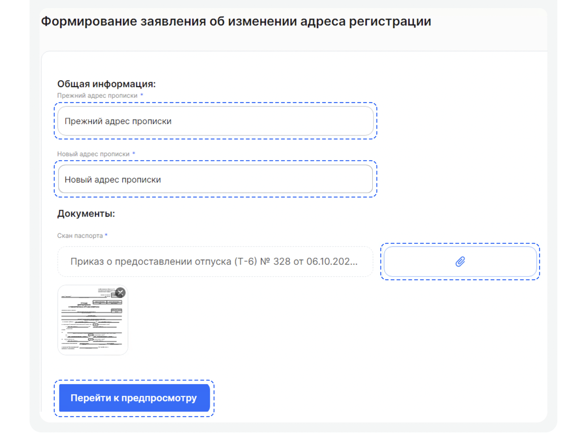
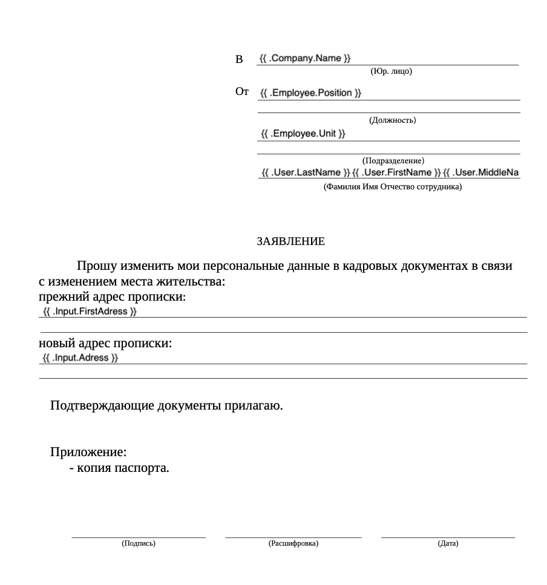
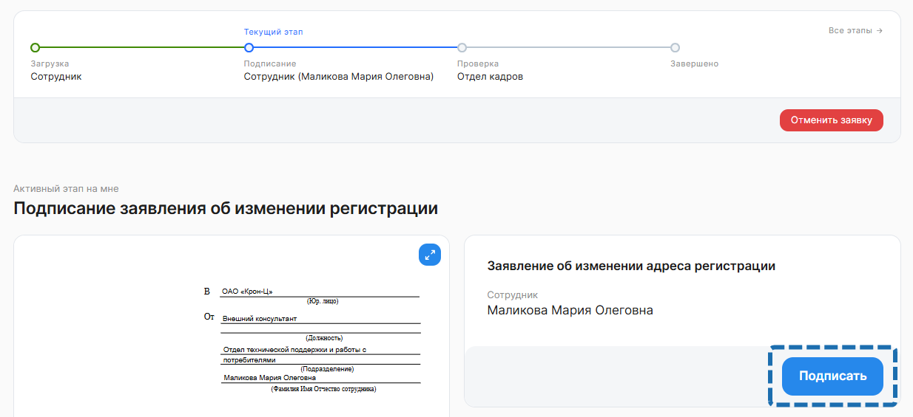
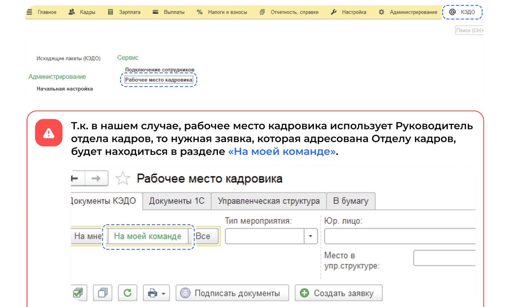
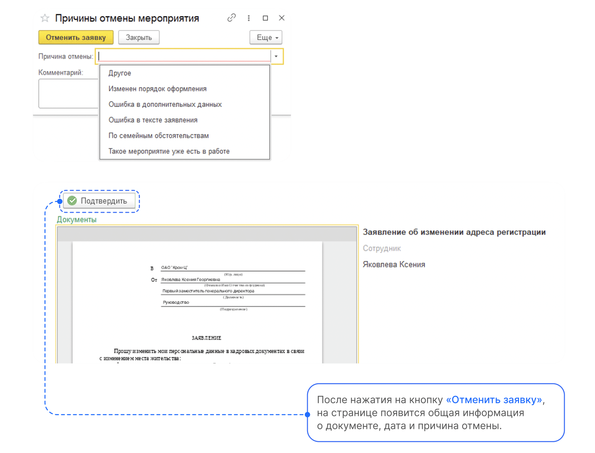
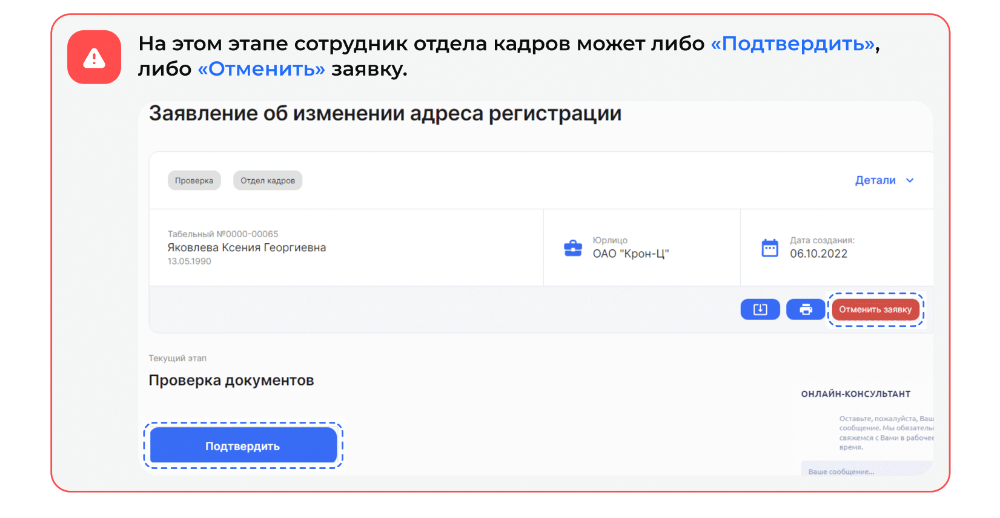
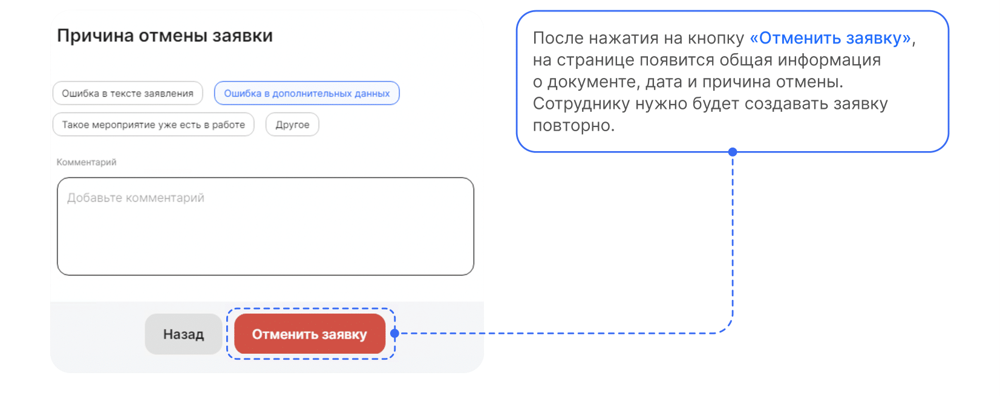

# Процесс «Заявление об изменении адреса регистрации»

## Старт процесса

Чтобы подать заявление об изменении адреса регистрации, Сотрудник:
1. Переходит в **Мои сервисы** веб-сервиса VK HR Tek, в раздел **Заявки**.
2. Нажимает кнопку **Создать заявку**.
3. Выбирает **Заявление об изменении адреса регистрации**.
4. Нажимает кнопку **Создать**.

## Этап 1. Формирование Сотрудником заявления об изменении адреса регистрации

1. Для формирования заявления Сотрудник заполняет пустые поля: **Прежний адрес прописки**, **Новый адрес прописки**.
6. Добавляет скан паспорта.
7. Нажимает кнопку **Перейти к предпросмотру**.

4. Проверяет заявление и нажимает кнопку **Продолжить**.

Шаблон заявления
 

## Этап 2. Подписание заявления Сотрудником

В открывшемся окне Сотрудник нажимает кнопку **Подписать**. Тип подписи: ПЭП.

## Этап 3. Проверка заявления Отделом кадров

Отдел кадров может работать с заявкой и в **1С**, и в **Сервисах компании** веб-сервиса VK HR Tek.

### Работа через 1С

Если в **Сервисах компании → Заявки** будет работать сотрудник отдела кадров, то заявки будут отображаться в разделе **На мне**.

На этом этапе сотрудник отдела кадров может либо **Подтвердить**, либо **Отменить** заявку.

1. Если требуется отменить заявку, специалист нажимает кнопку **Отменить**, выбирает **Причину отмены** и добавляет комментарий.

2. Если требуется вернуть заявку на доработку сотруднику, кадровый специалист обязательно заполняет поле комментарий и нажимает на кнопку **На доработку**.

3. Если специалист отдела кадров при проверке заявления не нашел ошибки, то он вручную изменяет адрес регистрации в карточке сотрудника в 1С, а затем нажимает кнопку **Подтвердить** в заявке.

### Работа через веб-сервис

1. Отдел кадров переходит в **Сервисы компании веб-сервиса VK HR Tek**, в раздел **Заявки**.

<warn>

Т.к. в данном случае **Сервисы компании → Заявки** использует Руководитель отдела кадров, то нужная заявка, которая адресована Отделу кадров, будет находиться в разделе **На моей команде**.
Если в **Сервисах компании → Заявки** будет работать сотрудник отдела кадров, то заявки будут отображаться в разделе **На мне**.

</warn>

2. Специалист находит нужную заявку и заходит в неё.

3. Если требуется отменить заявку, специалист нажимает кнопку **Отменить**, выбирает **Причину отмены** и добавляет комментарий.

4. Если требуется вернуть заявку на доработку сотруднику, кадровый специалист обязательно заполняет поле с комментарием и нажимает на кнопку **На доработку**.

5. Если специалист отдела кадров при проверке заявления не нашел ошибки, то он вручную изменяет адрес регистрации в карточке сотрудника в 1С, а затем нажимает кнопку **Подтвердить** в заявке.

