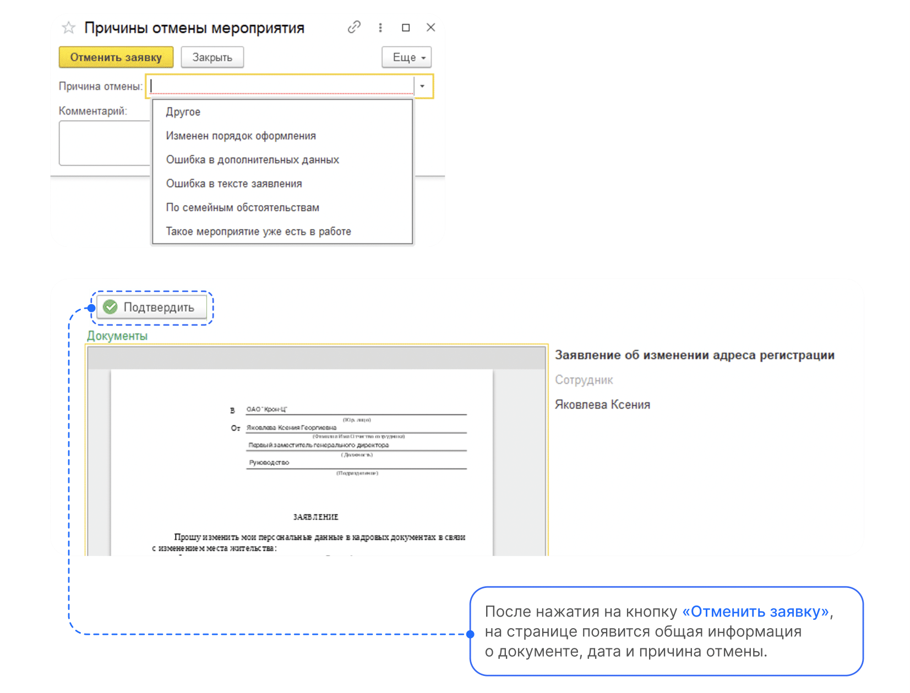

# Процесс «Заявление об изменении адреса регистрации»

## Старт процесса

Чтобы подать заявление об изменении адреса регистрации, Сотрудник:
1. Переходит в **Сервисы сотрудника веб-сервиса VK HR Tek**, в раздел **Заявки**.
2. Нажимает кнопку **Создать заявку**.
3. Выбирает **Заявление об изменении адреса регистрации**.
4. Нажимает кнопку **Подтвердить**.

## Этап 1. Формирование Сотрудником заявления об изменении адреса регистрации

1. Для формирования заявления Сотрудник заполняет пустые поля: **Прежний адрес прописки**, **Новый адрес прописки**.
6. Добавляет документ.
7. Нажимает кнопку **Перейти к предпросмотру**.

4. Проверяет заявление и нажимает кнопку **Продолжить**.

## Этап 2. Подписание заявления Сотрудником

1. В открывшемся окне нажимает кнопку **Подписать**.

## Этап 3. Проверка заявления Отделом кадров

Отдел кадров может работать с заявкой и в 1С, и в **Сервисах компании веб-сервиса VK HR Tek**.

Если в **Сервисах компании → Заявки** будет работать сотрудник отдела кадров, то заявки будут отображаться в разделе **На мне**.

На этом этапе сотрудник отдела кадров может либо **Подтвердить**, либо **Отменить** заявку.

Если требуется отменить заявку, специалист нажимает кнопку **Отменить**, выбирает **Причину отмены** и добавляет комментарий.

## Работа через веб-сервис

1. Отдел кадров переходит в **Сервисы компании веб-сервиса VK HR Tek**, в раздел **Заявки**.

<warn>

Т.к. в данном случае **Сервисы компании → Заявки** использует Руководитель отдела кадров, то нужная заявка, которая адресована Отделу кадров, будет находиться в разделе **На моей команде**.
Если в **Сервисах компании → Заявки** будет работать сотрудник отдела кадров, то заявки будут отображаться в разделе **На мне**.

</warn>

2. Специалист находит нужную заявку и заходит в неё.

3. Если требуется отменить заявку, специалист нажимает кнопку **Отменить**, выбирает **Причину отмены** и добавляет комментарий.

4. Сотрудник отдела кадров нажимает кнопку **Подтвердить**.

