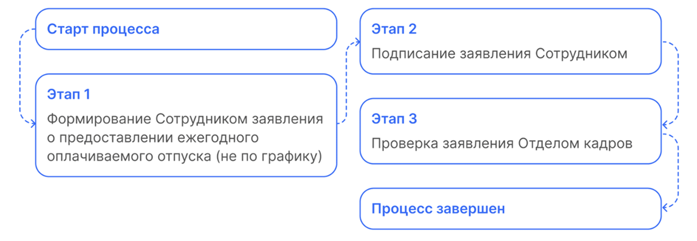
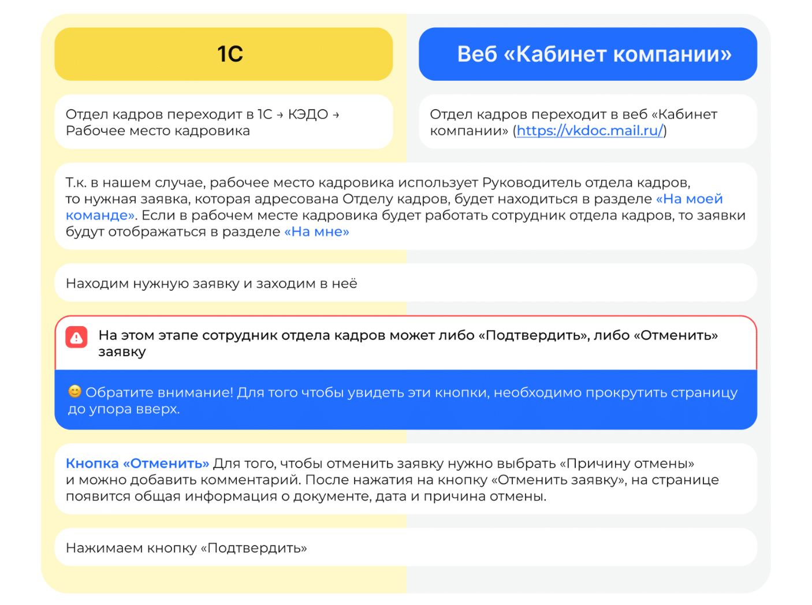

# Процесс «Заявление об изменении банковских реквизитов"

## Старт процесса

Чтобы подать заявление об изменении банковских реквизитов, Сотрудник:
1. Заходит в **Сервисы сотрудника веб-сервиса VK HR Tek**, в раздел **Заявки**.
 2. Нажимает кнопку **Создать заявку**.
 3. Выбирает **Заявление об изменении банковских реквизитов**.
 4. Нажимает **Подтвердить**.

## Этап 1. Формирование Сотрудником заявления о предоставлении ежегодного оплачиваемого отпуска (не по графику)

1. Сотрудник указывает **Номер расчетного счета**, **Наименование банка**, **БИК**.
2. Загружает файл с банковскими реквизитами и нажимает кнопку **Перейти к просмотру**.
3. Далее **Перейти к предпросмотру**.
4. Нажимает **Продолжить**.

## Этап 2. Подписание заявления Сотрудником

Чтобы подтвердить подписание документа, на телефон подступит смс сообщение, номер из которого нужно ввести в открывшемся окне и нажать кнопку **Подписать**.

1. Сотрудник проверяет документ.
6. Нажимает **Подписать**.

## Этап 3. Проверка заявления Отделом кадров

Отдел кадров может работать с заявкой и в **1С**, и в **Сервисы компании веб-сервиса VK HR Tek**.

