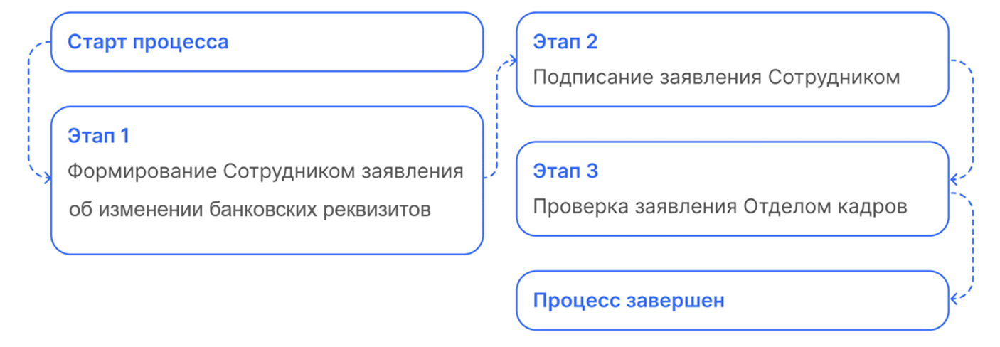
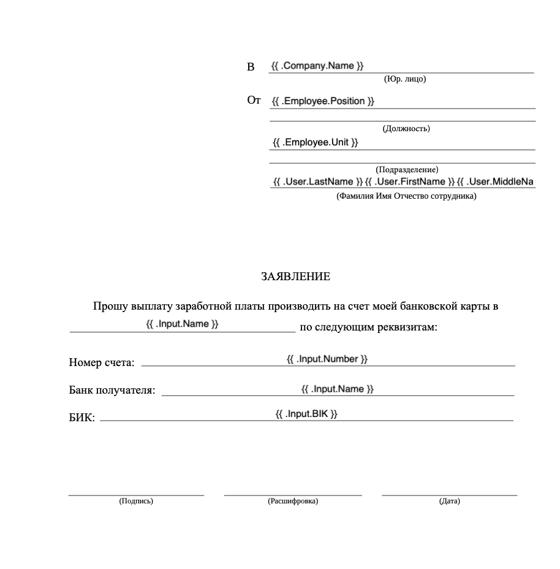
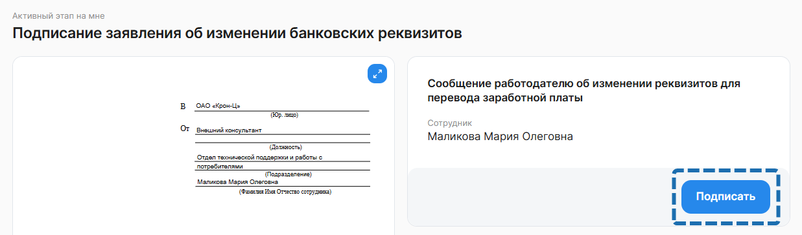
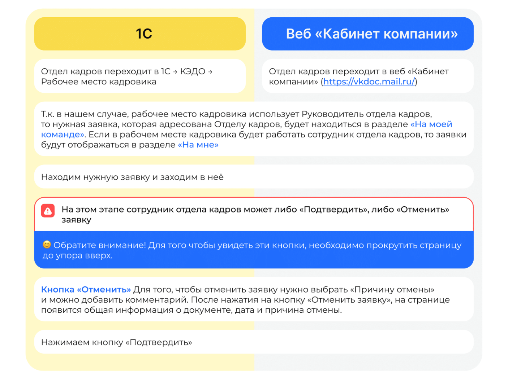

# Процесс «Заявление об изменении банковских реквизитов"

## Старт процесса

Чтобы подать заявление об изменении банковских реквизитов, Сотрудник:
1. Заходит в **Мои сервисы** веб-сервиса VK HR Tek, в раздел **Заявки**.
2. Нажимает кнопку **Создать заявку**.
3. Выбирает **Заявление об изменении банковских реквизитов**.
4. Нажимает **Создать**.

## Этап 1. Формирование Сотрудником заявления об изменении банковских реквизитов

1. Сотрудник указывает **Номер расчетного счета**, **Наименование банка**, **БИК**.
2. Загружает файл с банковскими реквизитами.
3. Нажимает кнопку **Перейти к предпросмотру**.
4. Нажимает **Продолжить**.

Шаблон заявления
 

## Этап 2. Подписание заявления Сотрудником

1. Сотрудник проверяет документ.
2. Нажимает **Подписать**. Тип подписи: ПЭП.

## Этап 3. Проверка заявления Отделом кадров

Отдел кадров может работать с заявкой и в **1С**, и в **Сервисы компании** веб-сервиса VK HR Tek.

Если требуется вернуть заявку на доработку сотруднику, кадровый специалист обязательно заполняет поле с комментарием и нажимает на кнопку **На доработку**.

Если специалист отдела кадров при проверке заявления не нашел ошибки, то он вручную изменяет банковские реквизиты в карточке сотрудника в 1С, а затем нажимает кнопку **Подтвердить** в заявке.