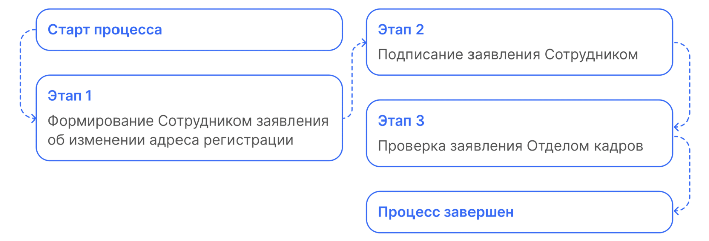
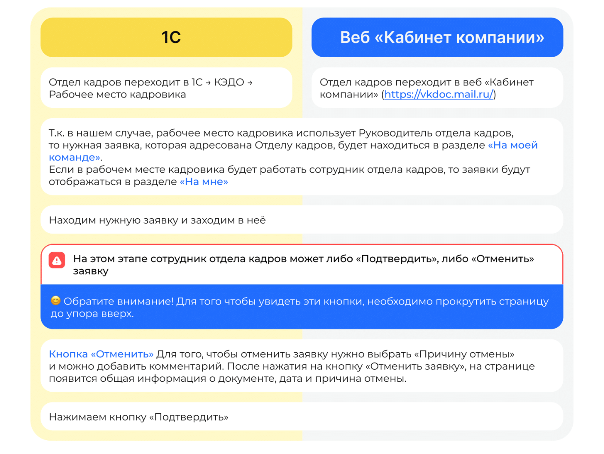

# Процесс «Заявление об изменении паспортных данных»

## Старт процесса

Чтобы подать заявление об изменении паспортных данных, Сотрудник:
1. Заходит в **Сервисы сотрудника веб-сервиса VK HR Tek**, в раздел **Заявки**. 
2. Нажимает кнопку **Создать заявку**.
3. Выбирает **Заявление об изменении паспортных данных**.
4. Нажимает **Подтвердить**.

## Этап 1. Формирование Сотрудником заявления об изменении адреса регистрации

1. Для формирования заявления Сотрудник загружает скан нового паспорта и нажимает кнопку **Перейти к просмотру**.
2. Проверяет заявление и нажимает кнопку **Продолжить**.

## Этап 2. Подписание заявления Сотрудником

Чтобы подтвердить подписание документа, на телефон подступает смс сообщение, код из которого нужно ввести в открывшемся окне и нажать кнопку **Подписать**.

## Этап 3. Проверка заявления Отделом кадров

Отдел кадров может работать с заявкой и в **1С**, и в **Сервисы компании веб-сервиса VK HR Tek**.

