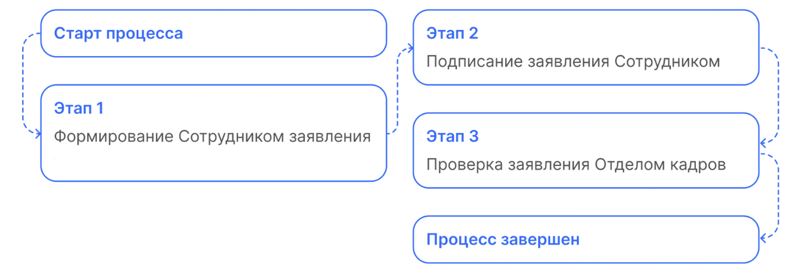
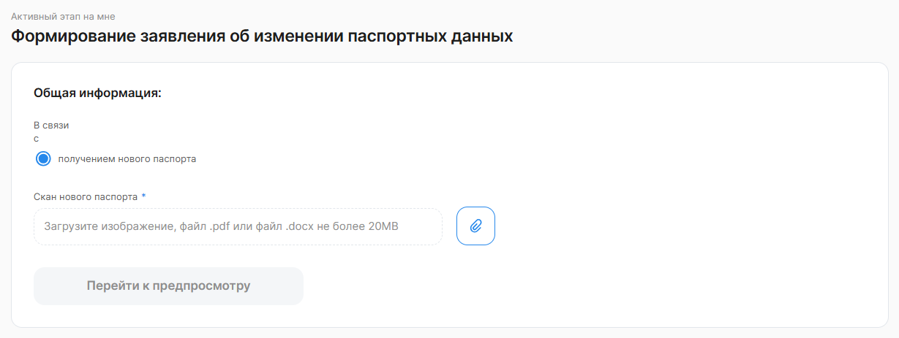
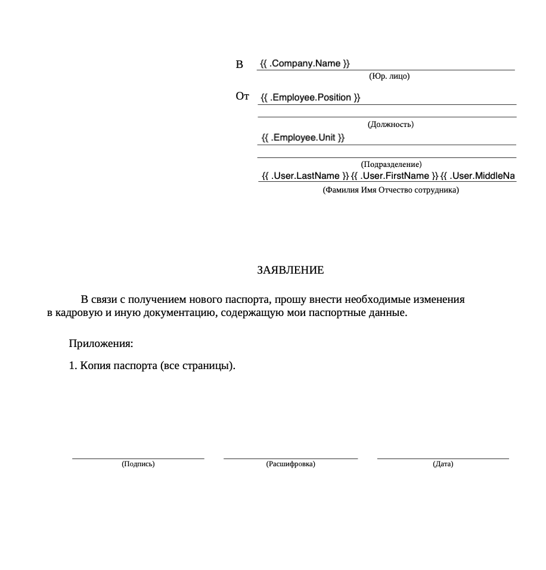
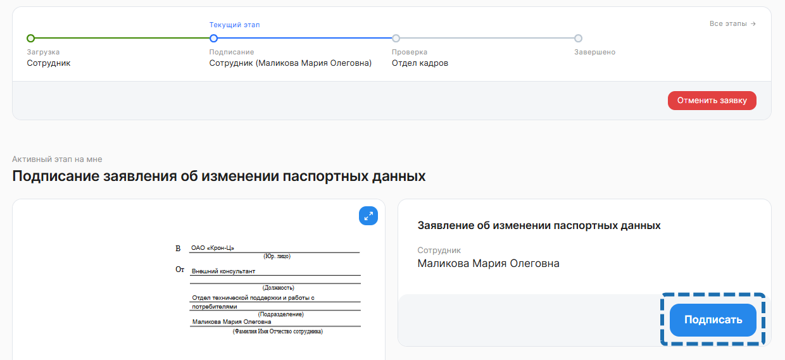
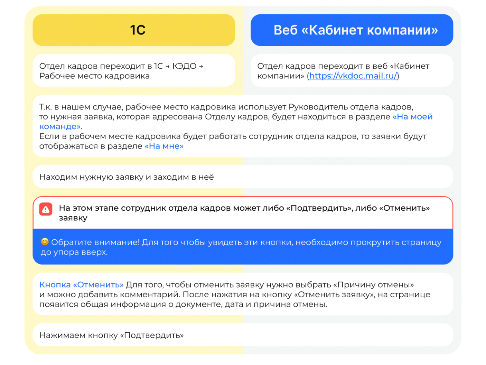

# Процесс «Заявление об изменении паспортных данных»

## Старт процесса

Чтобы подать заявление об изменении паспортных данных, Сотрудник:
1. Заходит в **Мои сервисы** веб-сервиса VK HR Tek, в раздел **Заявки**. 
2. Нажимает кнопку **Создать заявку**.
3. Выбирает **Заявление об изменении паспортных данных**.
4. Нажимает **Создать**.

## Этап 1. Формирование Сотрудником заявления об изменении паспортных данных

1. Для формирования заявления Сотрудник загружает скан нового паспорта и нажимает кнопку **Перейти к предпросмотру**.
2. Проверяет заявление и нажимает кнопку **Продолжить**.

Шаблон заявления
 

## Этап 2. Подписание заявления Сотрудником

После проверви заявления Сотрудник нажимает кнопку **Подписать**. Тип подписи: ПЭП.

## Этап 3. Проверка заявления Отделом кадров

Отдел кадров может работать с заявкой и в **1С**, и в **Сервисы компании** веб-сервиса VK HR Tek.

Если требуется вернуть заявку на доработку сотруднику, кадровый специалист обязательно заполняет поле с комментарием и нажимает на кнопку **На доработку**.

Если специалист отдела кадров при проверке заявления не нашел ошибки, то он вручную изменяет данные в карточке сотрудника в 1С, а затем нажимает кнопку **Подтвердить** в заявке.
