# Процесс «Заявление о предоставлении материальной помощи»

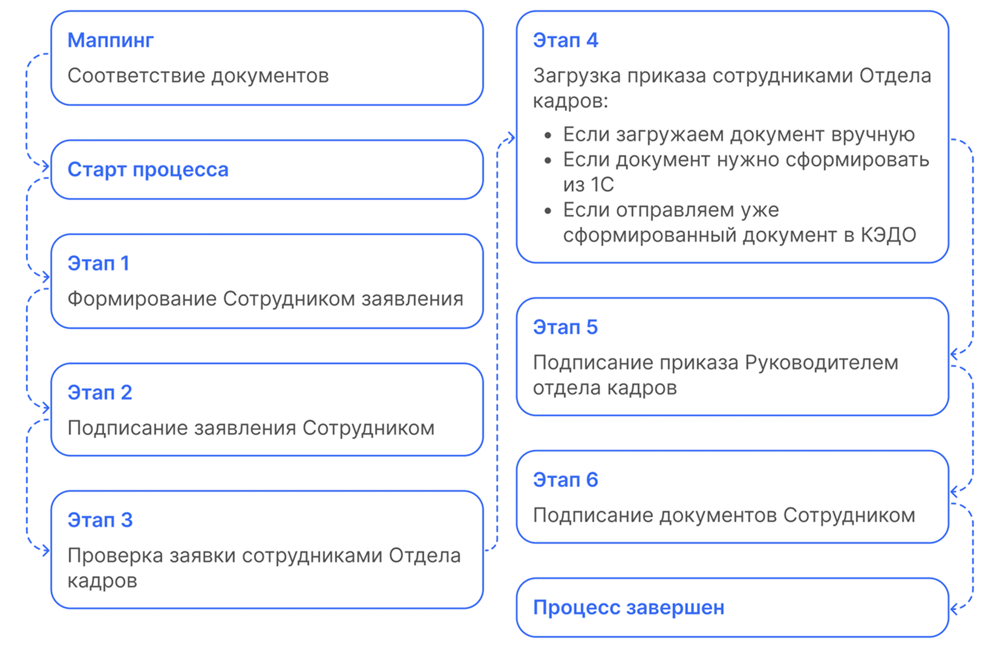

## Настройка соответствия документов 1С и КЭДО

На этапе формирования документов в заявке некоторые документы можно сформировать автоматически. Для этого в начальных настройках нужно проставить соответствие документов (маппинг).

1. Кадровый специалист переходит в 1С, в **КЭДО** → **Начальная настройка КЭДО** → **Соответствие документов**.
2. В колонке **Документ КЭДО** кликает два раза по полю напротив нужного документа **1С** и нажимает троеточие.

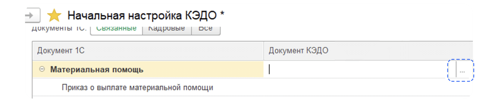

3. Для документа 1С «Материальная помощь» выбирает документ КЭДО «Заявление о предоставлении материальной помощи». 
4. Нажимает **ОК**.

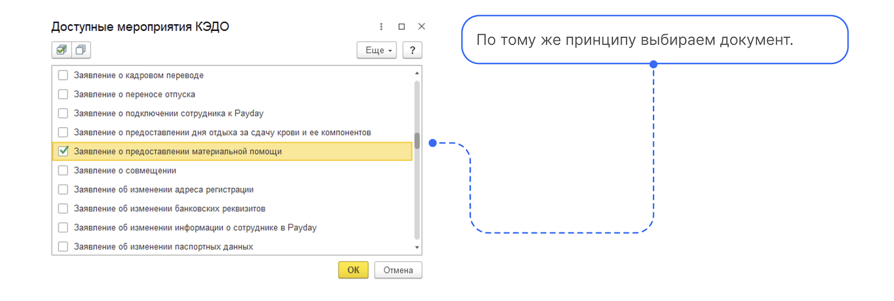

5. Нажимает **Сохранить изменения**.

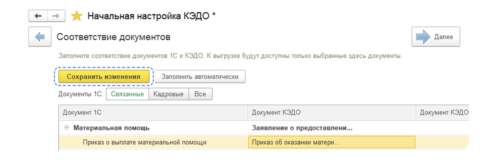

## Старт процесса
Чтобы подать заявление о предоставлении материальной помощи, Сотрудник:
1. Заходит в **Мои сервисы** веб-сервиса VK HR Tek, в раздел **Заявки**.

2. Нажимает кнопку **Создать заявку**.

3. Выбирает **Заявление о предоставлении материальной помощи**.
4. Нажимает **Создать**.

## Этап 1. Формирование Сотрудником заявления

1. Для формирования заявления из выпадающего списка сотрудник выбирает причину предоставления материальной помощи.

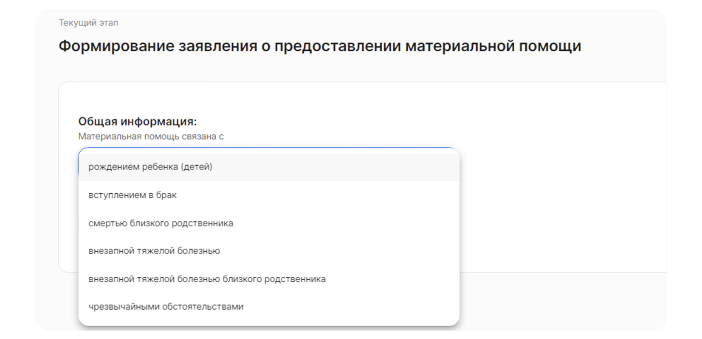

2. Далее в соотвествии с выбранной причиной загружает подтверждающий документ. Прикладываемый файл:
- Свидетельство о рождении ребенка (детей) (мультифайловый),
- Свидетельство о браке,
- Свидетельство о смерти,
- Документ, подтверждающий родство,
- Выписка из истории болезни (или другие документы подтверждающие необходимость лечения),
- Документ, подтверждающий факт наступления ЧС.
3. После загрузки документа нажимает **Перейти к предпросмотру**.

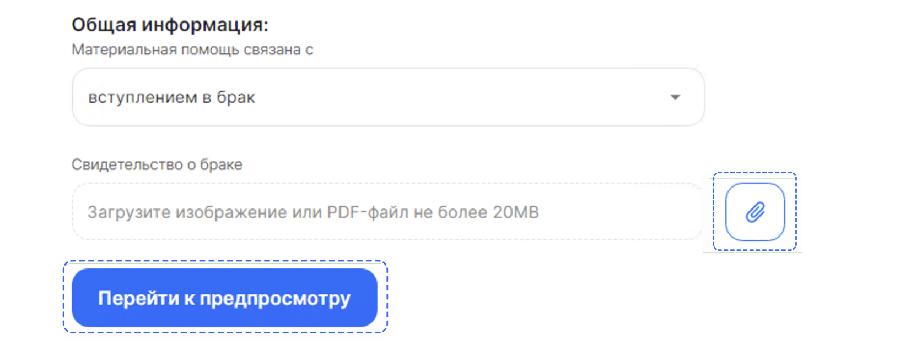

4. Проверяет заявление, если всё корректно, нажимает кнопку **Продолжить**.

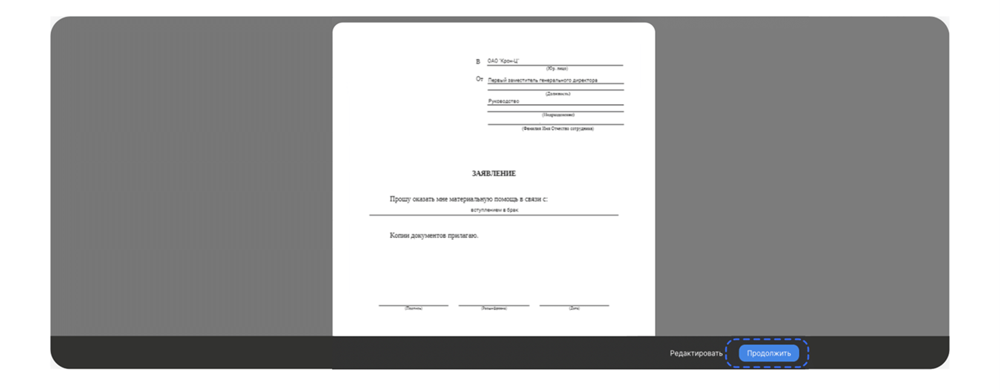

Шаблон заявления
 

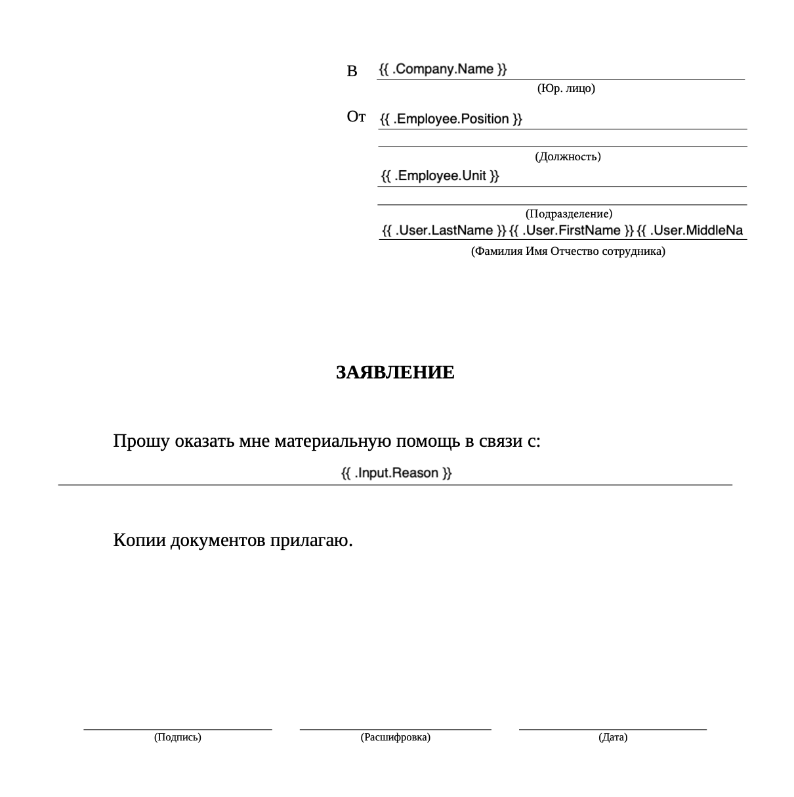

## Этап 2. Подписание заявления Сотрудником 

1. Сотрудник нажимает кнопку **Подписать**. Тип подписи: ПЭП.

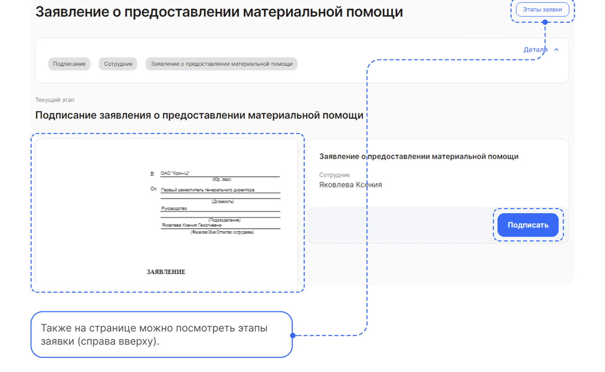

2. На странице появляется сообщение о том, что заявление подписано и заявка перешла на следующий этап.

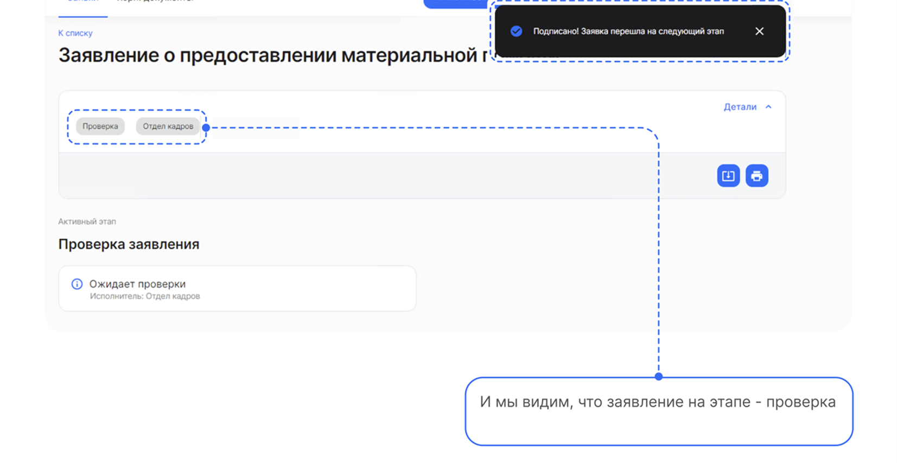

## Этап 3. Проверка заявки сотрудниками Отдела кадров

Отдел кадров может работать с заявкой и в **1С**, и в **Сервисах компании** веб-сервиса VK HR Tek.

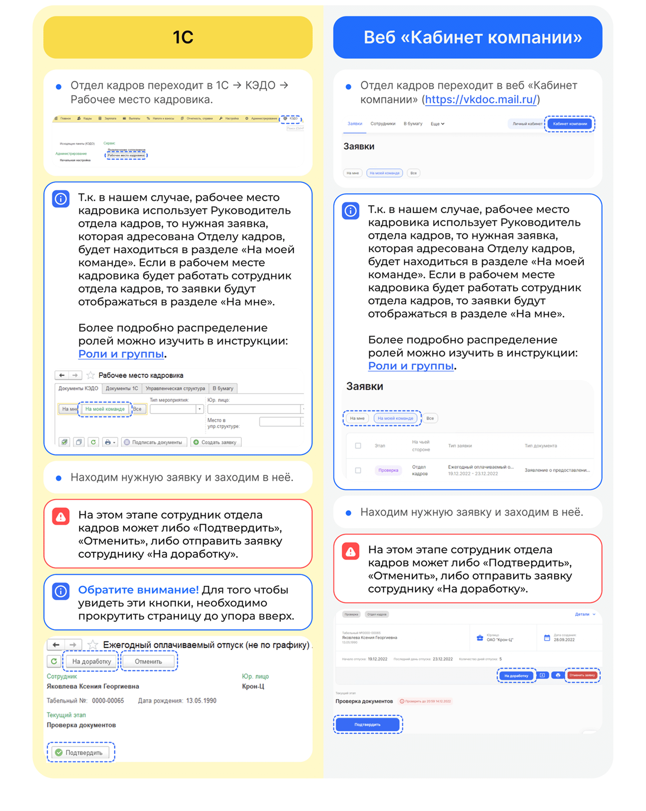

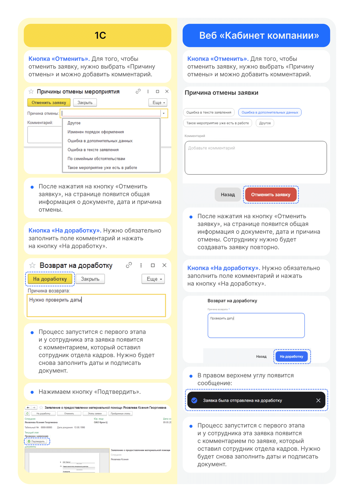

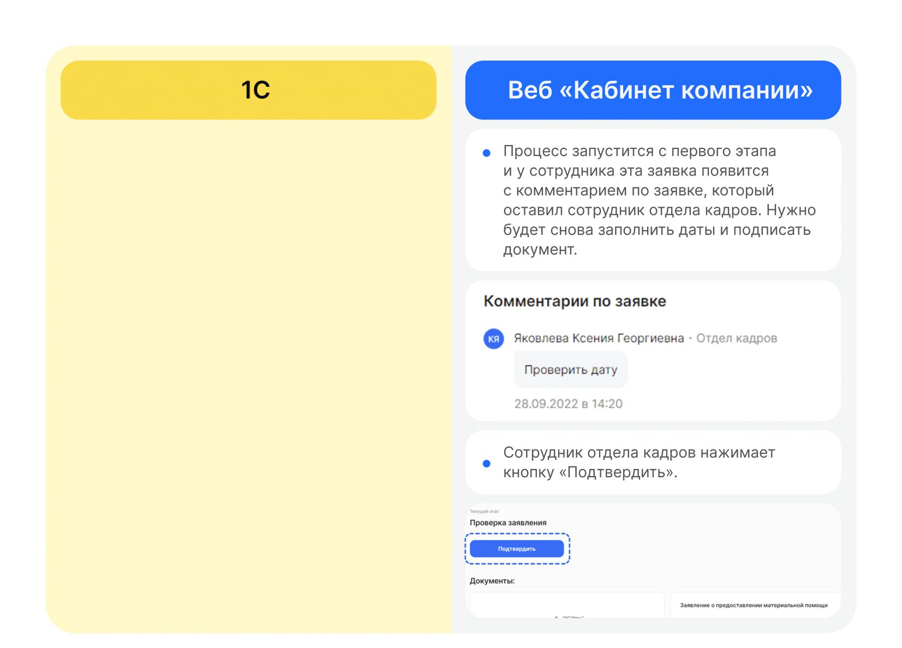

## Этап 4. Загрузка приказа сотрудниками Отдела кадров

### Работа через 1С

#### Если документ нужно формировать из 1С

1. Кадровый специалист нажимает кнопку **Создать документ**.

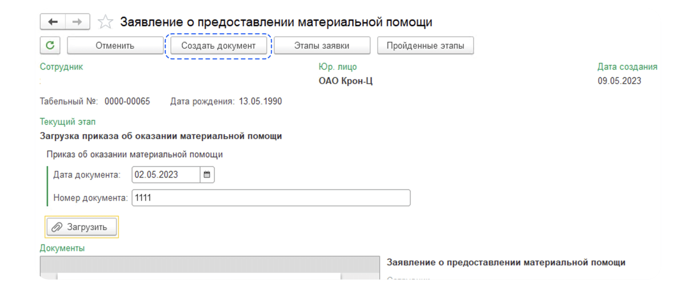

2. Открывается создание приказа о предоставлении материальной помощи. Специалист проверяет внесённые данные, нажимает кнопку **Провести**.

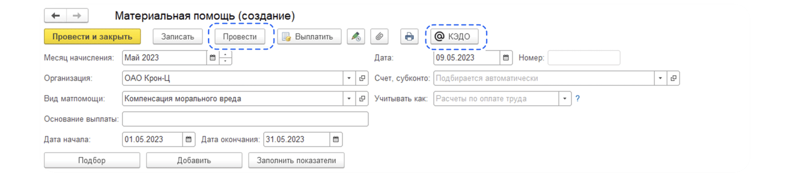

3. Выбирает действие **Подписать и отправить** или **Отправить в КЭДО**.

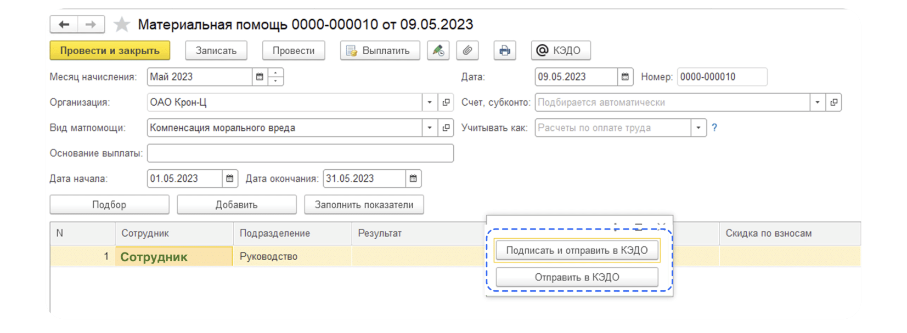

4. Если выбирает **Отправить в КЭДО**, документ нужно подписать.

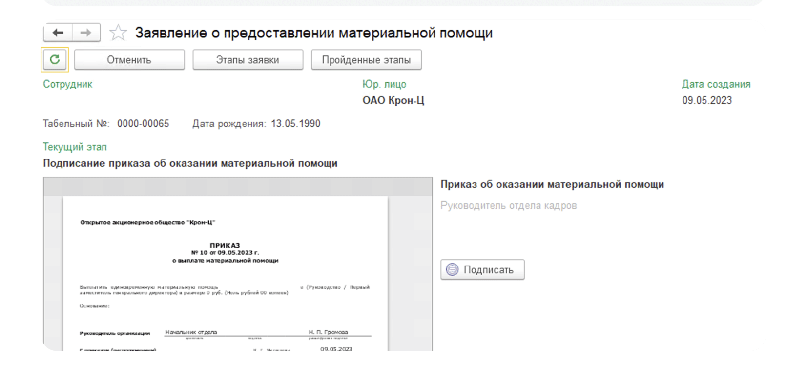

#### Если Отдел кадров загружает документ вручную

1. Вносит дату и номер документа.
2. Нажимает кнопку **Загрузить**.

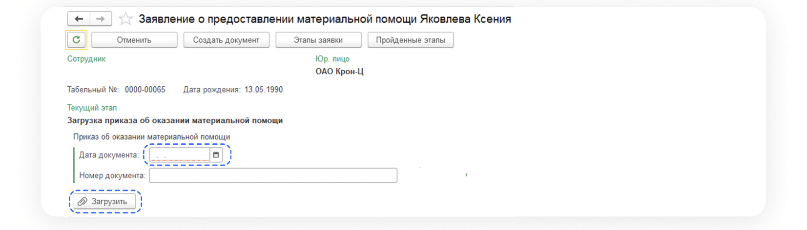

3. В предварительном просмотре нажимает кнопку **Загрузить**.

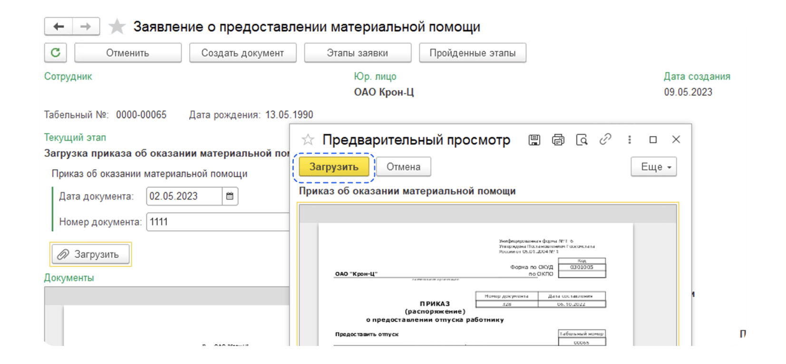

#### Если Отдел кадров отправляет уже сформированный документ в КЭДО

В случае если документ уже есть и нужно его отправить в КЭДО на подпись сотруднику, кадровый специалист переходит в документ и нажимает кнопку **КЭДО**.

Далее выбирает **Подписать и отправить** или **Отправить в КЭДО**.

Если при отправке документа в КЭДО, появилось сообщение «Нет доступных действий над документом в КЭДО», то устраните причины его возникновения.

**Возможные причины появления сообщения**:
1. Некорректно настроено сопоставление документов. Убедитесь, что маппинг документов 1С и КЭДО установлен корректно в разделе **КЭДО** → **Начальная настройка** → **Соответствие документов** (см. [статью](/ru/1C/user/mapping)).
2. Данный документ уже был ранее отправлен в КЭДО, повторная отправка невозможна.
3. Сотрудник, чей документ пытаетесь отправить, не подключен к КЭДО. Подробнее о подключении сотрудника см. в [статье](/ru/1C/user/employees/connect).
4. У пользователя, который отправляет документ, нет нужных прав. Проверьте, назначены ли для пользователя необходимые роли в КЭДО (раздел **Сервисы компании** → **Настройки** → **Роли сотрудников**) и группы доступа в настройке 1С (**Администрирование**  → **Настройки пользователей и прав**).
5. Неверный этап отправки документа. Например, если маппинг настроен на процесс «Заявление на отпуск (старт от сотрудника)», а вы пытаетесь сразу отправить приказ, система запретит выполнить это действие, т.к. сначала должно быть сформировано заявление от сотрудника.

### Сервисы компании веб-сервиса VK HR Tek

1. Отдел кадров переходит в **Сервисы компании веб-сервиса VK HR Tek**, в раздел **Заявки**.

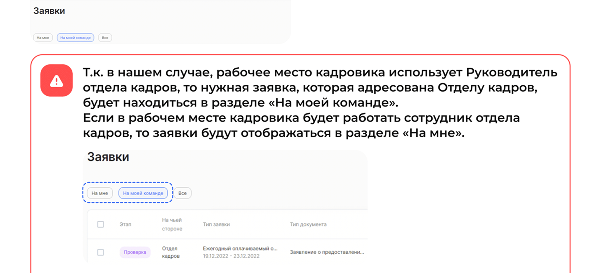

2. Находит нужную заявку и заходит в неё.

<warn>

На этом этапе сотрудник отдела кадров нажимает кнопку **Отменить**, либо отправляет заявку сотруднику **На доработку**.

</warn>

Для отмены заявки специалист  выбирает **Причину отмены** и добавляет комментарий.

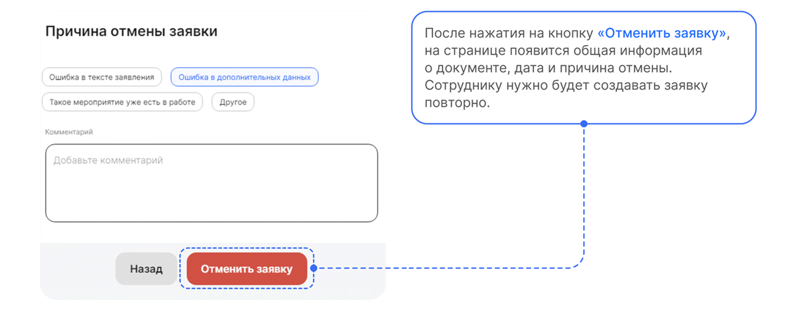

Если специалист отправляет заявку на доработку сотруднику, нужно обязательно заполнить поле комментарий и нажать на кнопку **На доработку**.

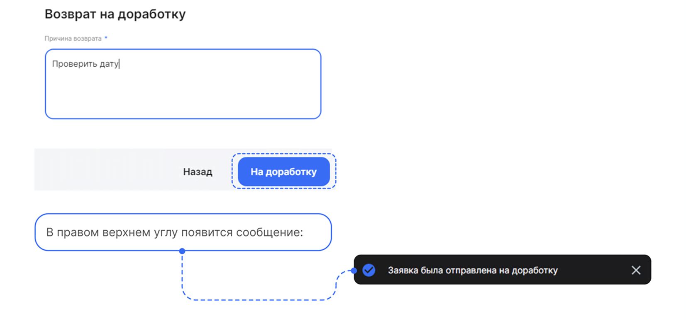

Процесс запустится с первого этапа и у сотрудника эта заявка появится с комментарием по заявке, который оставил сотрудник отдела кадров. Нужно снова заполнить даты и подписать документ.

3. Специалист открывает нужную заявку. Загрузка документа через веб-сервис производится только вручную.
2. Вносит дату и номер документа.
3. Нажимает на кнопку с изображением **Скрепки**.
4. Загружает документ и нажимает кнопку **Продолжить**.

## Этап 5. Подписание приказа Руководителем отдела кадров

Руководитель отдела кадров подписывает приказ с помощью УКЭП.

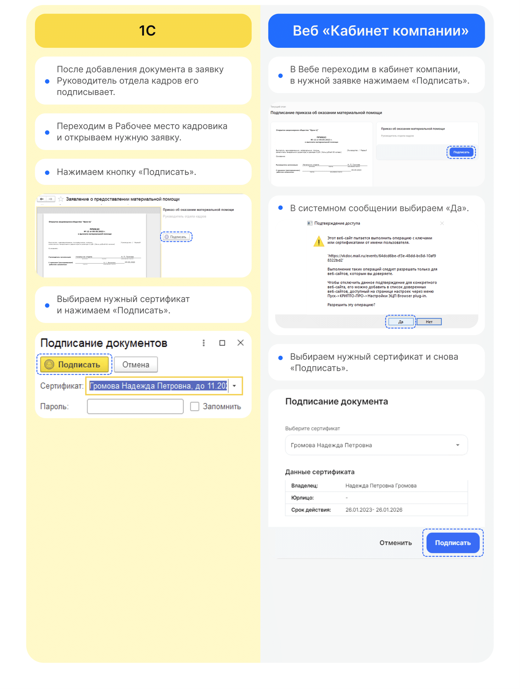

## Этап 6. Подписание документов Сотрудником

Сотруднику поступает уведомление на телефон о том, что нужно подписать документ. 

1. Сотрудник переходит в **Мои сервисы** в веб-сервисе, в раздел **Заявки**.
1. Открывает заявку.
2. Нажимает **Подписать**. Тип подписи: ПЭП.

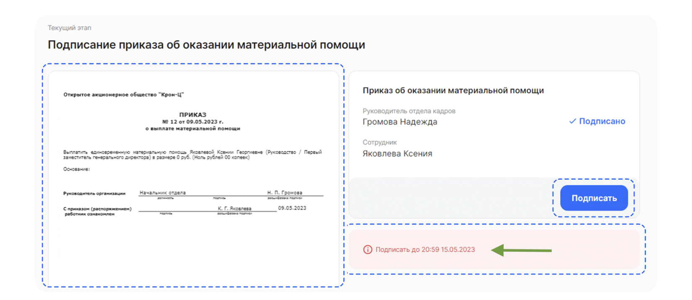

