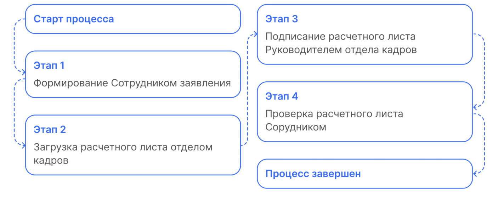
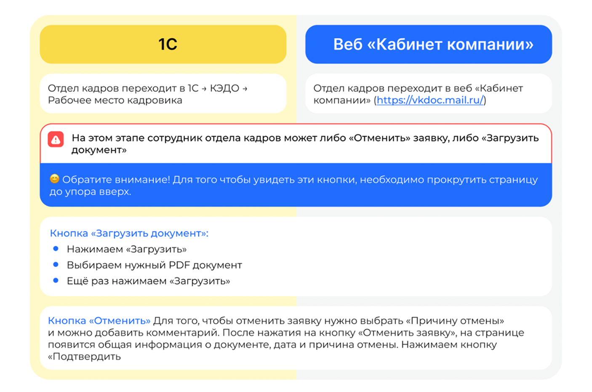

# Процесс «Заявление на расчётный листок»

## Старт процесса

Чтобы подать заявление об изменении паспортных данных, Сотрудник:
1. Переходит в **Сервисы сотрудника веб-сервиса VK HR Tek**, в раздел **Заявки**. 
2. Нажимает кнопку **Создать заявку**.
3. Выбирает тип заявки **Заявление об изменении паспортных данных**.
4. Нажимает **Подтвердить**.

## Этап 1. Формирование Сотрудником заявления

Сотрудник указывает период, за который желает получить расчетный лист и нажимает кнопку **Подтвердить**.

## Этап 2. Загрузка расчетного листа отделом кадров

Отдел кадров может загрузить документ двумя способами, через **1С** и через **Сервисы компании в веб-сервисе**..

## Этап 3. Подписание расчетного листа Руководителем отдела кадров

Руководитель отдела кадров может подписать документ двумя способами: через **1С** и через **Сервисы компании в веб-сервисе**.

Руководитель отдела кадров переходит в нужную заявку в **1С → Рабочем месте кадровика** или в разделе **Заявки** веб-сервиса и нажимает кнопку **Подписать**.

## Этап 4. Проверка расчетного листа Сотрудником

Сотрудник переходит в свой личный кабинет, проверяет приказ и нажимает кнопку **Подтвердить**.
