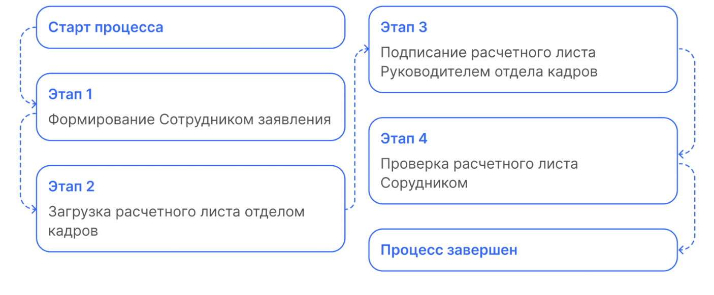
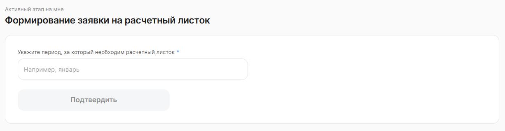
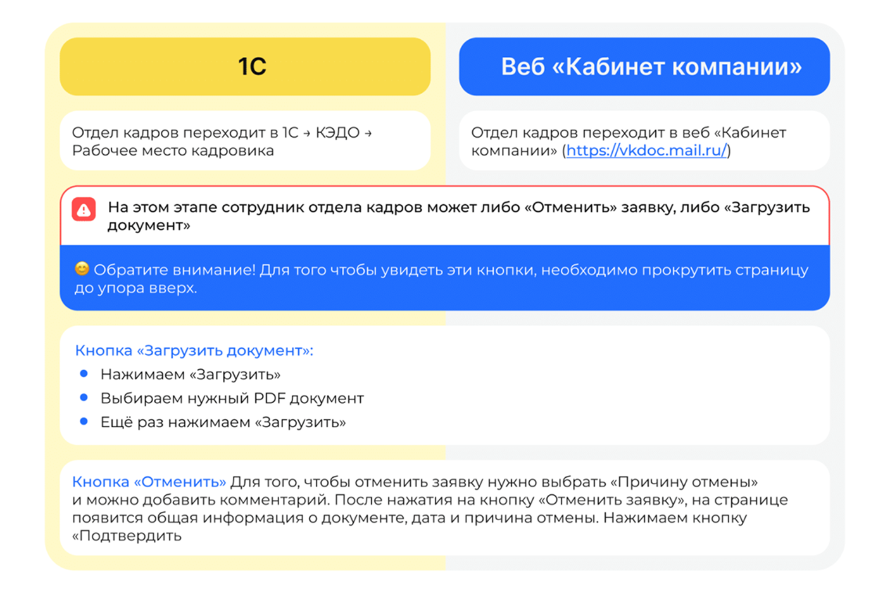

# Процесс «Заявление на расчётный листок»

## Старт процесса

Чтобы подать заявку на расчётный листок, Сотрудник:
1. Переходит в **Мои сервисы** веб-сервиса VK HR Tek, в раздел **Заявки**. 
2. Нажимает кнопку **Создать заявку**.
3. Выбирает тип заявки **Заявка на расчётный листок**.
4. Нажимает **Создать**.

## Этап 1. Формирование Сотрудником заявления

Сотрудник указывает период, за который желает получить расчетный листок и нажимает кнопку **Подтвердить**.

## Этап 2. Загрузка расчетного листка Отделом кадров

Отдел кадров может загрузить документ двумя способами, через **1С** и через **Сервисы компании в веб-сервисе**..

## Этап 3. Подписание расчетного листка Руководителем отдела кадров

Руководитель отдела кадров может подписать документ двумя способами: через **1С** и через **Сервисы компании в веб-сервисе**.

Руководитель отдела кадров переходит в нужную заявку в **1С → Рабочем месте кадровика** или в разделе **Заявки** веб-сервиса и нажимает кнопку **Подписать**. Тип подписи: УКЭП.

## Этап 4. Проверка расчетного листка Сотрудником

Сотрудник переходит в свой личный кабинет, проверяет расчетный листок и нажимает кнопку **Подтвердить**.
