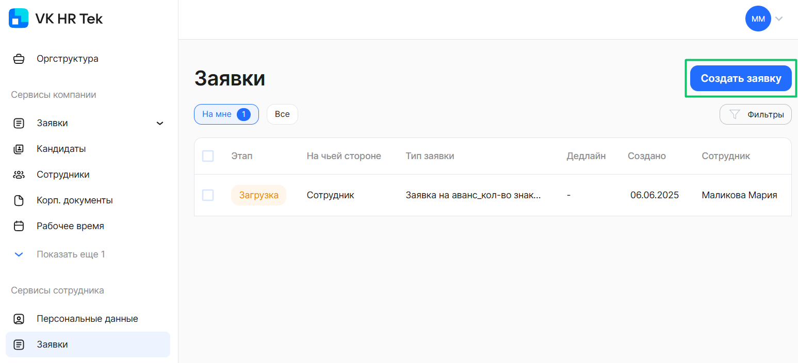

# Процесс «Заявление об измении персональных данных»

## Старт процесса

Чтобы подать заявление об изменении персональных данных, Сотрудник:
1. Переходит в **Сервисы сотрудника веб-сервиса VK HR Tek**, в раздел **Заявки**.
2. Нажимает кнопку **Создать заявку**.
3. Выбирает **Заявление об изменении персональных данных**.
4. Нажимает кнопку **Подтвердить**.

## Этап 1. Формирование Сотрудником заявления об изменении персональных данных

Для формирования заявления Сотрудник:

1. Заполняет пустые поля.
2. Указывает причину изменения персональных данных.
3. Выбирает документ, подтверждающий смену персональных данных.
4. Указывает необходимо ли вносить изменения в СНИЛС.
5. Прикрепляет необходимые документы.
6. Нажимает кнопку **Перейти к предпросмотру**.

7. Проверяет заявление и нажимает кнопку **Продолжить**.

## Этап 2. Подписание заявления Сотрудником

В открывшемся окне Сотрудник нажимает кнопку **Подписать**.

## Этап 3. Проверка заявления Отделом кадров

Отдел кадров может работать с заявкой и в **1С**, и в **Сервисах компании в веб-сервисе**.

Если требуется отменить заявку, специалист нажимает кнопку **Отменить**, выбирает **Причину отмены** и добавляет комментарий.

Если требуется вернуть заявку на доработку сотруднику, кадровый специалист обязательно заполняет поле комментарий и нажимает на кнопку **На доработку**.

Для согласования заявки кадровый специалист нажимает кнопку **Подтвердить**.

# Работа через веб-сервис

1. Отдел кадров переходит в **Сервисы компании в веб-сервисе**, в раздел **Заявки**.

<warn>

Т.к. в данном случае **Сервисы компании → Заявки** использует Руководитель отдела кадров, то нужная заявка, которая адресована Отделу кадров, будет находиться в разделе **На моей команде**.

Если в **Сервисах компании → Заявки** будет работать сотрудник отдела кадров, то заявки будут отображаться в разделе **На мне**.

</warn>

2. На этом этапе сотрудник отдела кадров может либо **Подтвердить**, **Отменить**, либо отправить заявку сотруднику **На доработку**.

3. Если требуется отменить заявку, специалист нажимает кнопку **Отменить**, выбирает **Причину отмены** и добавляет комментарий.

4. Если требуется вернуть заявку на доработку сотруднику, кадровый специалист обязательно заполняет поле комментарий и нажимает на кнопку **На доработку**.

5. Процесс запустится с первого этапа и у сотрудника эта заявка появится с комментарием по заявке, который оставил сотрудник отдела кадров. Нужно будет снова заполнить даты и подписать документ.
4. Сотрудник отдела кадров нажимает кнопку **Подтвердить**.