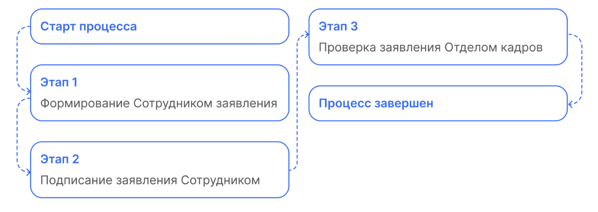
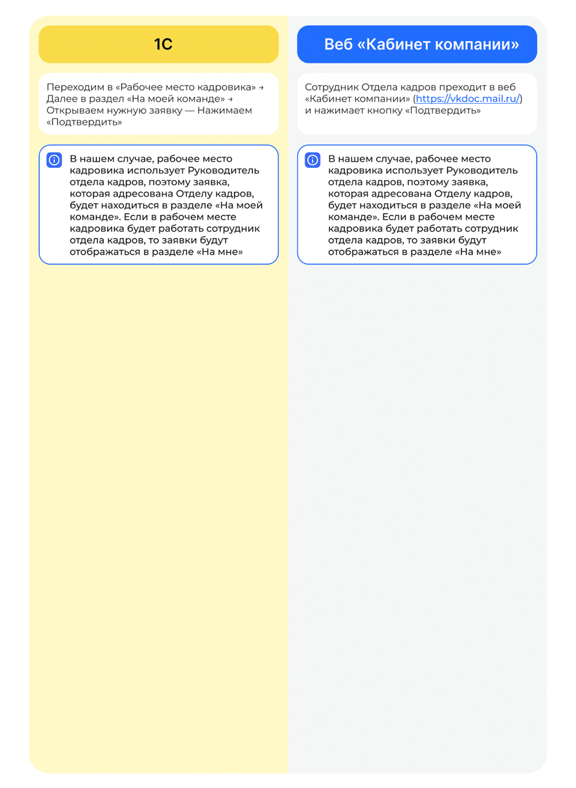

# Процесс «Заявление на отпуск по уходу за ребенком до 1,5/3 лет»

## Старт процесса

Чтобы подать заявление, Сотрудник: 
1. Переходит в **Сервисы сотрудника веб-сервиса VK HR Tek**, в раздел **Заявки**. 
2. Нажимает кнопку **Создать заявку**.
3. Выбирает **Заявление на отпуск по уходу за ребенком до 1,5/3 лет**.
4. Нажимает **Подтвердить**.

## Этап 1. Формирование Сотрудником заявления

1. После нажатия кнопки **Создать заявку**, сотрудник заполняет все поля, отмеченные звездочками, и прикрепляет необходимые документы. Для этого сотруднику нажимает на кнопку с изображением скрепки.
3. На этом этапе сотрудник может **Отменить заявку**.
4. На странице заявки можно ознакомиться со сформированным заявлением (данные о сотруднике заполняются автоматически).
5. Если всё верно, нажимает кнопку **Продолжить**.

## Этап 2. Подписание заявления Сотрудником
1. Сотрудник нажимает на кнопку **Подписать**.
Чтобы подтвердить подписание документа, на телефон поступает смс сообщение, код из которого Сотрудник вводит в открывшемся окне и нажимает кнопку **Подписать**.

