# Процесс «Заявление на отпуск по БиР»

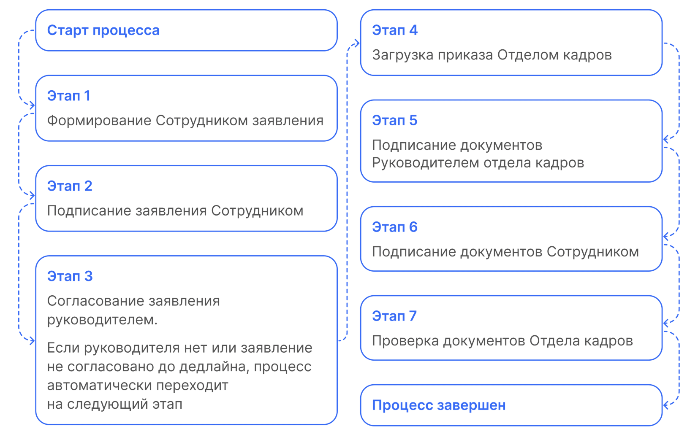

## Старт процесса

Чтобы подать заявление на отпуск по БиР, Сотрудник: 1. Пеходит в **Сервисы сотрудника веб-сервиса VK HR Tek**, в раздел **Заявки**.
2. Нажимает кнопку **Создать заявку**.

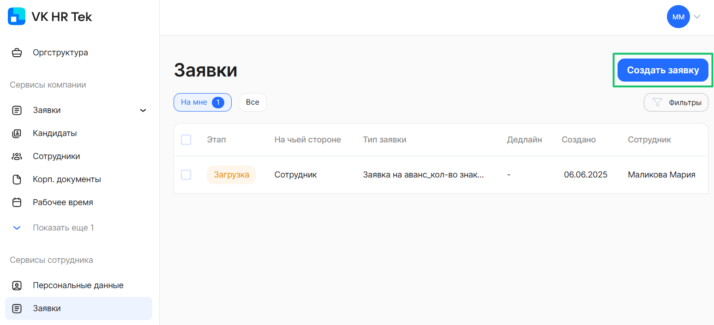

3. Выбирает **Заявление на отпуск по уходу за ребенком до 1,5 лет**.

4. Нажимает **Подтвердить**.

## Этап 1. Формирование Сотрудником заявления

1. После нажатия кнопки **Создать заявку**, Cотрудник заполняет все поля, отмеченные звездочками, и прикрепляет необходимые документы.

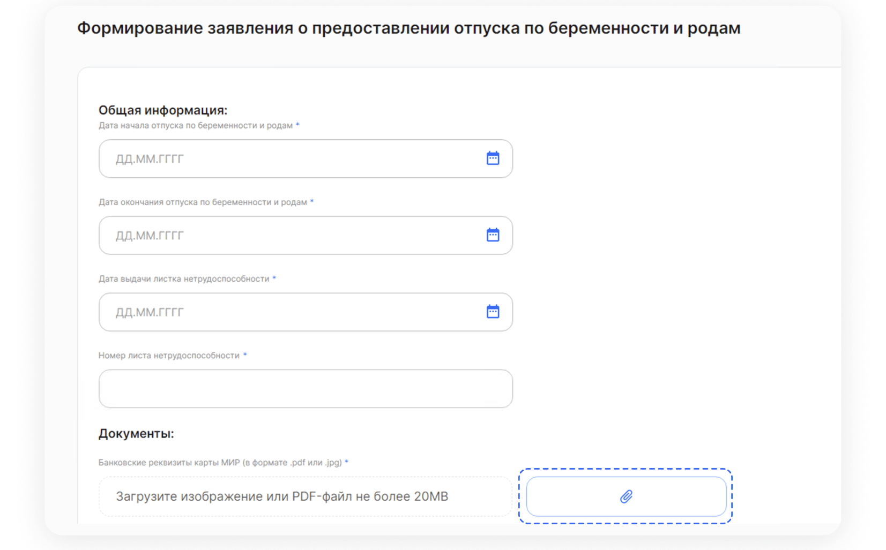

2. На этом этапе сотрудник может **Отменить заявку**.

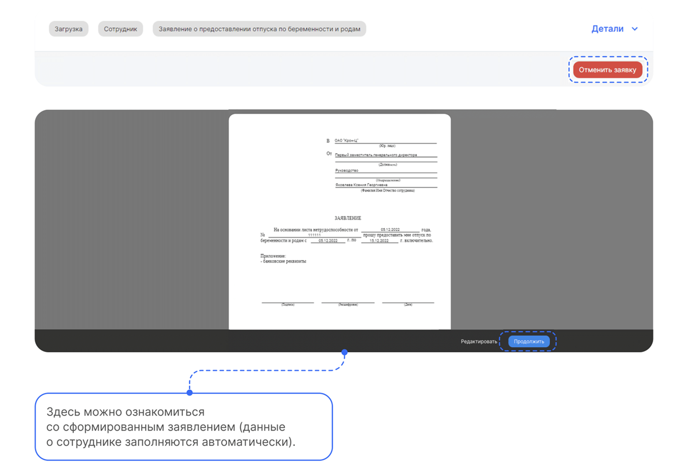

3. Если заявка заполнена верно, нажимает на кнопку **Продолжить**.

## Этап 2. Подписание заявления Сотрудником

1. Проверяет документ и нажимает кнопку **Подписать**.

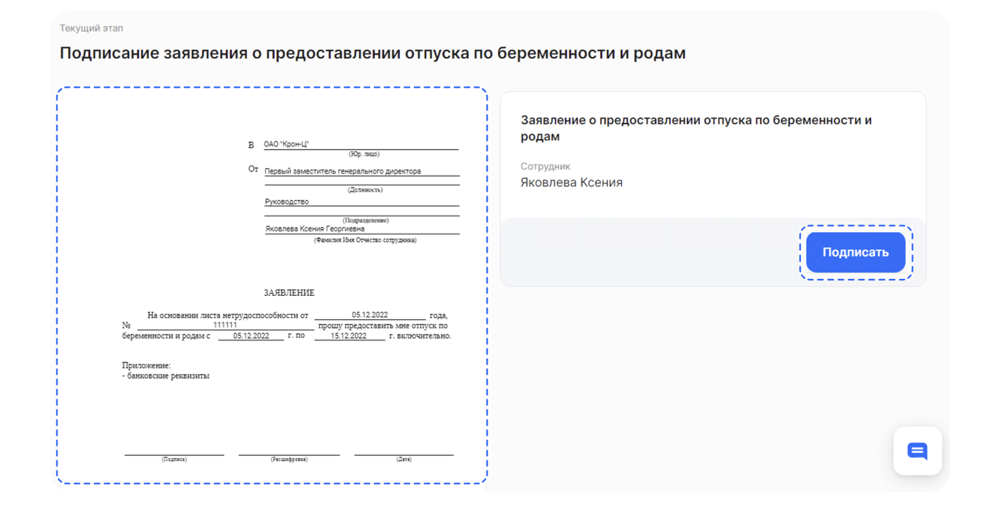

2. Вводит код из смс и нажимает на кнопку **Подписать**.

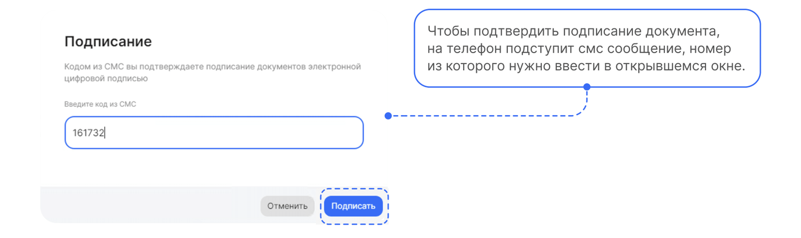

## Этап 3. Согласование заявления руководителем

<warn>

Если по какой-то причине у сотрудника нет руководителя и заявление не согласовано до дедлайна, процесс автоматически переходит на следующий этап **Загрузка приказа Отделом кадров**.

</warn>

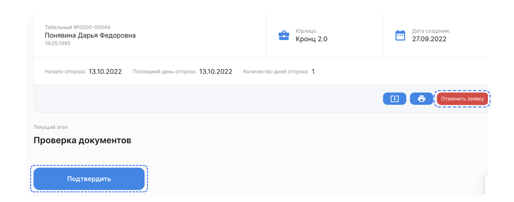

## Этап 4. Загрузка приказа Отделом кадров

Сотрудники отдела кадров могут обрабатывать заявки как в системе **1С**, так и в **Сервисах компании веб-сервиса VK HR Tek**.

## Работа через 1С

1. Специалист переходит в **Рабочее место кадровика**, в раздел **На моей команде** и открывает нужную заявку.
2. Приказ можно сформировать автоматически или загрузить вручную.

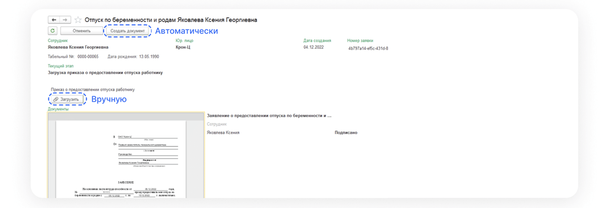

3. Для загрузки вручную нажимает на кнопку со скрепкой и загружает файл PDF.
4. Для автоматического создания документа нажимает **Создать документ**.
5. В открывшемся окне проверяет данные, выбирает причины нетрудоспособности и нажимает кнопку **Провести** → кнопку **КЭДО** → **Отправить в КЭДО**.

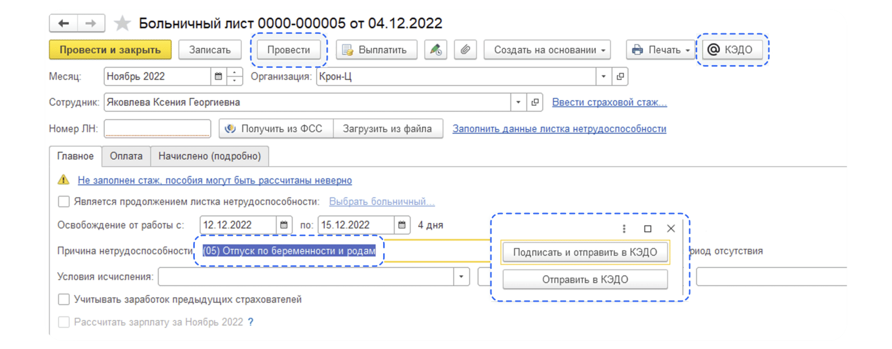

6. Далее руководитель отдела кадров должен подписать документ.

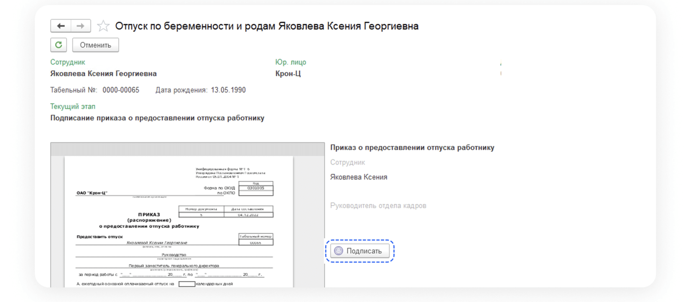

## Сервисы компании веб-сервиса VK HR Tek

1. Сотрудник Отдела кадров преходит в **Сервисы компании веб-сервиса VK HR Tek**, в раздел **Заявки**.
2. Открывает нужную заявку и нажимает кнопку **Подтвердить**.

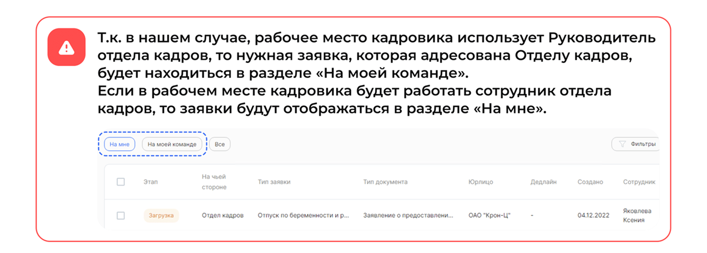

На этом этапе отдел кадров может **Отменить заявку**.

3. Приказ загружается только вручную. Для этого специалист нажимает кнопку с изображением скрепки и загружаете документ.

3. После загрузки документа нажимает кнопку **Продолжить**.

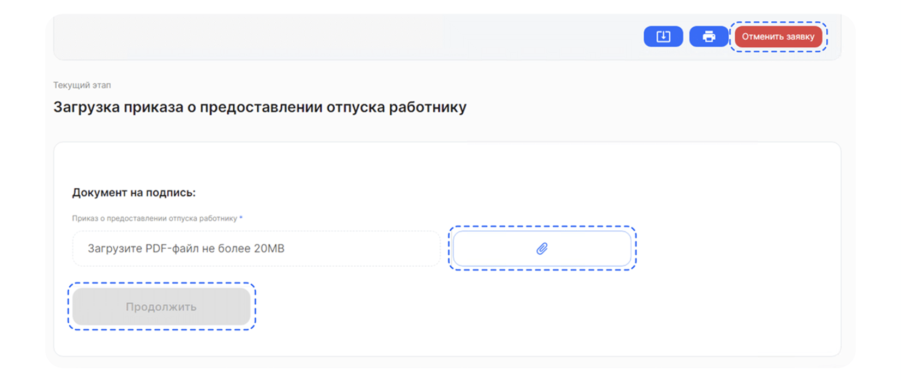

## Этап 5. Подписание документов Руководителем отдела кадров

1. Сотрудники отдела кадров могут обрабатывать заявки как в системе **1С**, так и в **Сервисах компании веб-сервиса VK HR Tek**.

## Работа через 1С

Руководитель отдела кадров подписывает документ.

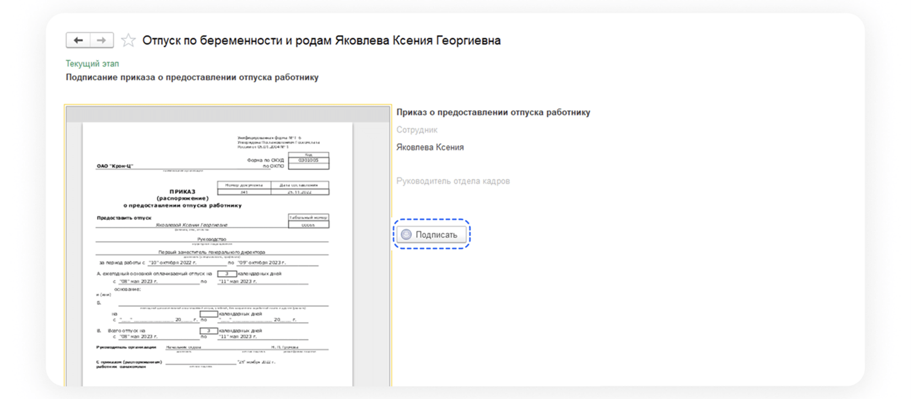

## Сервисы компании веб-сервиса VK HR Tek

Руководитель отдела кадров подписывает документ.

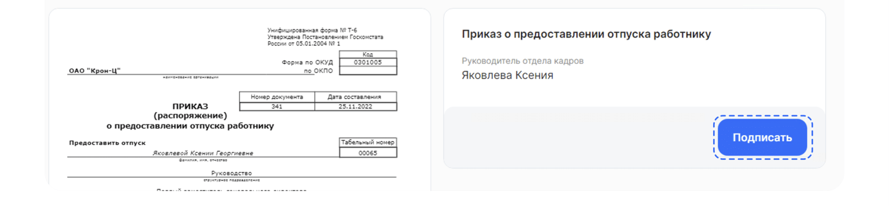

В открывшемся окне нажимает кнопку **Подписать**.

## Этап 6. Подписание документов Сотрудником

1. Сотрудник подписывает документы.

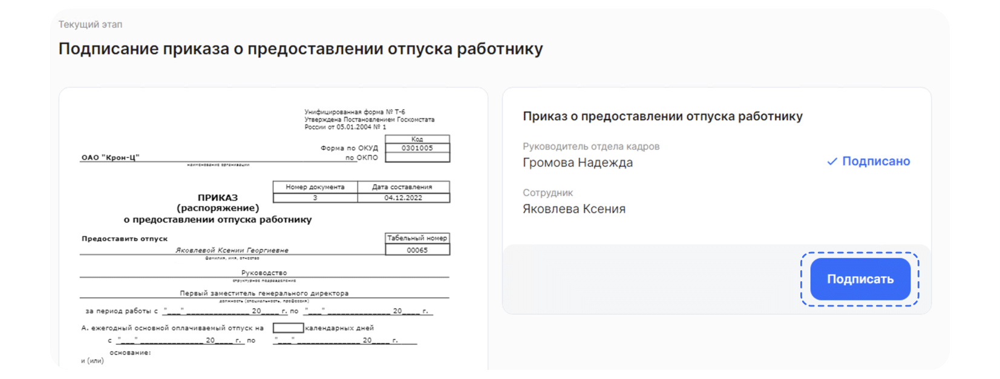

2. Подтверждает подписание документа с помощью смс-кода.

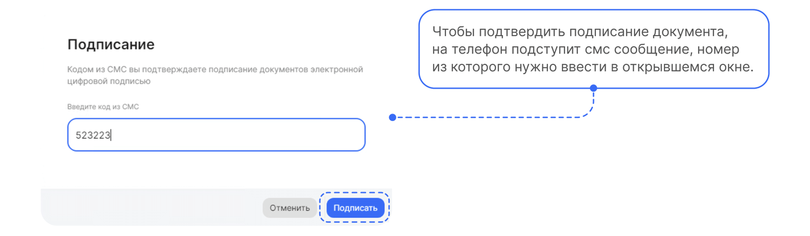

## Этап 7. Проверка документов Отделом кадров

Сотрудники отдела кадров могут обрабатывать заявки как в системе **1С**, так и в **Сервисах компании веб-сервиса VK HR Tek**.

## Работа через 1С

Сотрудник отдела кадров открывает нужную заявку в **Рабочем месте кадровика** и нажимает кнопку **Подтвердить**.

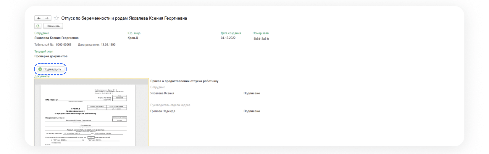

## Работа через веб-сервис

Сотрудник отдела кадров открывает нужную заявку с этапом **Проверка** в **Сервисах компании → Заявки** и нажимает кнопку **Подтвердить**.

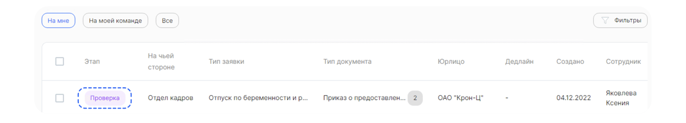

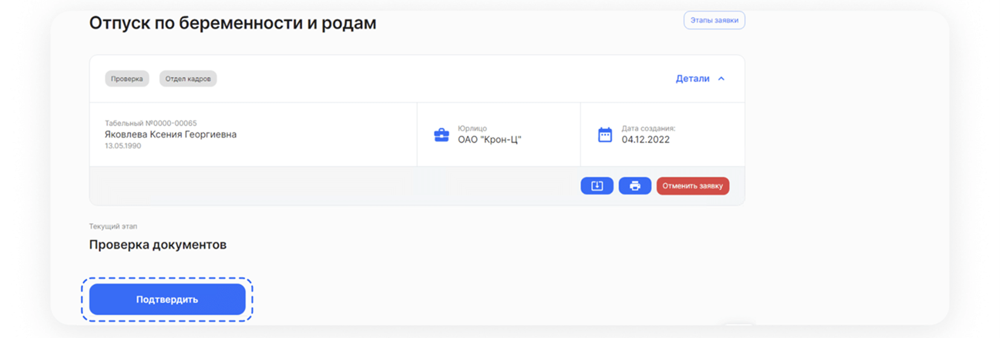
