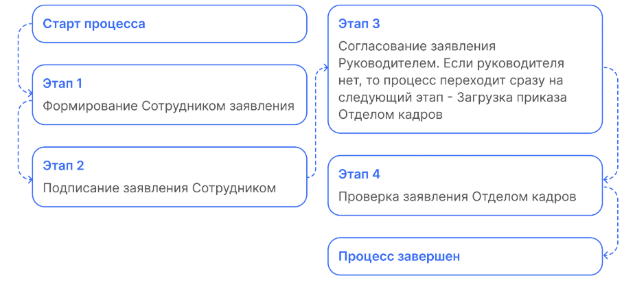
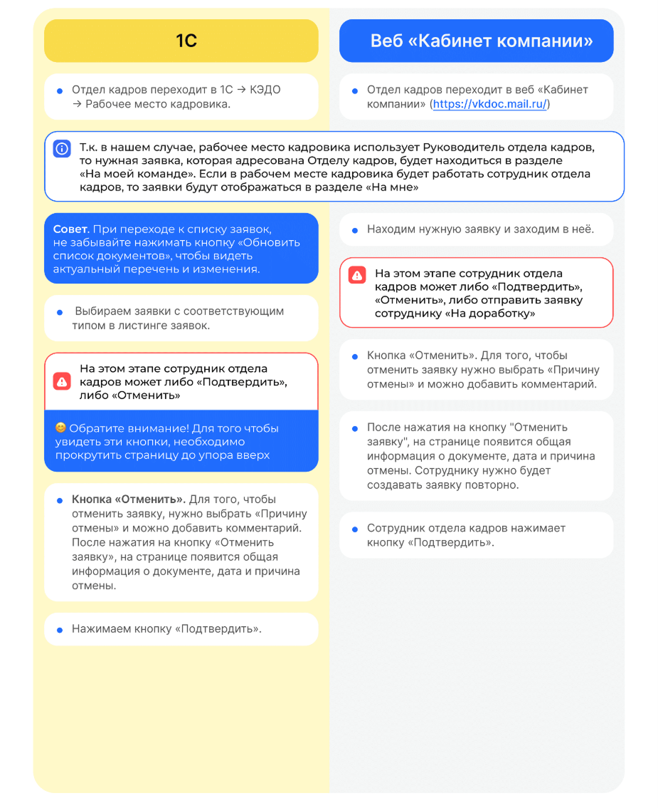

# Процесс «Досрочный выход из отпуска по уходу за ребенком»

## Старт процесса

Чтобы подать заявление, Сотрудник:
1. Переходит в **Сервисы сотрудника веб-сервиса VK HR Tek**, в раздел **Заявки**.
 2. Нажимает кнопку **Создать заявку**.
 3. Выбирает **Досрочный выход из отпуска по уходу за ребенком**.
 4. Нажимает **Подтвердить**.

## Этап 1. Формирование Сотрудником заявления

1. После нажатия кнопки **«Создать заявку»** сотрудник заполняет поле **Дата последнего дня отпуска по уходу за ребенком** и нажимает **Продолжить**.
3. На этом этапе сотрудник может **Отменить заявку»**.
4. Здесь можно ознакомиться со сформированным заявлением (данные о сотруднике заполняются автоматически).
5. Если всё верно, Сотрудник нажимает кнопку **Продолжить**.

## Этап 2. Подписание заявления Сотрудником

1. Нажимает кнопку **Подписать**.
8. Проверяет документ.
9. Нажимает **Подписать**.
10. Чтобы подтвердить подписание документа, на телефон поступает смс сообщение, код из которого вводит в открывшемся окне и нажимает кнопку **Подписать**.

## Этап 3. Согласование заявления Руководителем
Если по какой-то причине у сотрудника нет руководителя, то процесс переходит сразу на следующий этап **Загрузка приказа Отделом кадров**.

Руководитель переходит в **Сервисы компании веб-сервиса VK HR Tek**, в раздел **Заявки**.

<warn>

На данном этапе Руководитель может либо **Подтвердить**, либо **Отменить заявку**.
В случае отмены заявки процесс стартует с первого этапа формирования заявления сотрудником.

</warn>

Руководитель открывает нужную заявку и нажимает кнопку **«Подтвердить»**.

## Этап 4. Проверка заявления Отдела кадров

Отдел кадров может работать с заявкой и в **1С**, и в **Сервисах компании веб-сервиса VK HR Tek**.

