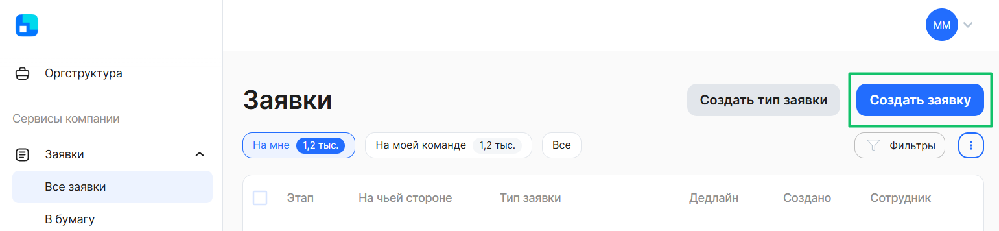

# Процесс «Заявка на получение справки 2-НДФЛ»

## Маппинг. Соответствие документов
На этапе формирования документов в заявке некоторые документы можно сформировать автоматически. Для этого в начальных настройках нужно проставить соответствие документов (маппинг).

1. Кадровый специалист переходит в 1С, в **КЭДО** - **Начальная настройка КЭДО** - **Соответствие документов**.

2. Выбирает нужный процесс.
3. Нажимает **ОК**.

4. Нажимает кнопку **Сохранить изменения**.

5. Если нужно удалить соответствие, кликает два раза на процессе, далее правой клавишей мыши и нажимает **Очистить**.

6. Далее в начальной настройке переходит в **Настройку автоматического создания документов**.

7. Если нужно, чтобы документ формировался автоматически, проставляет галку напротив нужной справки. Далее проставляет ответственного и нажимает **Записать**.

## Старт процесса
Чтобы подать заявление на получение справки 2-НДФЛ, Сотрудник:
1. Переходит в **Сервисы сотрудника веб-сервиса VK HR Tek**, в раздел **Заявки**. 
2. Нажимает кнопку **Создать заявку**.

3. Выбирает **Заявление на получение справки 2-НДФЛ**.
3. Нажимает **Подтвердить**.

## Этап 1. Формирование заявки на получение справки 2-НДФЛ

1. Для формирования заявки 2-НДФЛ сотрудник указывает период, за который необходимо получить справку.
5. Затем нажать **Подтвердить**.

## Этап 2. Работа с процессом со стороны сотрудников отдела кадров

## Работа через 1С

1. Отдел кадров переходит в **1С** → **КЭДО** → **Рабочее место кадровика**.

2. Выбирает заявки с типом **Заявка на получение справки 2-НДФЛ** в листинге заявок.

### Вариант 1: Получение справки

1. Внутри заявки автоматически будет сформирован документ, который подписывается руководителем отделов кадров. Также руководитель отдела кадров может **Отменить** заявку.

2. В открывшемся диалоговом окне специалист выбирает документы, которые будут формироваться автоматически, проставляет галочки в поле **Создавать автоматически**, выбирает ответственного и нажимает на кнопку **Записать**.

### Вариант 2: Получение справки через кнопку «Создать документ»

Кроме того, справку можно **Загрузить** или создать через кнопку **Создать документ**.

1. Специалист выбирает год, нажимает кнопку **Заполнить** → **Провести**.

2. Нажимает кнопку **КЭДО** → **Отправить в КЭДО**.
После чего сформированная справка уйдет на подписание сотруднику.

## Работа через веб-сервис
В **Сервисах компании**, в разделе **Заявки** открывает заявку **Заявка на получение справки 2-НДФЛ**.

## Этап 3. Подписание справки Руководителем отдела кадров
## Работа через 1С

1. В появившемся диалоговом окне нажимает **Подписать** или может отменить действие.

2. Выбирает сертификат подписанта.

## Сервисы компании веб-сервиса VK HR Tek

Внутри данного заявления уполномоченный руководитель может **Отменить заявку** или нажать кнопку **Подписать**.

## Этап 4. Проверка документов сотрудником

Сотрудник проверяет заявку в личном кабинете и подтверждает получение документа.

