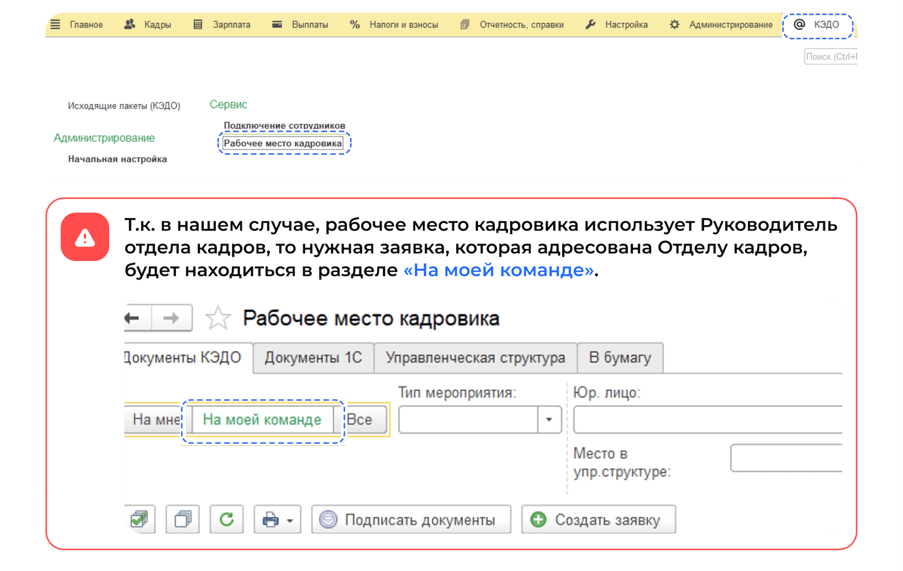
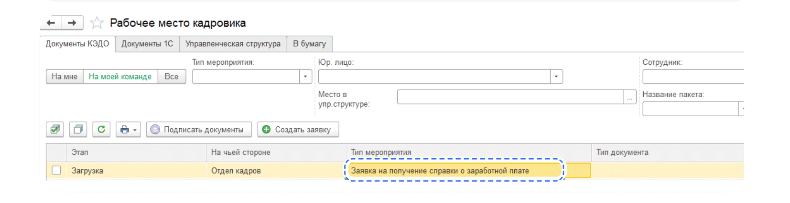
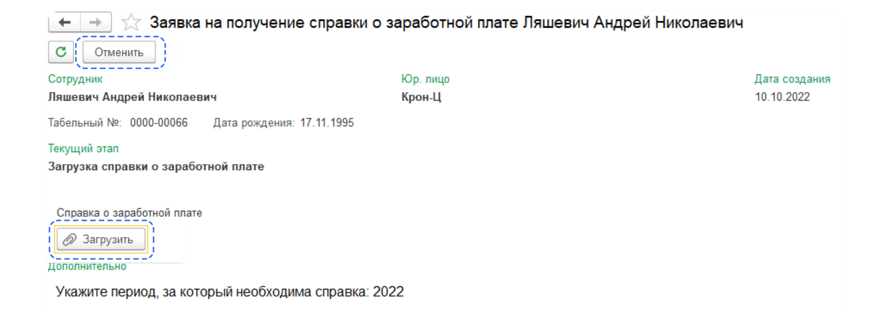
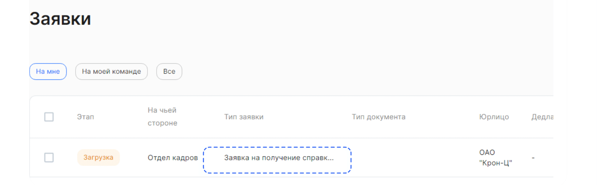
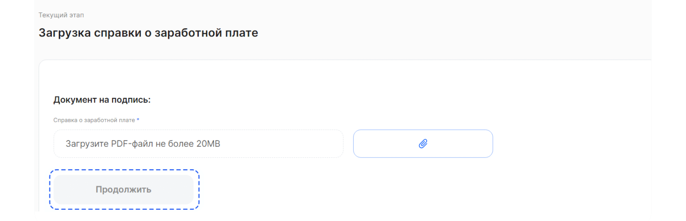
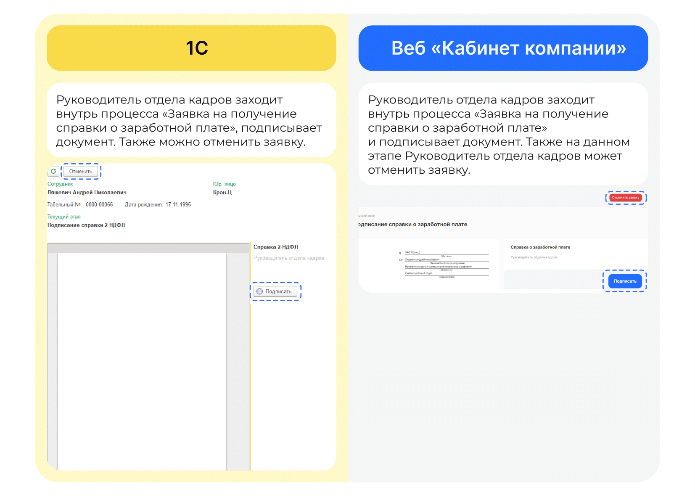
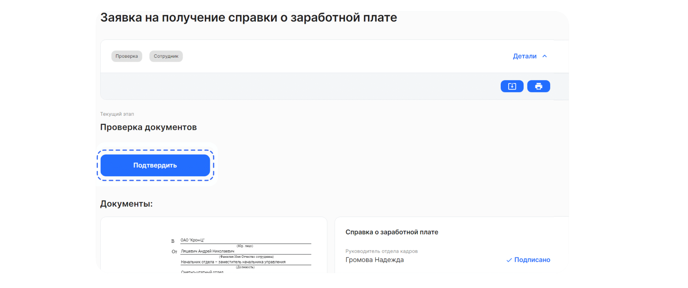

# Процесс «Заявка на получение справки о заработной плате»

## Старт процесса

Чтобы подать заявление на получение справки о заработной плате, Сотрудник:
1. Переходит в **Сервисы сотрудника веб-сервиса VK HR Tek**, в раздел **Заявки**.
2. Нажимает кнопку **Создать заявку**.
3. Выбирает **Заявка на получение справки о заработной плате**.
4. Нажимает кнопку **Подтвердить**.

## Этап 1. Формирование заявки на получение справки о заработной плате

1. Сотрудник в личном кабинете выбирает **Заявка на получение справки о заработной плате**.
2. Нажимает на кнопку **Подтвердить**.

3. Для окончательного формирования заявки указывает период, за который необходима информация.
7. Нажимает на кнопку **Подтвердить**.

## Этап 2. Формирование заявки на получение справки с места работы со стороны компании

1. Сотрудник отдела кадров переходит в **1С** → **КЭДО** → **Рабочее место кадровика**.

Если в **Рабочем месте кадровика** будет работать сотрудник отдела кадров, то заявки будут отображаться в разделе **На мне**.

<info>

При переходе к списку заявок, не забывайте нажимать кнопку **Обновить список документов**, чтобы видеть актуальный перечень и изменения.

</info>

2. Сотрудник отдела кадров выбирает заявку с типом **Заявка на получение справки о заработной плате** в списке заявок.

3. Сотрудник отдела кадров подгружает соответствующий документ. На данном этапе данный процесс может быть отменен.

## Работа через веб-сервис

1. В **Сервисах компании**, в разделе **Заявки** Сотрудник Отдела кадров выбирает соответствующую заявку из общего списка.

2. После перехода внутрь заявки сотрудник Отдела кадров прикрепляет документ. 

## Этап 3. Подписание документа Руководителем отдела кадров

## Этап 4. Проверка документа сотрудником

После проверки запрашиваемого документа Сотрудник нажимает на кнопку **Подтвердить**.

