# Процесс «Заявка на получение справки с места работы»

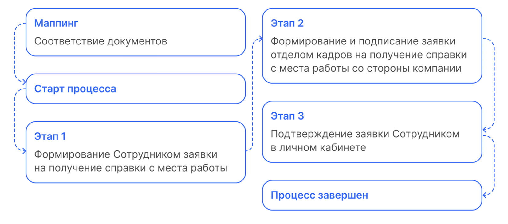

## Маппинг. Соответствие документов

На этапе формирования документов в заявке некоторые документы можно сформировать автоматически. Для этого в начальных настройках нужно проставить соответствие документов (маппинг).

1. Кадровый специалист переходит в 1С, в **КЭДО** - **Начальная настройка КЭДО** - **Соответствие документов**.

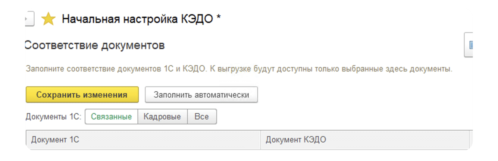

2. В колонке **Документ КЭДО** кликает два раза по полю напротив нужного документа **1С** и нажимает троеточие.

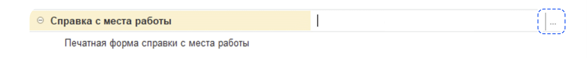

3. Выбирает нужный процесс.
4. Нажимает **ОК**.

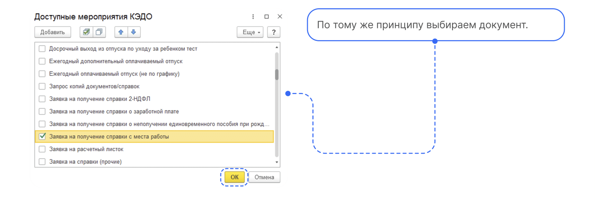

5. Нажимает **Сохранить изменения**.

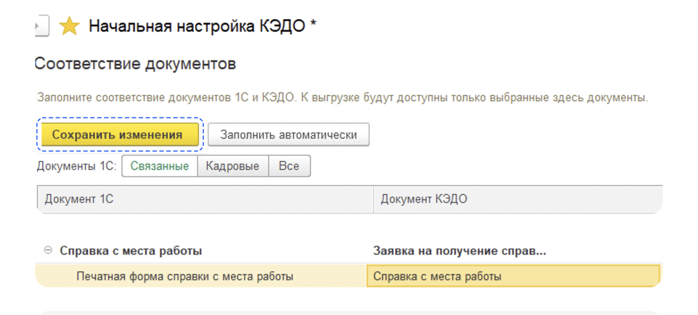

6. Если нужно удалить соответствие, кликнуть два раза на процесс, далее правой клавишей мыши нажать **Очистить**.

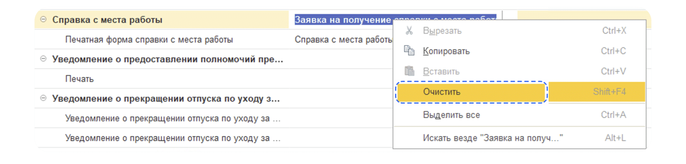

7. Далее в начальной настройке переходит в **Настройку автоматического создания документов**.

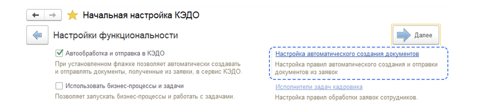

8.  Если нужно, чтобы документ формировался автоматически, проставляет галочку напротив нужной справки. Далее проставляет ответственного и нажимает **Записать**.

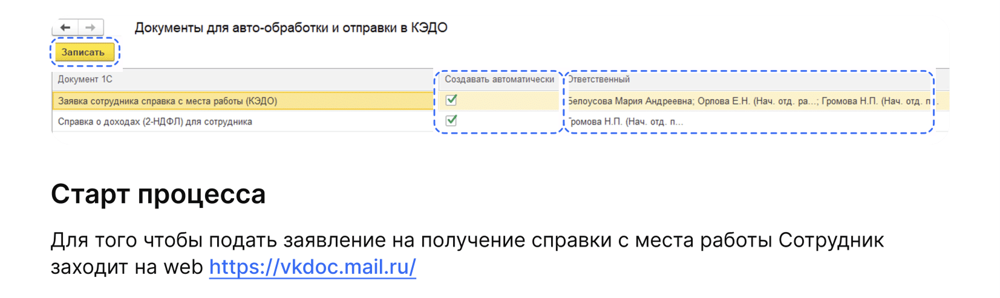

## Старт процесса

Чтобы подать заявление на получение справки с места работы, Сотрудник:
1. Переходит в **Сервисы сотрудника веб-сервиса VK HR Tek**, в раздел **Заявки**.
2. Нажимает кнопку **Создать заявку**.

3. Выбирает **Заявление на получение справки с места работы**.
4. Нажимает **Подтвердить**.

## Этап 1. Формирование Сотрудником заявки на получение справки с места работы

1. Сотрудник в личном кабинете выбирает **Заявка на получение справки с места работы**.

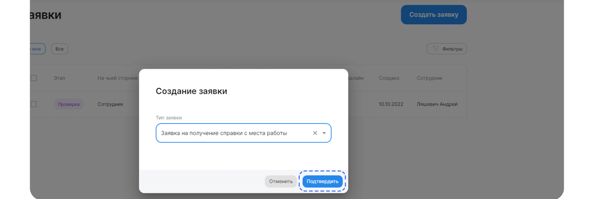

2. В выпадающем диалоговом окне сотрудник указывает основание запроса документа и нажимает кнопку **Подтвердить**.

## Этап 2. Формирование и подписание заявки отделом кадров на получение справки с места работы со стороны компании

## Работа через 1С

1. Отдел кадров переходит в **1С** → **КЭДО** → **Рабочее место кадровика**.

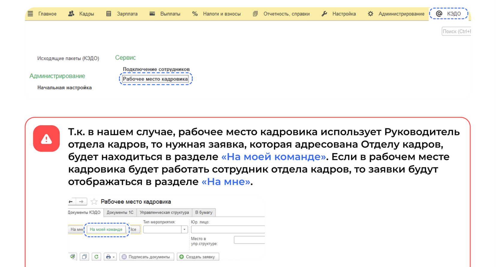

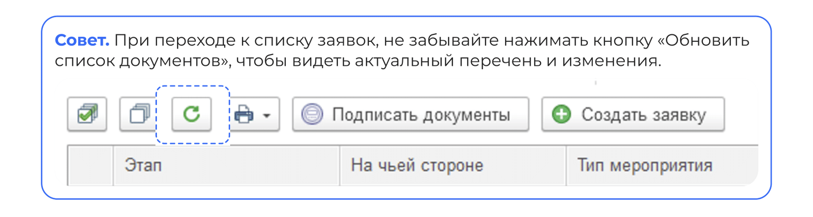

2. Сотрудник отдела кадров выбирает заявку с типом **Заявка на получение справки с места работы** в списке заявок.

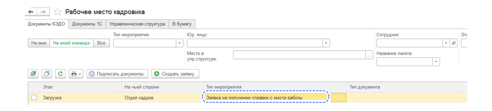

3. Внутри заявки автоматически будет сформирован документ, который подписывается руководителем отделов кадров. Также руководитель отдела кадров может **Отменить** заявку.

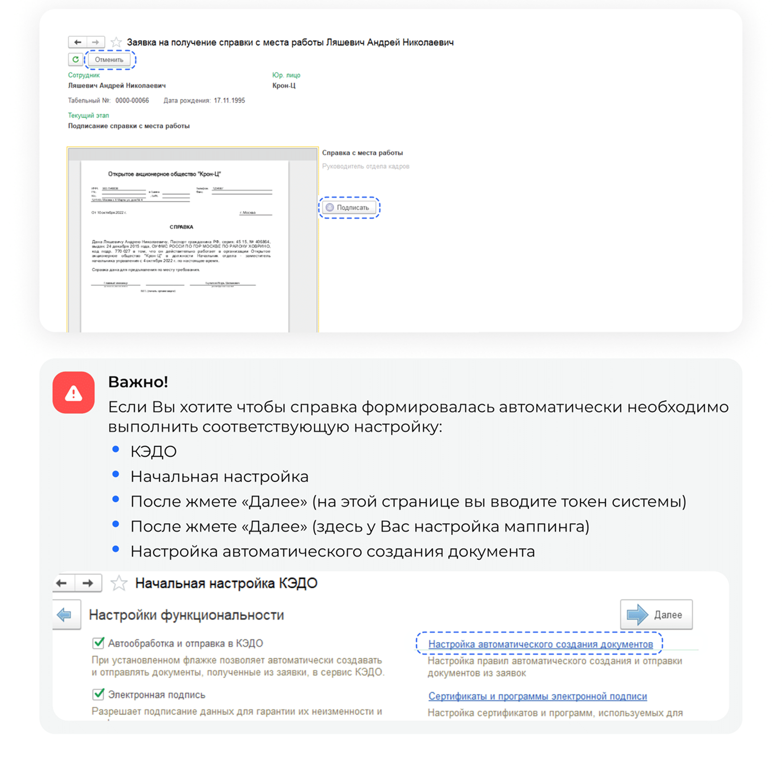

4. В открывшемся диалоговом окне выбирает документы, которые будут формироваться автоматически, проставив галочки в поле **Создавать автоматически**, выбрает ответственного и нажимает кнопку **Записать**.

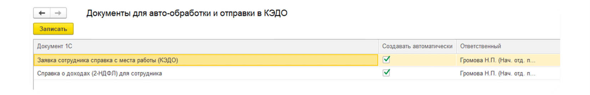

5. Загружает документ в формате PDF. После загрузки документа нажимает кнопку **Подписать**, после чего документ будет направлен сотруднику.

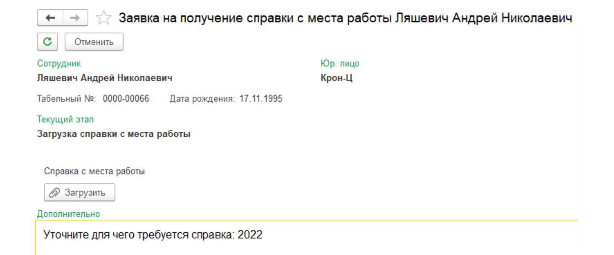

## Сервисы компании веб-сервиса VK HR Tek

1. В **Сервисах компании**, в разделе **Заявки** Руководитель отдела кадров выбирает заявку с типом **Заявка на получение справки с места работы** в списке заявок.

2. Руководитель отдела кадров подписывает автоматически сформированный документ, после чего он направляется сотруднику.

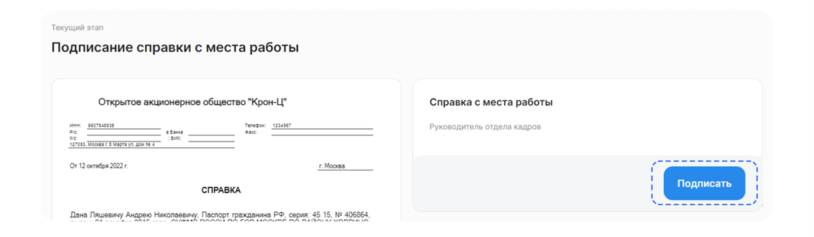

## Этап 3. Подтверждение заявки Сотрудником в личном кабинете

1. В личном кабинете Сотрудник выбирает соответствующую заявку.

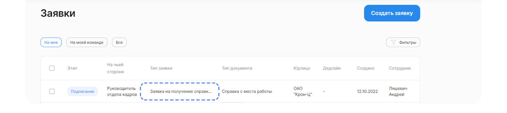

2. Сотрудник проверяет предоставленный ему документ и нажимает кнопку **Подтвердить**.

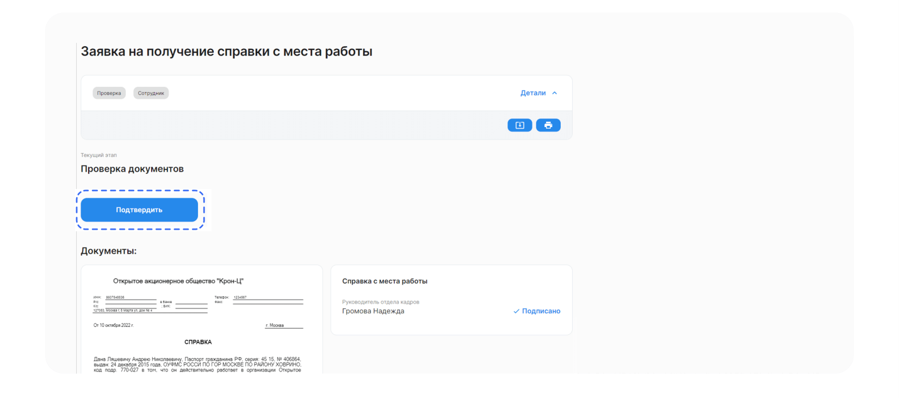