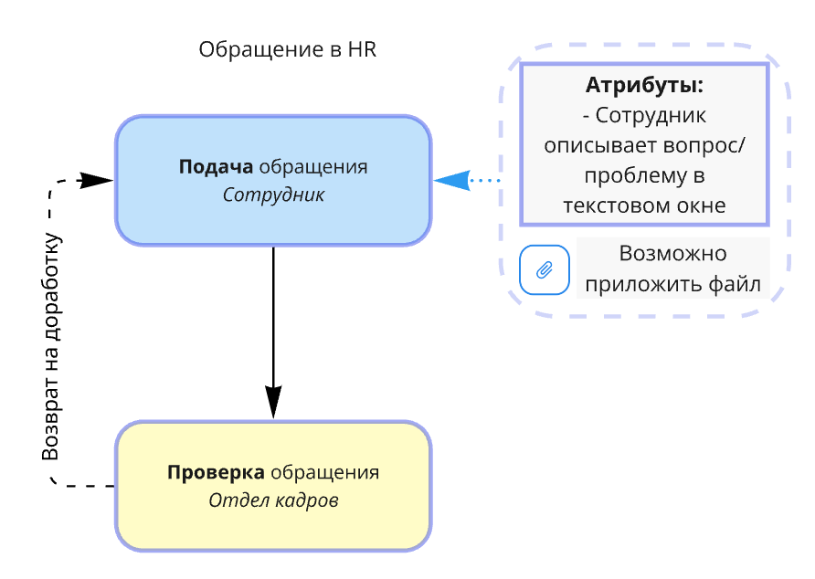
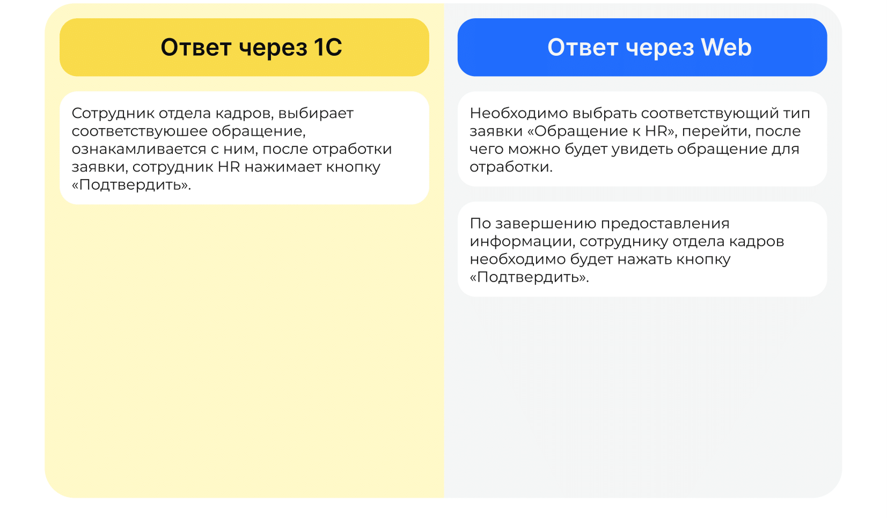

# Процесс обращения в HR

## Этап 1. Старт процесса

Процесс **Обращение в HR** — это свободная форма подачи заявлений для сотрудников. В таких заявках сотрудники могут задать интересующие их кадровые вопросы и прикрепить любой документ в формате PDF.

Чтобы обратиться к HR:
1. Сотрудник переходит в **Мои сервисы** веб-сервиса VK HR Tek, в раздел **Заявки**.
2. Нажимает на кнопку **Создать заявку**.
3. Выбирает **Обращение в HR**.
4. Нажимает кнопку **Создать**.

## Этап 2. Формирование заявки на Обращение к HR

Для формирования обращения сотрудник формулирует вопрос в свободной форме в выпадающем диалоговом окне и нажимает на кнопку **Подтвердить**.

## Этап 3. Формирование ответа от службы HR

