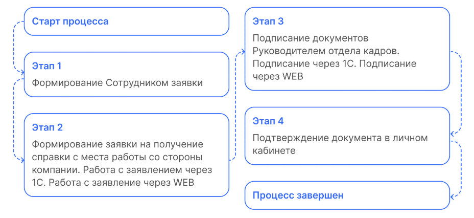
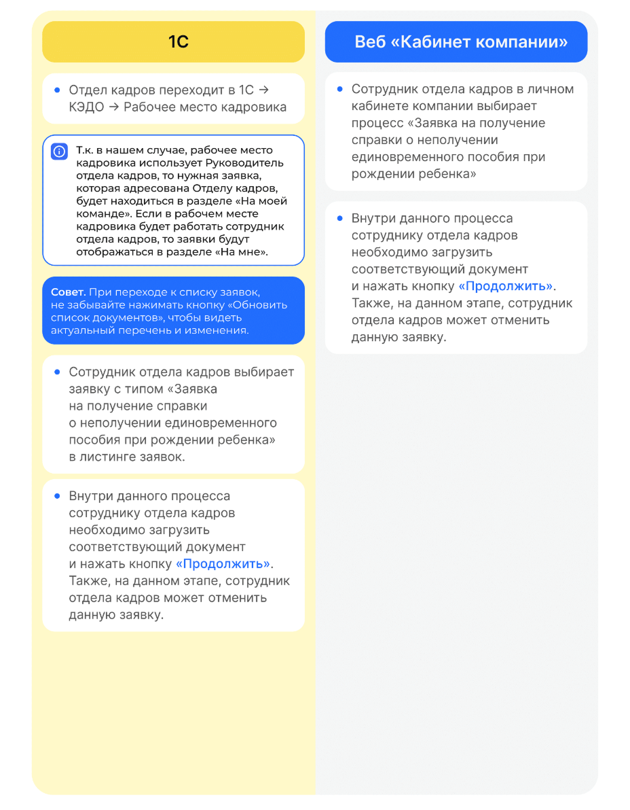
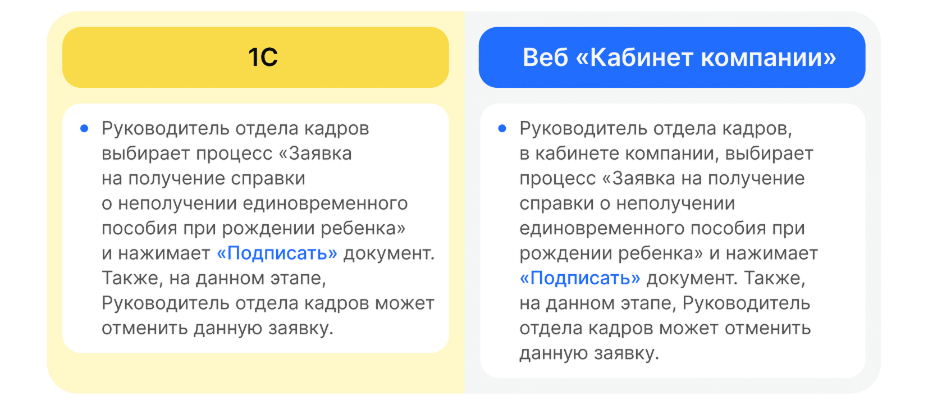

# Процесс «Заявка на получение справки о неполучении единовременного пособия при рождении ребенка»

# Старт процесса

Чтобы подать заявление на получение справки о неполучении единовременного пособия при рождении ребенка, Сотрудник:
1. Переходит в **Сервисы сотрудника в веб-сервисе**.
2. Нажимает кнопку **Создать заявку**. 
3. Выбирает **Заявка на получение справки о неполучении единовременного пособия при рождении ребенка**.
4. Нажимает кнопку **Подтвердить**.

## Этап 1. Формирование Сотрудником заявки
1. Сотрудник в личном кабинете выбирает **Заявка на получение справки о неполучении единовременного пособия при рождении ребенка** и нажимает кнопку **«Подтвердить»**.
2. Для формирования документа вводит обязательные данные о ребенке и после нажимает на кнопку **Подтвердить**.

## Этап 2. Формирование заявки на получение справки с места работы со стороны компании

## Этап 3. Подписание документов Руководителем отдела кадров

## Этап 4. Подтверждение документа в личном кабинете

1. Сотрудник в личном кабинете переходит на страницу заявки.
2. Сотрудник ознакомляется с документом и нажимает на кнопку **Подтвердить**.