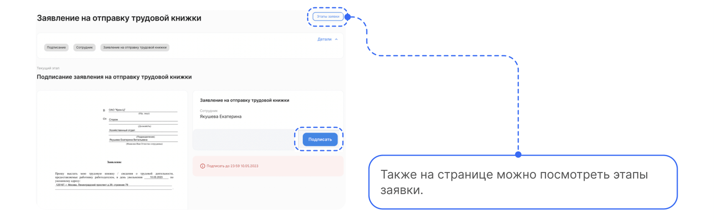
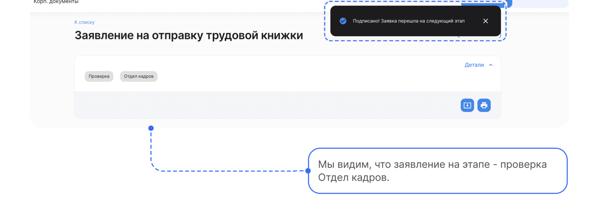
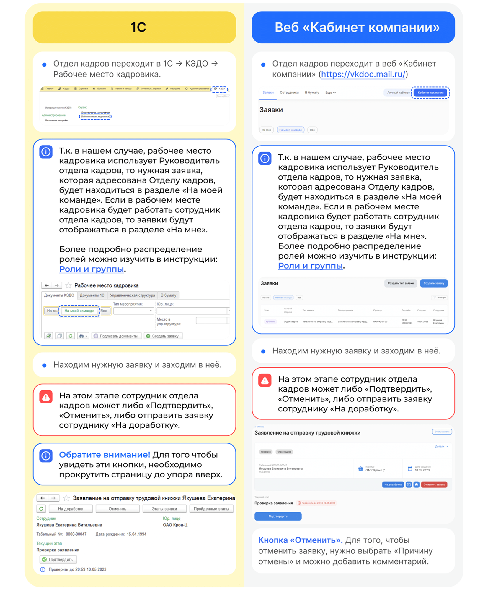
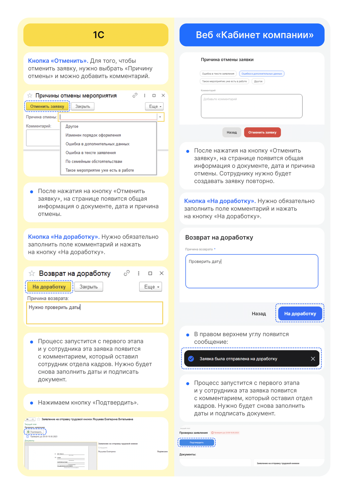

# Процесс «Заявление на отправку трудовой книжки»

## Старт процесса
1. Чтобы подать заявление на отправку трудовой книжки Сотрудник переходит в **Сервисы сотрудника в веб-сервисе**, в раздел **Заявки**.
2. Нажимает на кнопку **Создать заявку**.

3. Выбирает **Заявление на отправку трудовой книжки**.
4. Нажимает **Подтвердить**.

## Этап 1. Формирование Сотрудником заявления

1. Нажимает **Перейти к предпросмотру**.
6. Проверяет заявление, если всё корректно, нажимает кнопку **Продолжить**.

## Этап 2. Подписание заявления Сотрудником

1. Нажимает кнопку **Подписать**.

2. Вводит код из смс и нажимает **Подписать**.

3. На странице появляется сообщение о том, что заявление подписано и заявка перешла на следующий этап.

## Этап 2. Подписание заявления Сотрудником

Отдел кадров может работать с заявкой и в **1С**, и в **Сервисах сотрудника в веб-сервисе**.

