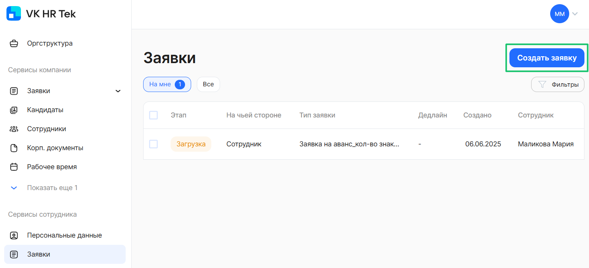
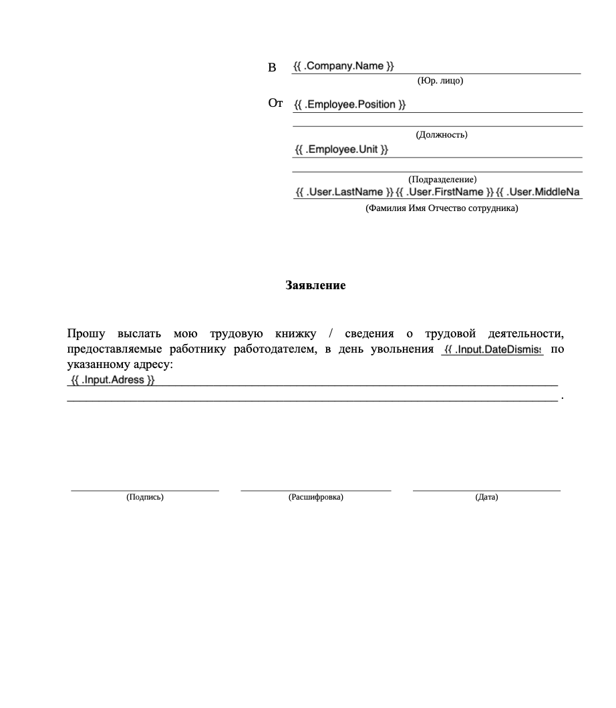
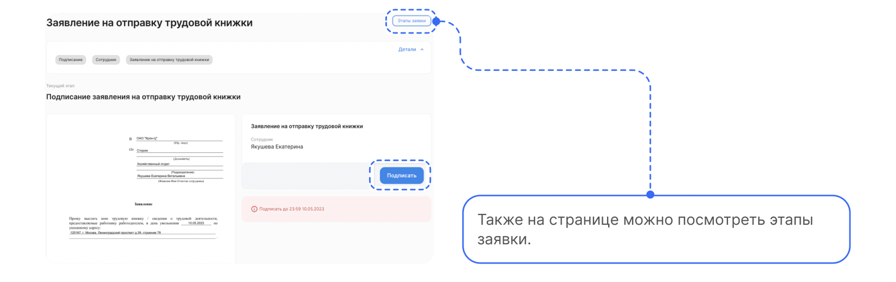
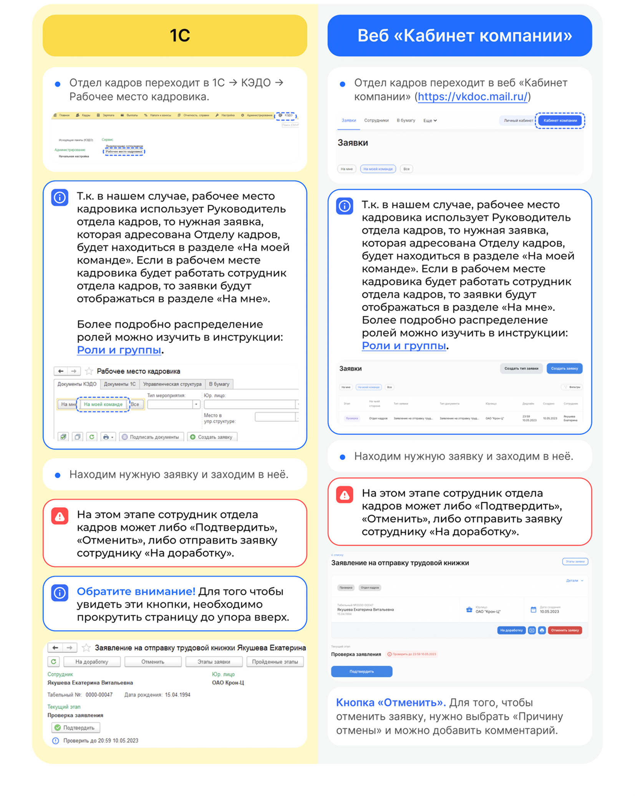
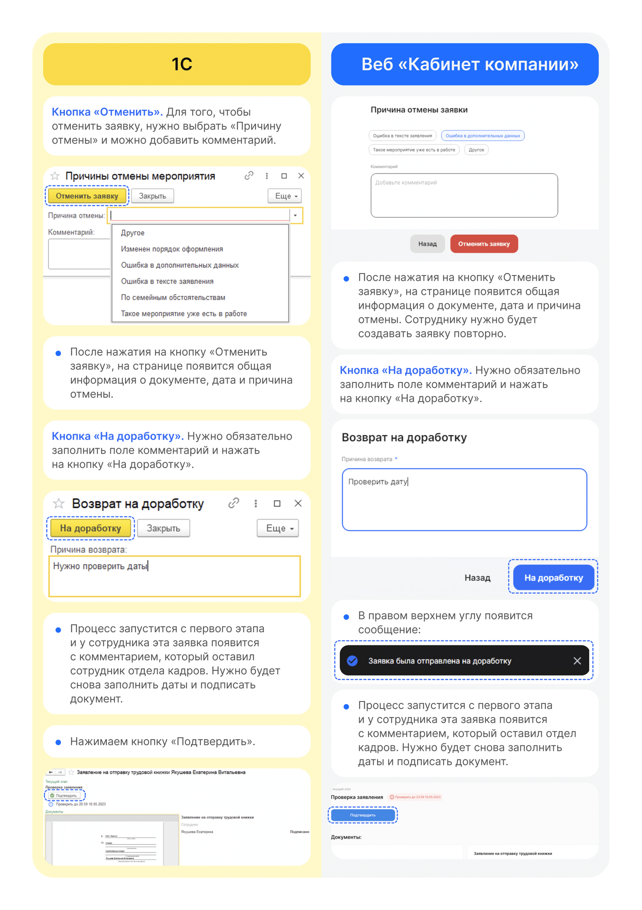

# Процесс «Заявление на отправку трудовой книжки»

## Старт процесса
1. Чтобы подать заявление на отправку трудовой книжки Сотрудник переходит в **Мои сервисы** в веб-сервисе, в раздел **Заявки**.
2. Нажимает на кнопку **Создать заявку**.

3. Выбирает **Заявление на отправку трудовой книжки**.
4. Нажимает **Подтвердить**.

## Этап 1. Формирование заявления Сотрудником

1. Сотрудник заполняет адрес для отправки трудовой книжки и дату увольнения.
1. Нажимает **Перейти к предпросмотру**.

3. Проверяет заявление, если всё корректно, нажимает кнопку **Продолжить**.

Шаблон заявления
 

## Этап 2. Подписание заявления Сотрудником

1. Нажимает кнопку **Подписать**. Сотрудник должен подписать заявление не позднее даты увольнения. Тип подписи: ПЭП.

2. На странице появляется сообщение о том, что заявление подписано и заявка перешла на следующий этап.

## Этап 3. Проверка заявления Отделом кадров

Отдел кадров может работать с заявкой и в **1С**, и в **Сервисах сотрудника в веб-сервисе**.

