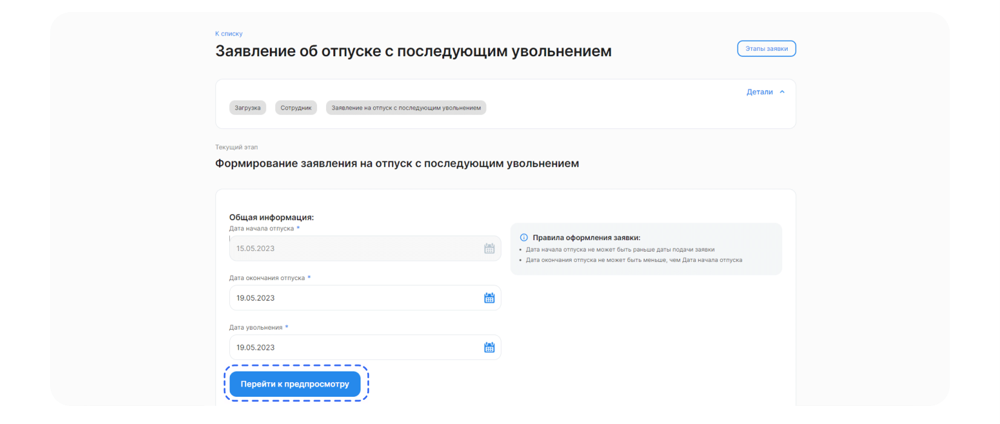
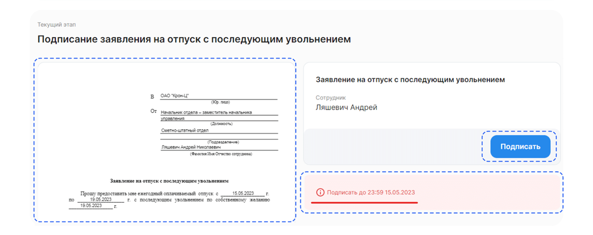
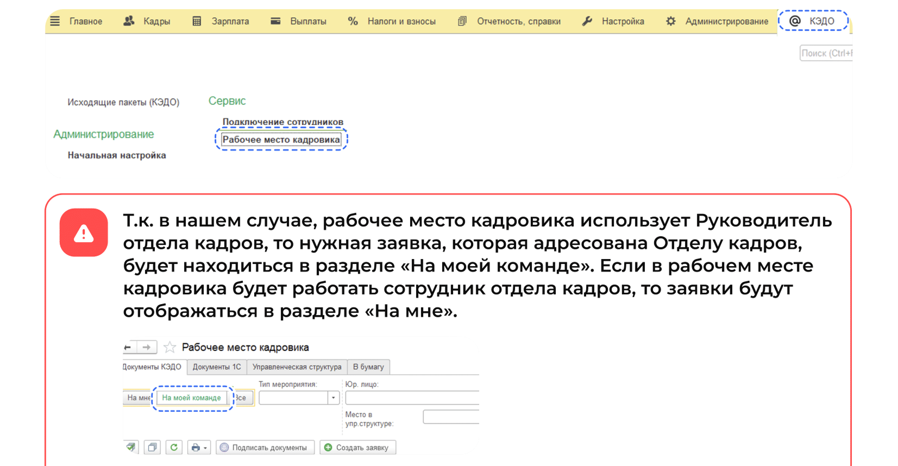
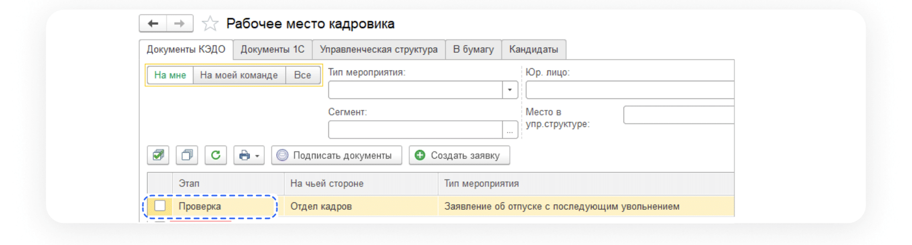
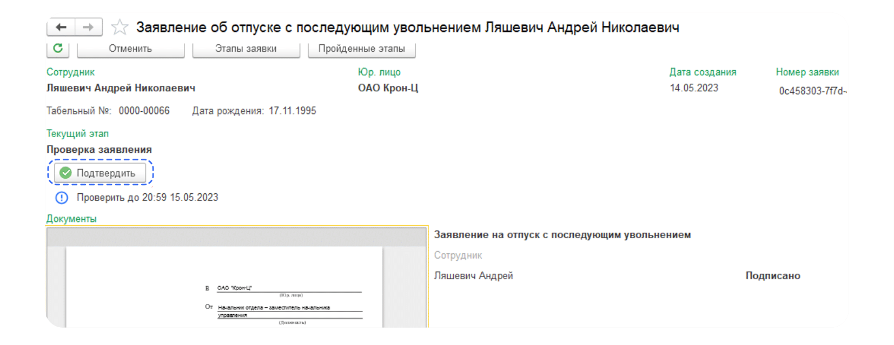
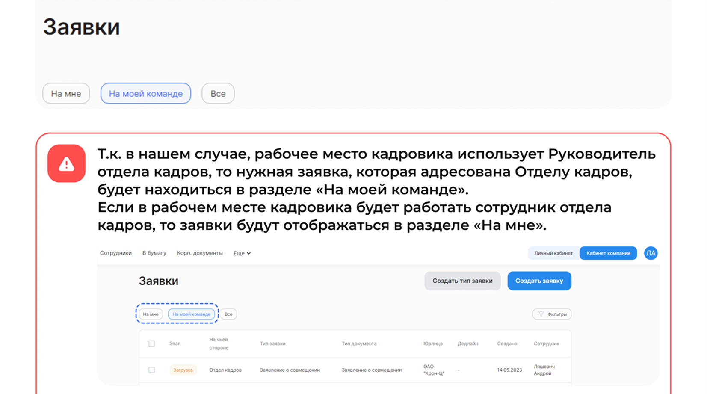
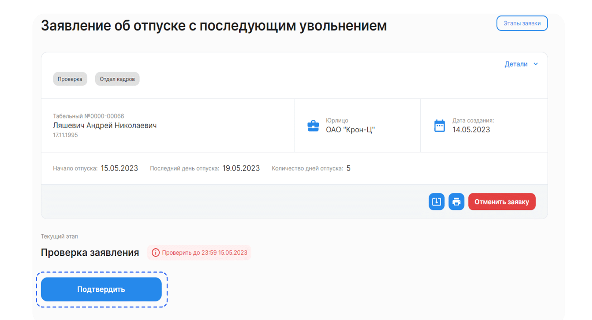

# Процесс «Заявление об отпуске с последующим увольнением»

## Старт процесса

1. Чтобы подать заявление об отпуске с последующим увольнением Сотрудник переходит в **Сервисы сотрудника** веб-сервиса VK HR Tek, в раздел **Заявки**.
2. Нажимает кнопку **Создать заявку**.

3. Выбирает **Заявление об отпуске с последующим увольнением**.
4. Нажимает **Подтвердить**.

## Этап 1. Формирование Сотрудником заявления

1. Сотрудник заполняет поля с должностью и датой перевода.
2. Нажимает кнопку **Перейти к просмотру**.

## Этап 2. Подписание заявления Сотрудником

1. Проверяет документ.
2. Нажимает **Подписать**.

<info>

На странице расположены: 
- Сформированный документ.
- Дедлайн, до которого нужно подписать документ.
- Кнопка **Подписать**.

</info>

Чтобы подтвердить подписание документа, на телефон поступит смс-сообщение, номер из которого Сотрудник вводит в открывшемся окне и нижимает кнопку **Подписать**.

## Этап 3. Взаимодействие с документами представителей сотрудников компании

Сотрудники отдела кадров могут загружать документы двумя способами: через **1С** и через **Сервисы компании**.

## Работа через 1С

Сотрудник отдела кадров переходит в **1С** → **КЭДО** → **Рабочее место кадровика**.

<warn>

На данном этапе сотрудник с ролью **Отдел кадров** ознакомляется с документами и нажимает кнопку **Подтвердить** либо может **Отменить** заявку.

</warn>

## Сервисы компании веб-сервиса VK HR Tek

1. Отдел кадров переходит в **Сервисы компании в веб-сервисе**.

2. Находит нужную заявку и заходит в неё.

<warn>

На данном этапе сотрудник с ролью **Отдел кадров** ознакомляется с документами и нажимает кнопку **Подтвердить** либо может **Отменить заявку**.

</warn>

