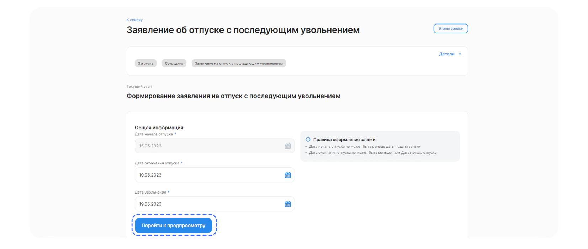
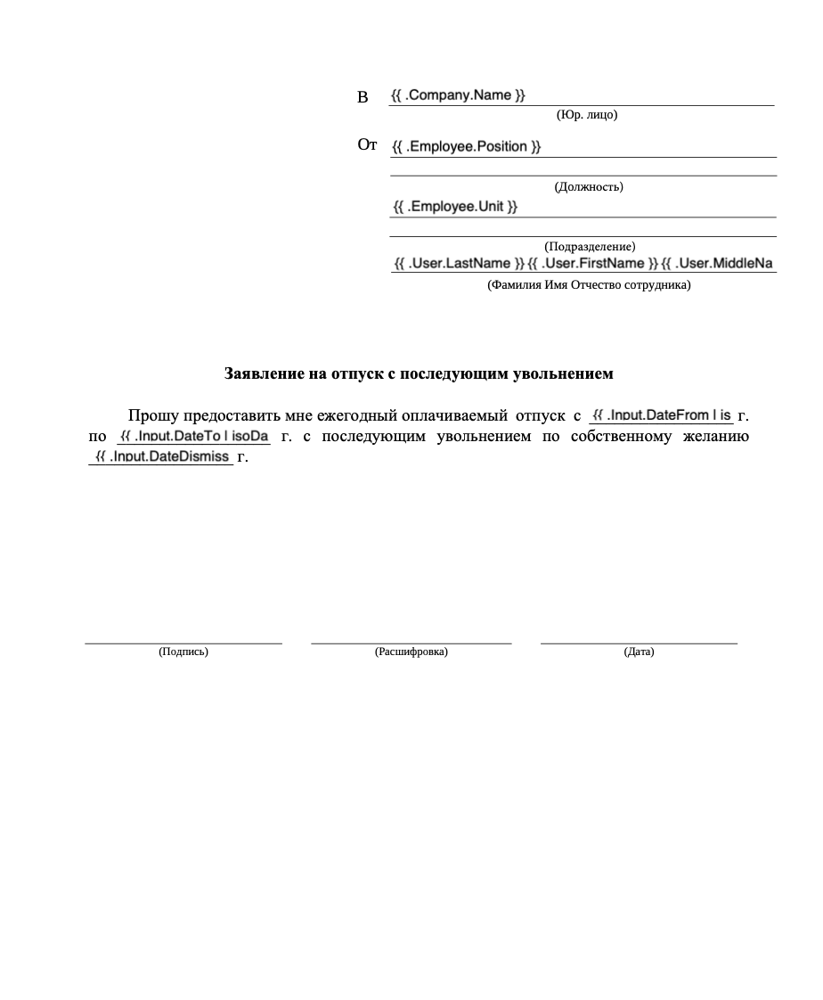
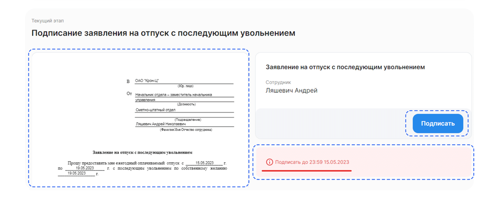
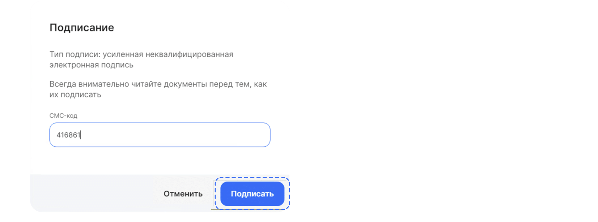
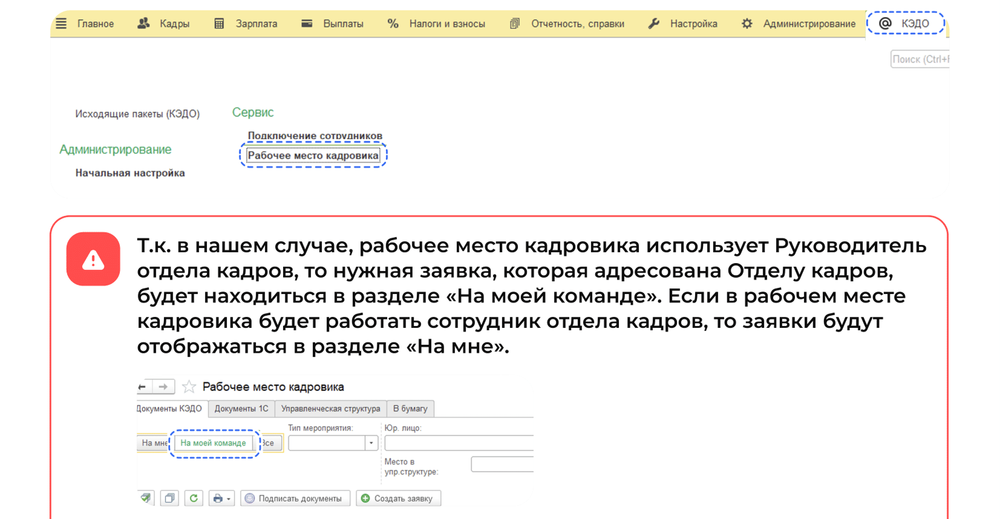
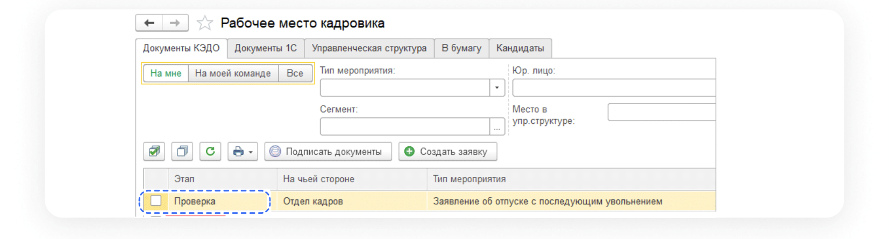
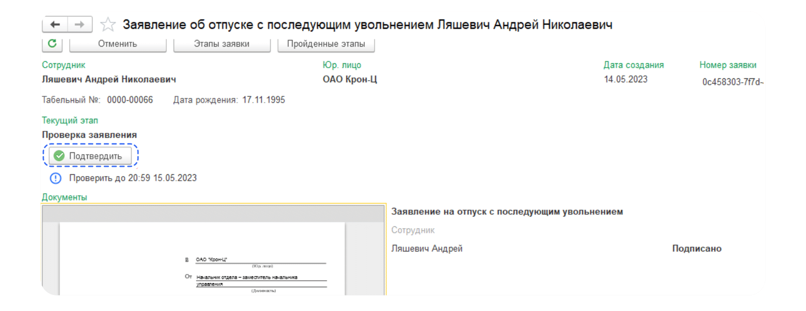
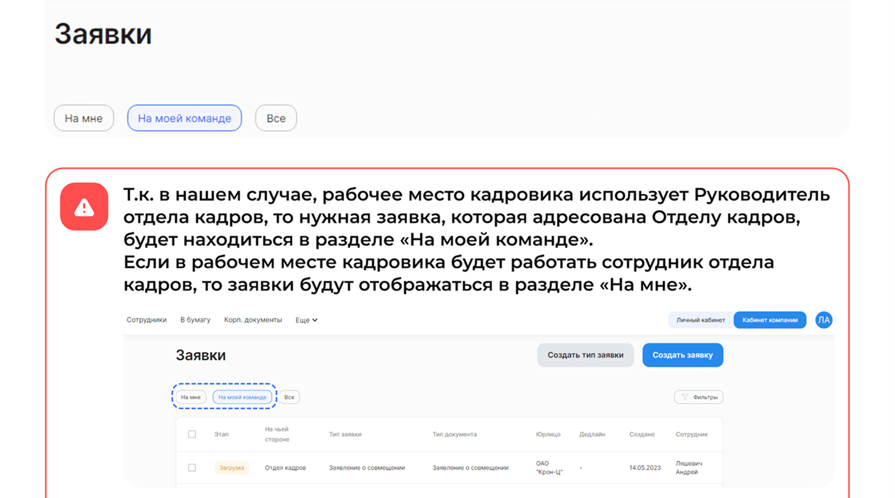
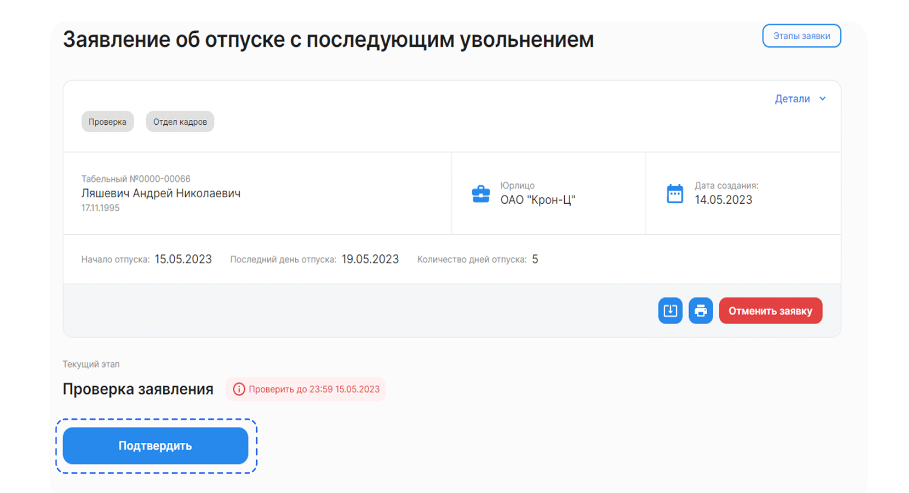

# Процесс «Заявление об отпуске с последующим увольнением»

## Старт процесса

1. Чтобы подать заявление об отпуске с последующим увольнением Сотрудник переходит в **Мои сервисы** веб-сервиса VK HR Tek, в раздел **Заявки**.
2. Нажимает кнопку **Создать заявку**.

3. Выбирает **Заявление об отпуске с последующим увольнением**.
4. Нажимает **Создать**.

## Этап 1. Формирование Сотрудником заявления

1. Сотрудник заполняет поля:
- Дата начала отпуска,
- Дата окончания отпуска,
- Дата увольнения.
2. Нажимает кнопку **Перейти к просмотру**.

Шаблон заявления
 

## Этап 2. Подписание заявления Сотрудником

1. Проверяет документ.
2. Нажимает **Подписать**. Сотрудник должен подписать заявление до даты начала отпуска. 

3. Чтобы подтвердить подписание документа, на телефон поступит СМС-сообщение, номер из которого Сотрудник вводит в открывшемся окне и нижимает кнопку **Подписать**.

## Этап 3. Согласование заявления Руководителем

<warn>

Если руководителя нет, то бизнес-процесс переходит сразу на следующий этап — Загрузка приказа Отделом кадров.

На данном этапе сотрудник с ролью **Отдел кадров** ознакомляется с документами и нажимает кнопку **Подтвердить**, либо может **Отменить заявку**. В случае отмены заявки, процесс стартует с первого этапа формирования заявления сотрудником.

</warn>

1. Руководитель переходит в **Сервисы компании**, в раздел **Заявки**.
2. Открывает нужную заявку.
3. Нажимает **Подтвердить**.

## Этап 4. Проверка заявления Отделом кадров

Сотрудники отдела кадров могут загружать документы двумя способами: через **1С** и через **Сервисы компании**.

### Работа через 1С

Сотрудник отдела кадров переходит в **1С** → **КЭДО** → **Рабочее место кадровика**.

<warn>

На данном этапе сотрудник с ролью **Отдел кадров** ознакомляется с документами и нажимает кнопку **Подтвердить** либо может **Отменить** заявку, либо отправить заявку сотруднику **На доработку**.

</warn>

### Сервисы компании веб-сервиса VK HR Tek

1. Отдел кадров переходит в **Сервисы компании в веб-сервисе**.

2. Находит нужную заявку и заходит в неё.

<warn>

На данном этапе сотрудник с ролью **Отдел кадров** ознакомляется с документами и нажимает кнопку **Подтвердить** либо может **Отменить** заявку, либо отправить заявку сотруднику **На доработку**.

</warn>

