# Процесс «Заявление об увольнении»

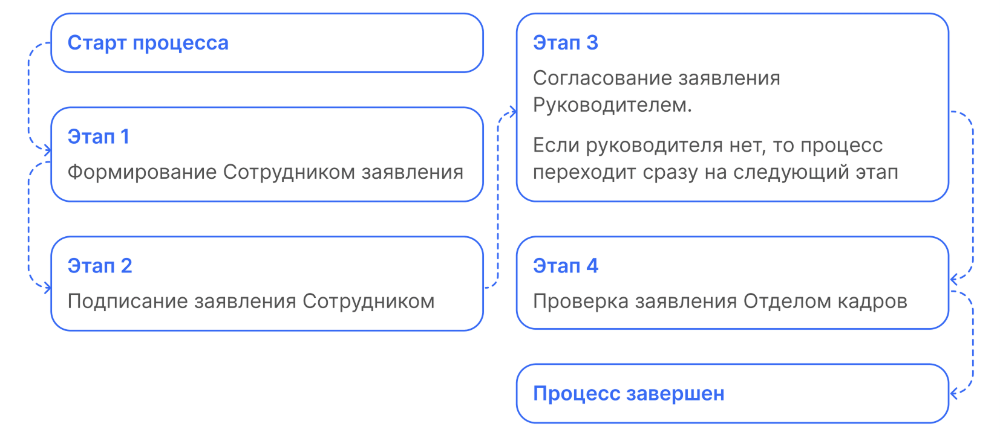

 

## Старт процесса

1. Чтобы подать заявление об увольнении Сотрудник переходит **Сервисы сотрудника веб-сервиса VK HR Tek**, в раздел **Заявки**.
2. Нажимает на кнопку **Создать заявку**.

3. Выбирает **Заявление об увольнении**.
4. Нажимает **Подтвердить**.

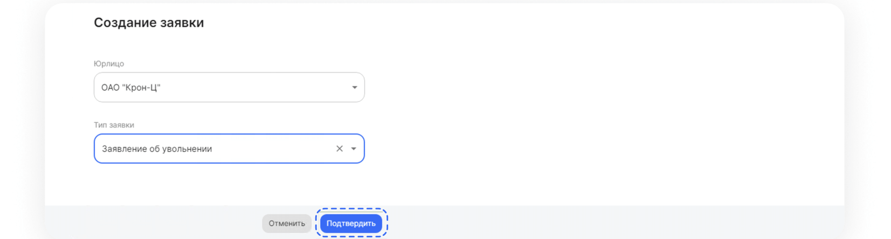

 

## Этап 1. Формирование Сотрудником заявления

<warn>

На этом этапе сотрудник может **Отменить заявку**.

</warn>

1. Выбирает дату последнего рабочего дня и нажимает **Перейти к предпросмотру**.

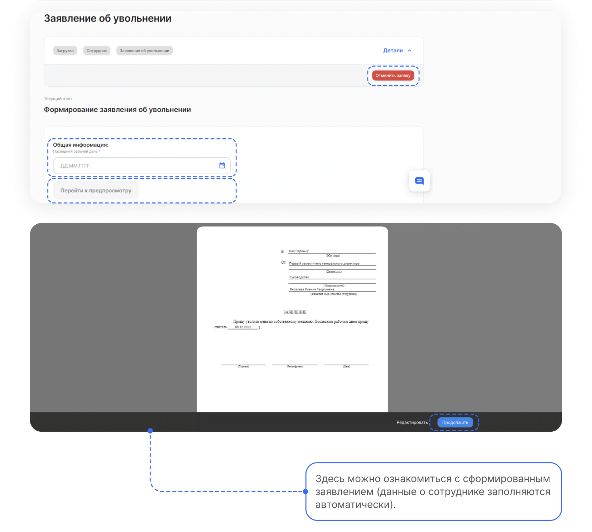

2. Если всё верно, нажимает кнопку **Продолжить**.

## Этап 2. Подписание заявления Сотрудником

1. Нажимает кнопку **Подписать**.

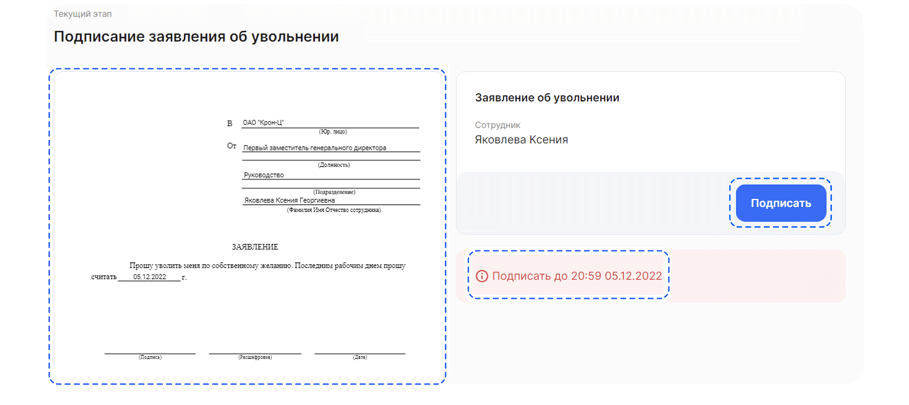

<info>

На странице расположены:
- Сформированный документ;
- Дедлайн, до которого нужно подписать документ; 
- Кнопка **Подписать**.

</info>

2. Проверяет документ.
3. Нажимает на кнопку **Подписать**.

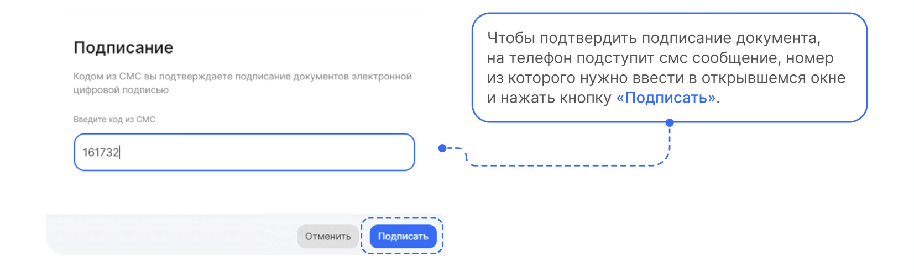

 

## Этап 3. Согласование заявления Руководителем

1. Руководитель переходит в **Сервисы компании** веб-сервиса VK HR Tek, в раздел **Заявки**.

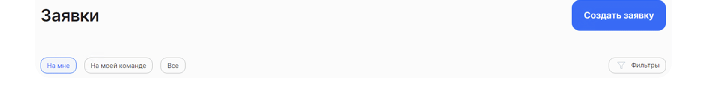

<warn>

На данном этапе Руководитель может **Подтвердить**, **Отменить заявку**, либо отправить **На доработку**.

</warn>

2. В случае отмены заявки или отправки на доработку, процесс стартует с первого этапа формирования заявления сотрудником.

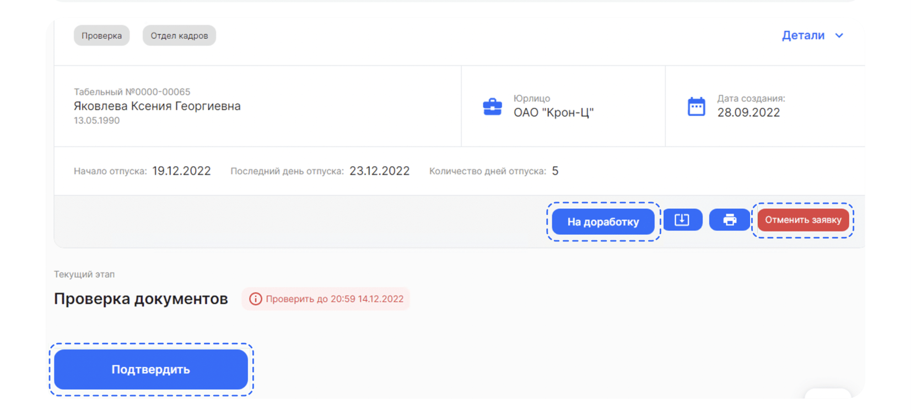

Кнопка **Отменить** позволяет отменить заявку с выбором **Причины отмены** и добавлением комментария.

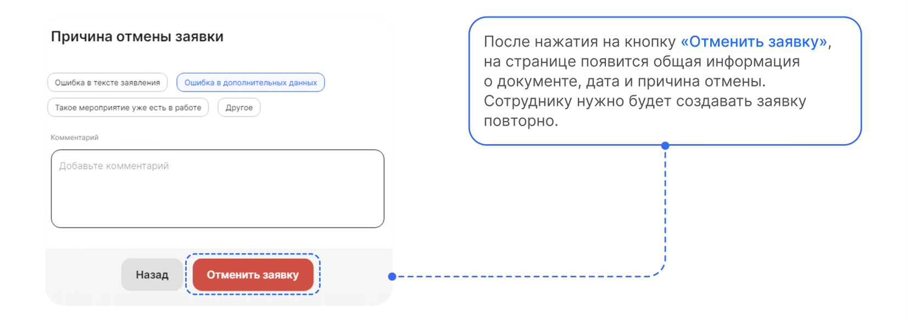

Если Руководитель нажал кнопку **На доработку**, то обязательно указывает комментарий.

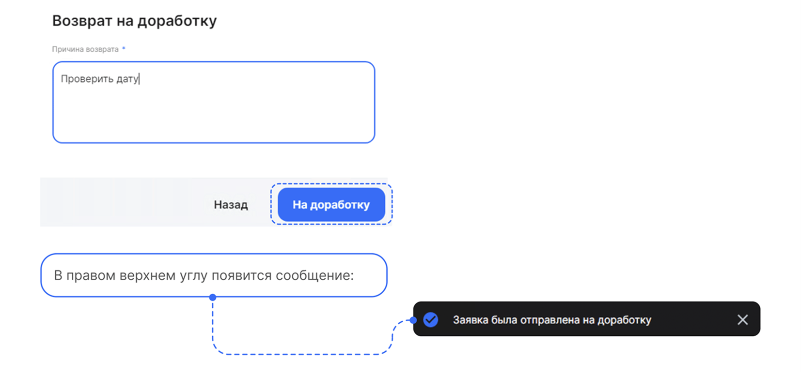

Процесс запустится с первого этапа и у сотрудника эта заявка появится с комментарием по заявке, который оставил сотрудник отдела кадров. Нужно будет снова заполнить даты и подписать документ.

3. Руководитель открывает нужную заявку и нажимает **Подтвердить**.

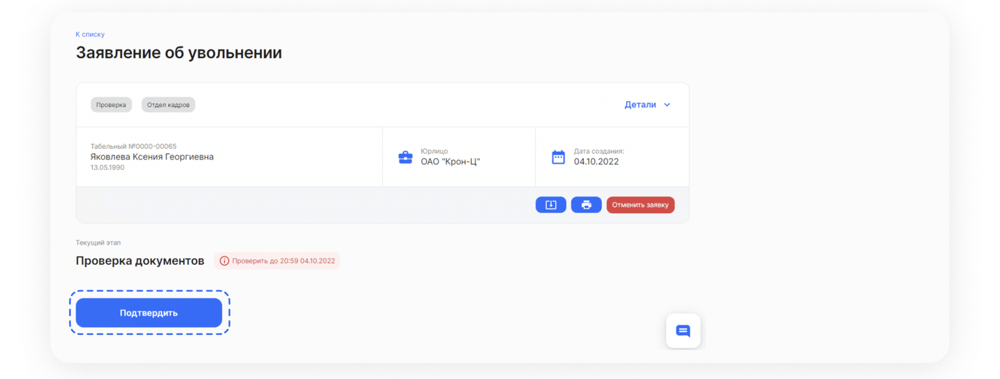

 

## Этап 4. Проверка заявления Отделом кадров

Сотрудники отдела кадров могут обрабатывать заявки как в системе **1С**, так и в **Сервисах компании веб-сервиса**.

## Работа через 1С

1. Переходит в **Рабочее место кадровика** → вкладка **На моей команде**.
2. Открывает нужную заявку.
3. Нажимает **Подтвердить**.

<warn>

В данном случае **Рабочее место кадровика** использует Руководитель отдела кадров, поэтому заявка, которая адресована Отделу кадров, будет находиться на вкладке **На моей команде**. Если в **Рабочем месте кадровика** будет работать сотрудник Отдела кадров, то заявки будут отображаться на вкладке **На мне**.

</warn>

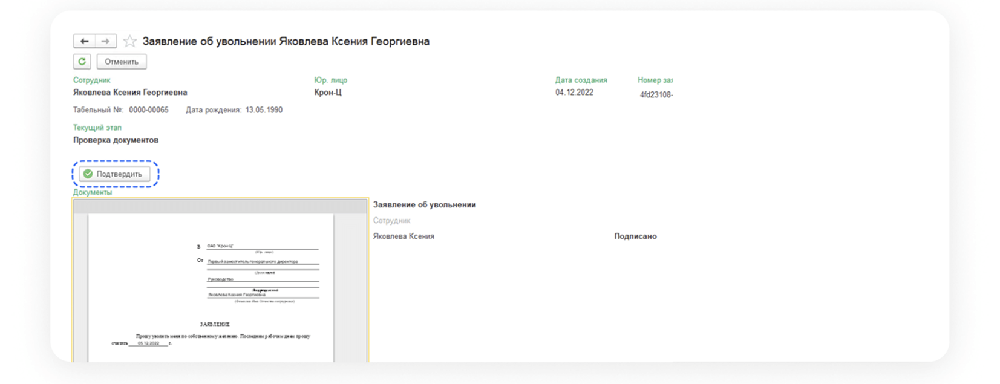

 

## Сервисы компании веб-сервиса VK HR Tek

1. Сотрудник Отдела кадров преходит в **Сервисы компании веб-сервиса VK HR Tek**, в раздел **Заявки**.
2. Нажимает на кнопку **Подтвердить**.

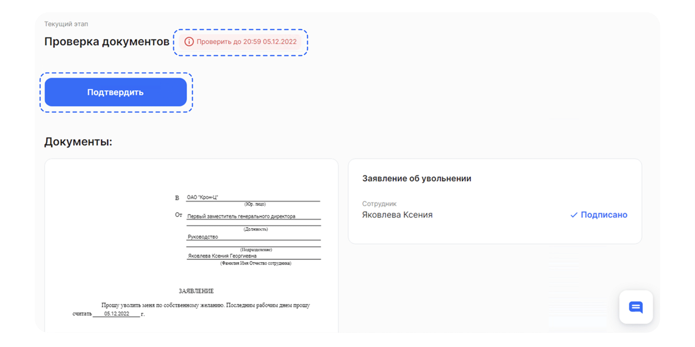
