# Процесс «Заявление об увольнении по соглашению сторон»

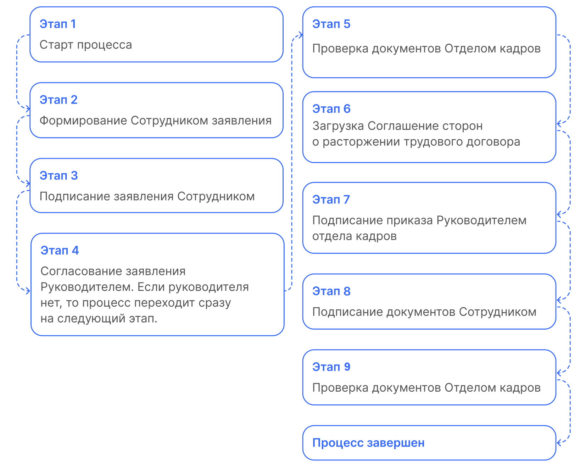

## Этап 1. Старт процесса

1. Чтобы подать заявление Сотрудник переходит в **Мои сервисы** веб-сервиса VK HR Tek, в раздел **Заявки**.
2. Нажимает кнопку **Создать заявку**.

3. Выбирает **Заявление об увольнении по соглашению сторон**.
4. Нажимает **Подтвердить**.

## Этап 2. Формирование Сотрудником заявления

Для формирования заявления необходимо:
1. Заполнить поля:
- Номер трудового договора,
- Дата заключения трудового договора,
- Дата увольнения.

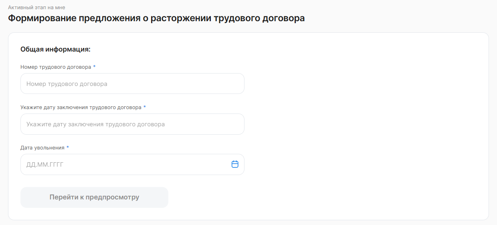

2. Нажать **Перейти к предпросмотру**.
3. Проверить заявление, если всё корректно, нажать кнопку **Продолжить**.

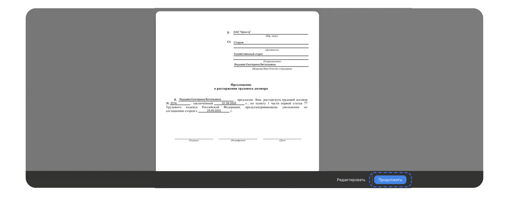

Шаблон заявления
 

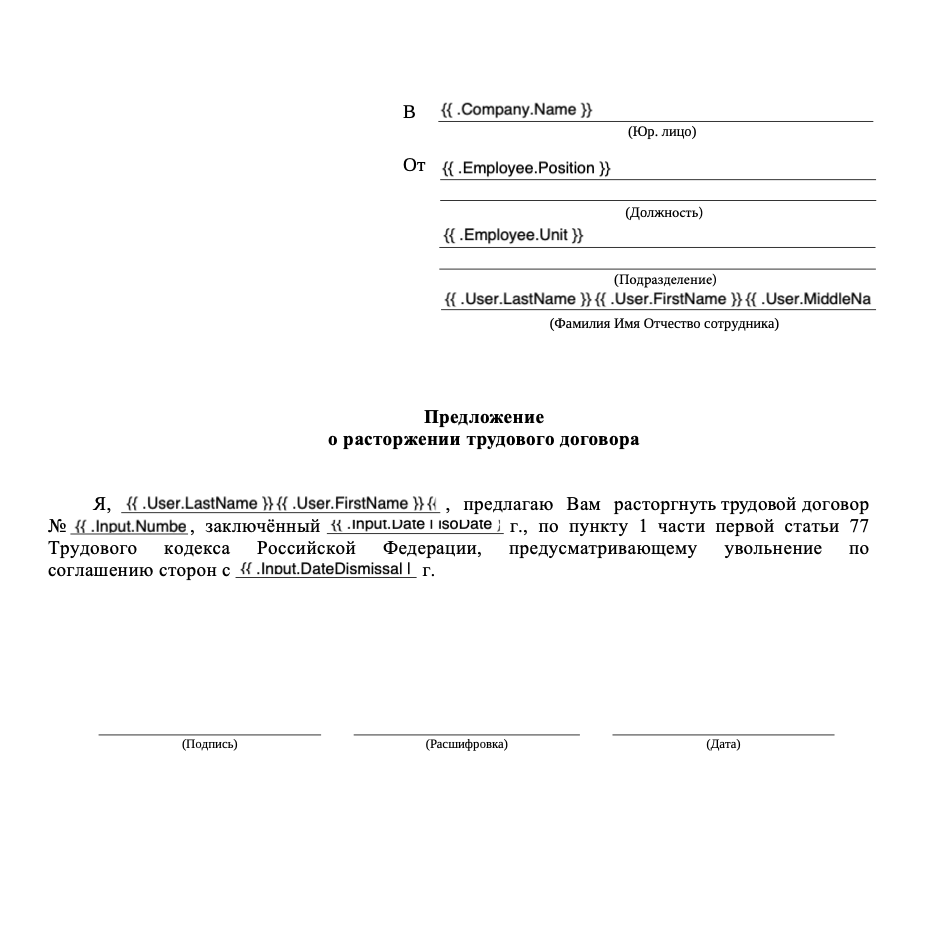

## Этап 3. Подписание заявления Сотрудником

1. Нажимает на кнопку **Подписать**. Сотрудник должен подписать заявление не позднее, чем за 14 дней до даты увольнения. 

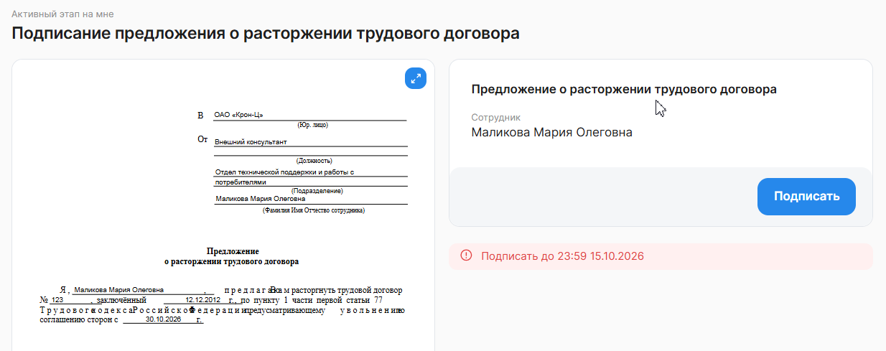

2. Вводит код из СМС и нажимает **Подписать** (в случае УНЭП УЦ Контур). 

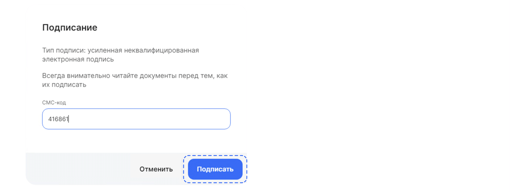

3. На странице появляется сообщение о том, что заявление подписано и заявка перешла на следующий этап.

## Этап 4. Согласование заявления Руководителем

1. Руководитель переходит в **Сервисы компании**  веб-сервиса VK HR Tek, в раздел **Заявки**.

<warn>

Если по какой-то причине у сотрудника нет руководителя, то процесс переходит сразу на следующий этап **Проверка заявления Отделом кадров**.

</warn>

2. Открывает нужную заявку.
3. Нажимает кнопку **Подтвердить**. Руководитель должен согласовать заявление не позднее, чем за 14 дней до даты увольнения.

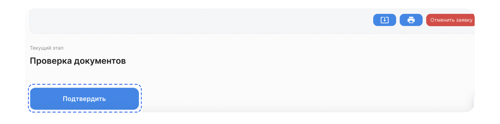

## Этап 5. Проверка документов Отделом кадров

На данном этапе кадровый специалист может либо **Подтвердить**, либо **Отменить заявку**. Специалист должен согласовать заявление не позднее, чем за 14 дней до даты увольнения.

В случае возврата на доработку, процесс возвращается на этап формирования заявления сотрудником.

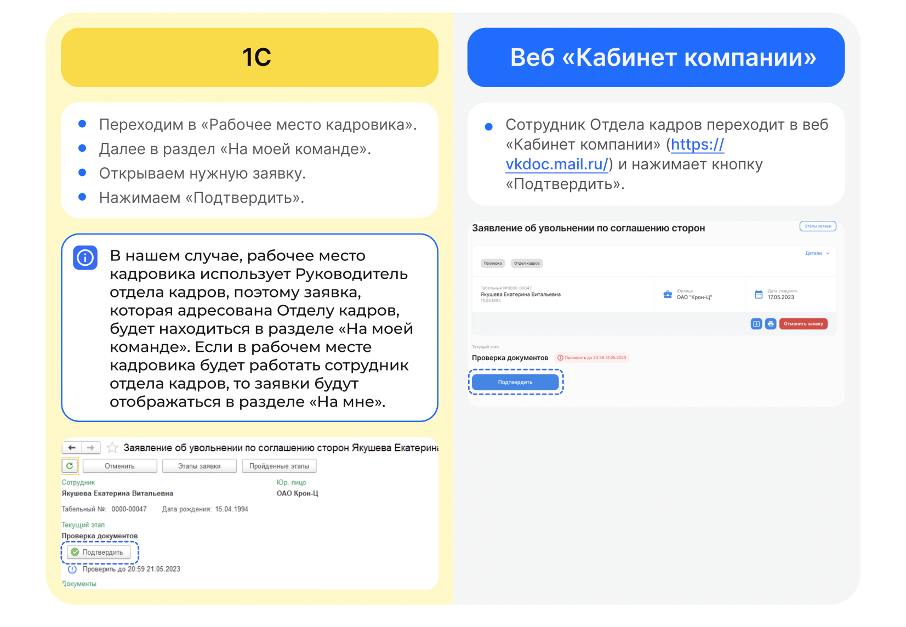

## Этап 6. Загрузка Соглашение сторон о расторжении трудового договора

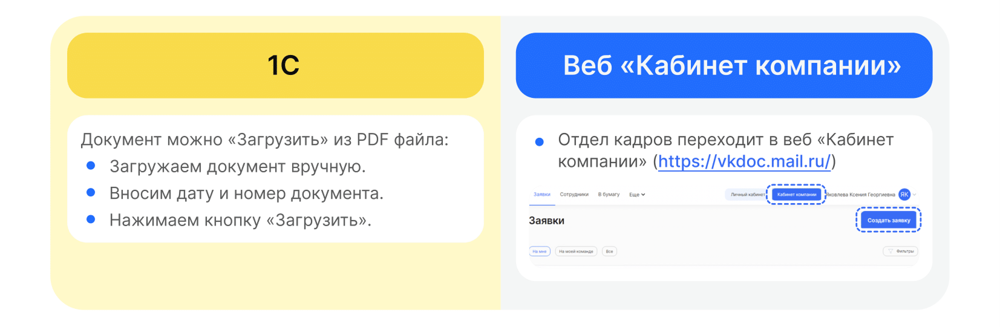

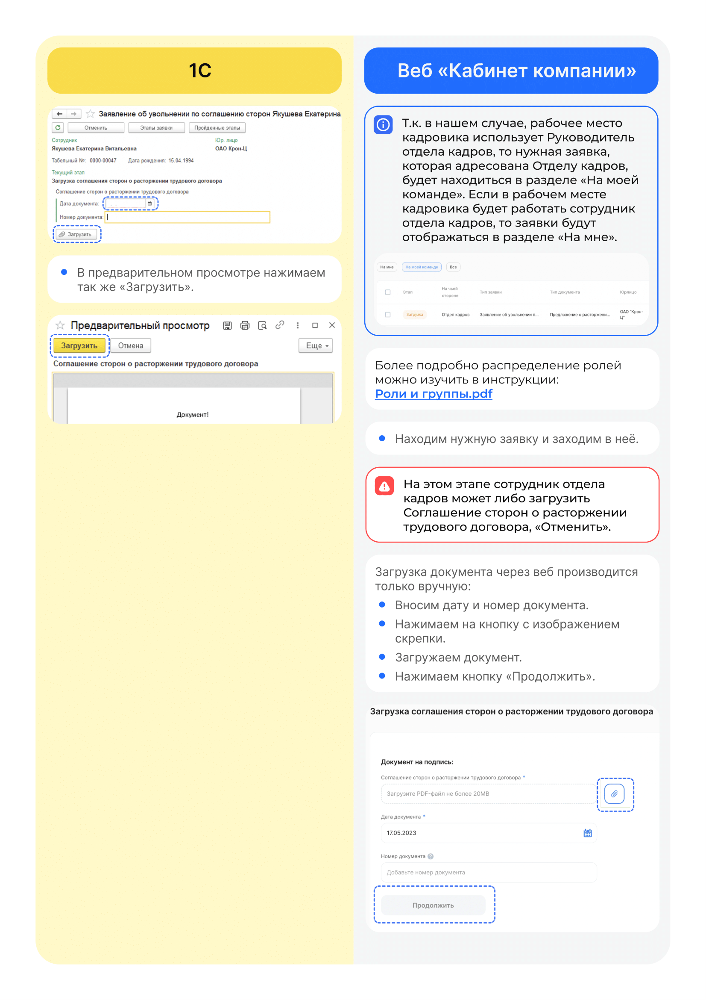

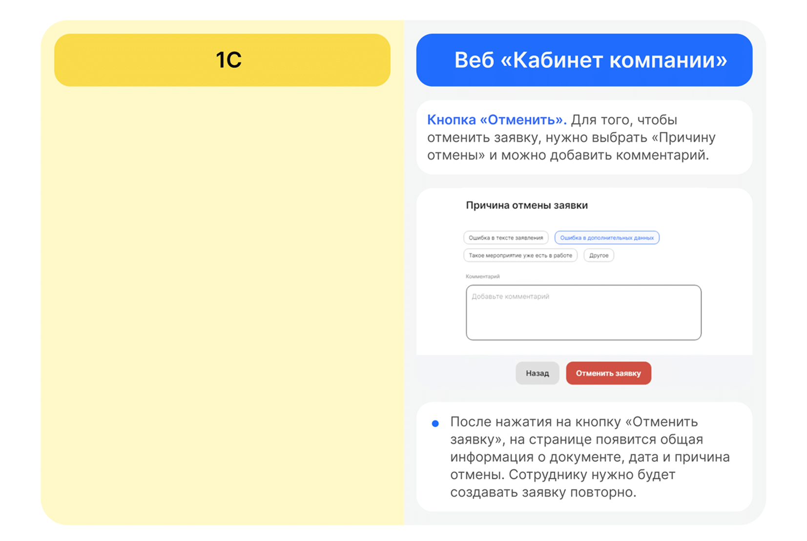

## Этап 7. Подписание приказа Руководителем отдела кадров

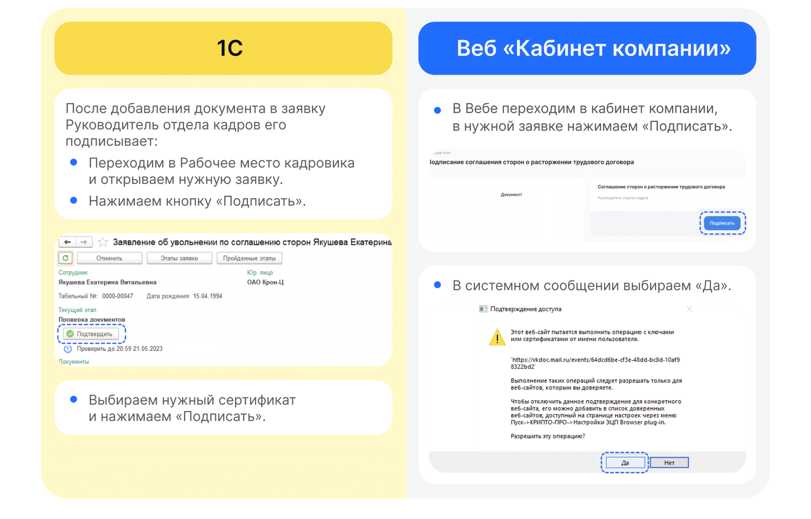

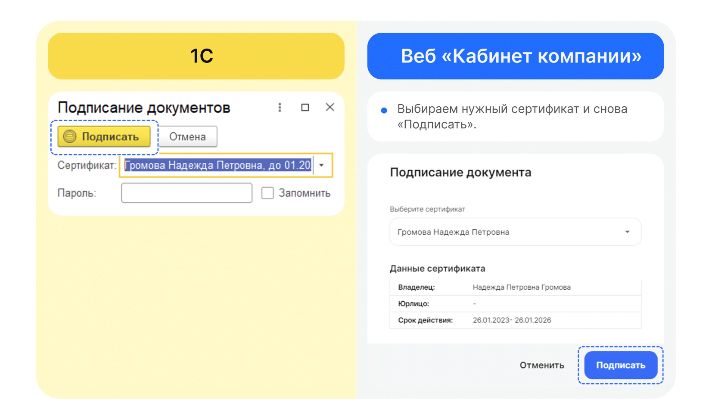

## Этап 8. Подписание документов Сотрудником

1. Сотруднику поступает уведомление на телефон о том, что нужно подписать документ. Сотрудник переходит в Личный кабинет веб-сервиса, в раздел **Заявки**.
2. Открывает заявку.
3. Нажимает на кнопку **Подписать**. Сотрудник должен подписать заявление не позднее, чем за 14 дней до даты увольнения. 

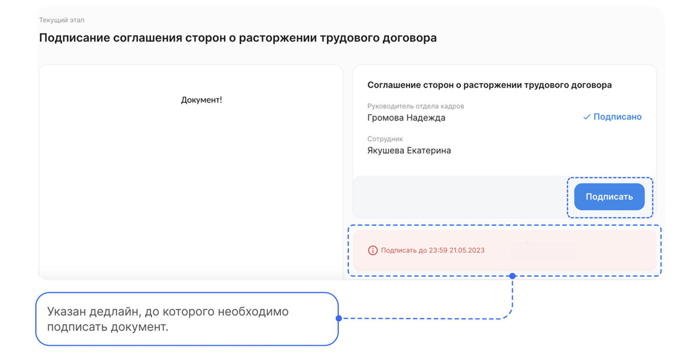

## Этап 9. Проверка документов Отделом кадров

