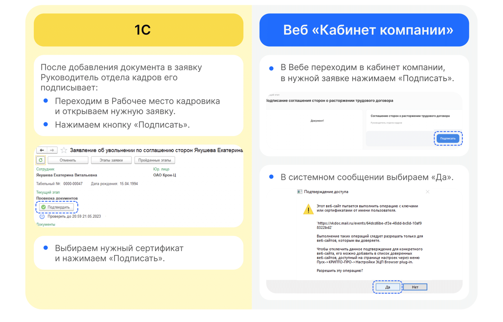

# Процесс «Заявление об увольнении по соглашению сторон»

## Этап 1. Старт процесса

1. Чтобы подать заявление Сотрудник переходит в **Сервисы сотрудника** веб-сервиса VK HR Tek, в раздел **Заявки**.
2. Нажимает кнопку **Создать заявку**.

3. Выбирает **Заявление об увольнении по соглашению сторон**.
4. Нажимает **Подтвердить**.

## Этап 2. Формирование Сотрудником заявления

1. Нажимает **Перейти к предпросмотру**.
2. Проверяет заявление, если всё корректно, нажимает на кнопку **Продолжить**.

## Этап 3. Подписание заявления Сотрудником

1. Нажимает на кнопку **Подписать**.

2. Вводит код из смс и нажимает **Подписать**.

3. На странице появляется сообщение о том, что заявление подписано и заявка перешла на следующий этап.

## Этап 4. Согласование заявления Руководителем

1. Руководитель переходит в **Сервисы компании**  веб-сервиса VK HR Tek, в раздел **Заявки**.

<warn>

Если по какой-то причине у сотрудника нет руководителя, то процесс переходит сразу на следующий этап **Загрузка Соглашение сторон о расторжении трудового договора**.

</warn>

<info>

На данном этапе Руководитель может либо **Подтвердить**, либо **Отменить заявку**. В случае возврата на доработку, процесс возвращается на этап формирования заявления сотрудником.

</info>

2. Открывает нужную заявку.
3. Нажимает кнопку **Подтвердить**.

## Этап 5. Загрузка Соглашение сторон о расторжении трудового договора

## Этап 6. Подписание приказа Руководителем отдела кадров

## Этап 7. Подписание документов Сотрудником

1. Сотруднику поступает уведомление на телефон о том, что нужно подписать документ. Сотрудник переходит в Личный кабинет веб-сервиса, в раздел **Заявки**.
2. Открывает заявку.
3. Нажимает на кнопку **Подписать**.

## Этап 8. Проверка документов Отделом кадров

