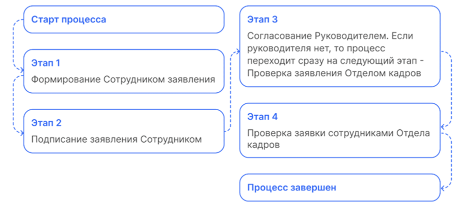
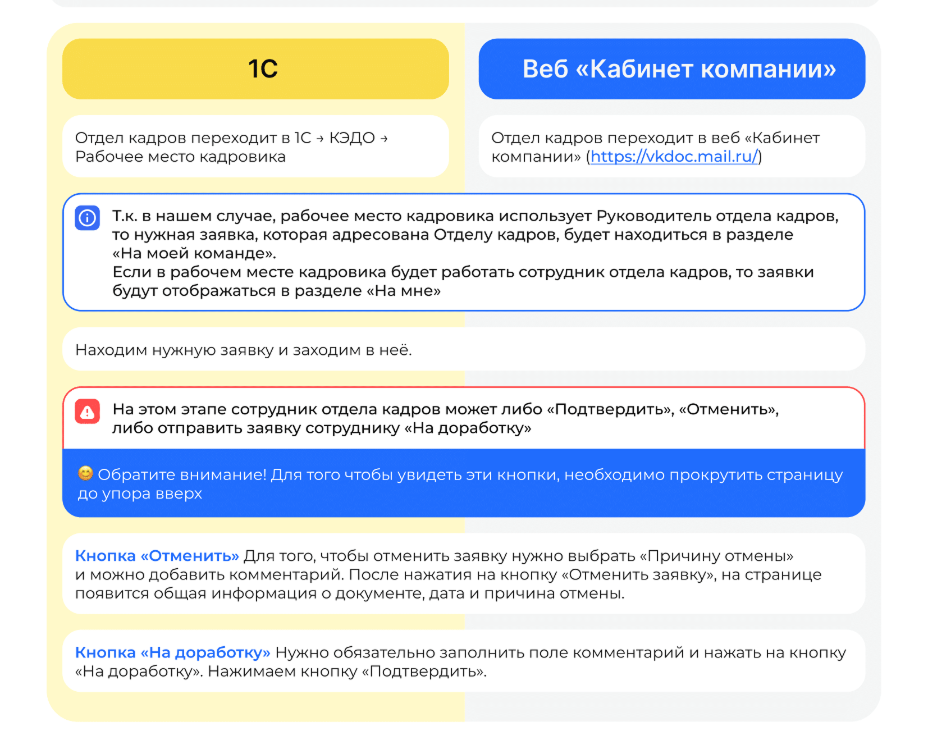
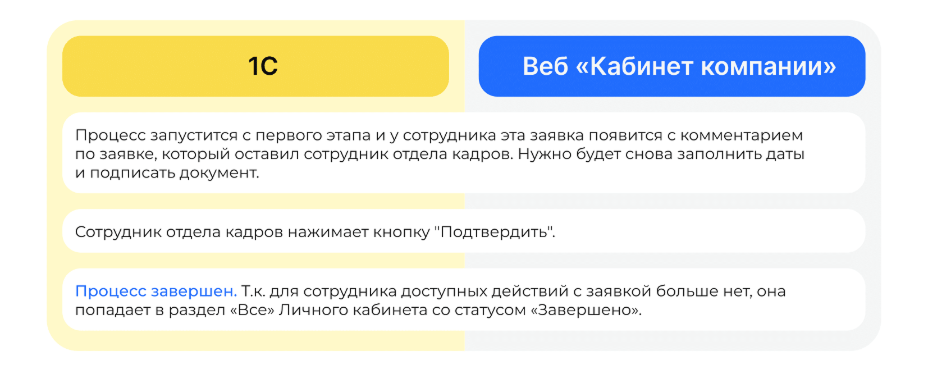

# Процесс «Заявление на отзыв заявления об увольнении»

## Старт процесса

Чтобы подать заявление на отзыв заявления об увольнении:
1. Сотрудник переходит в Личный кабинет веб-сервиса → раздел **Заявки**.
2. Нажимает кнопку **Создать заявку**.
3. Выбирает **Заявление об увольнении**.
4. Нажимает **Подтвердить**.

## Этап 1. Формирование Сотрудником заявления

1. На этом этапе сотрудник может **Отменить заявку**. Выбирает дату последнего рабочего дня и нажимает **Перейти к просмотру**.
2. Ознакомляется со сформированным заявлением (данные о сотруднике заполняются автоматически). Если всё верно, нажимает кнопку **Продолжить**.

## Этап 2. Подписание заявления Сотрудником

1. Нажимает кнопку **Подписать**.
2. Проверяет документ и нажимает **Подписать**. Чтобы подтвердить подписание документа, на телефон поступает смс-сообщение, код из которого Сотрудник вводит в открывшемся окне и нажимает кнопку **Подписать**.

## Этап 3. Согласование заявления Руководителем

Если по какой-то причине у  сотрудника нет руководителя, то процесс переходит сразу на следующий этап **Проверка заявления Отделом кадров**.

1. Руководитель переходит в **Сервисы компании** веб-сервиса VK HR Tek, в раздел **Заявки**.

<warn>

На данном этапе Руководитель может либо **Подтвердить**, либо **Отменить заявку**.

В случае отмены заявки процесс стартует с первого этапа формирования заявления сотрудником.

</warn>

## Этап 4. Проверка заявки сотрудниками Отдела кадров

Отдел кадров может работать с заявкой и в **1С**, и в **Сервисах компании** веб-сервиса.

