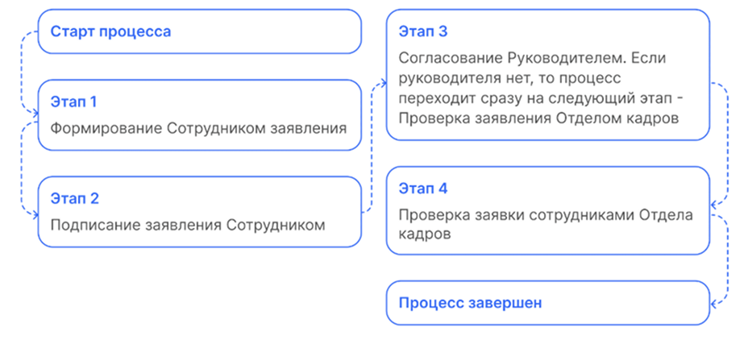
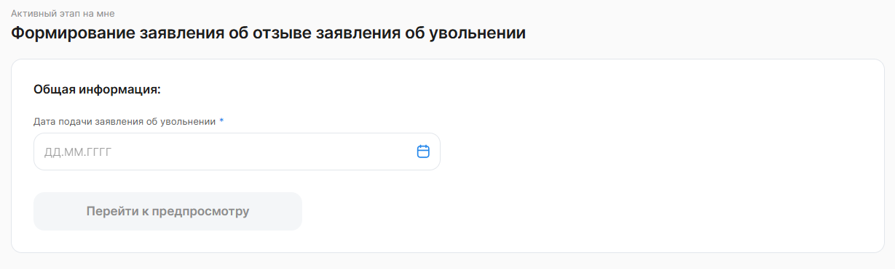
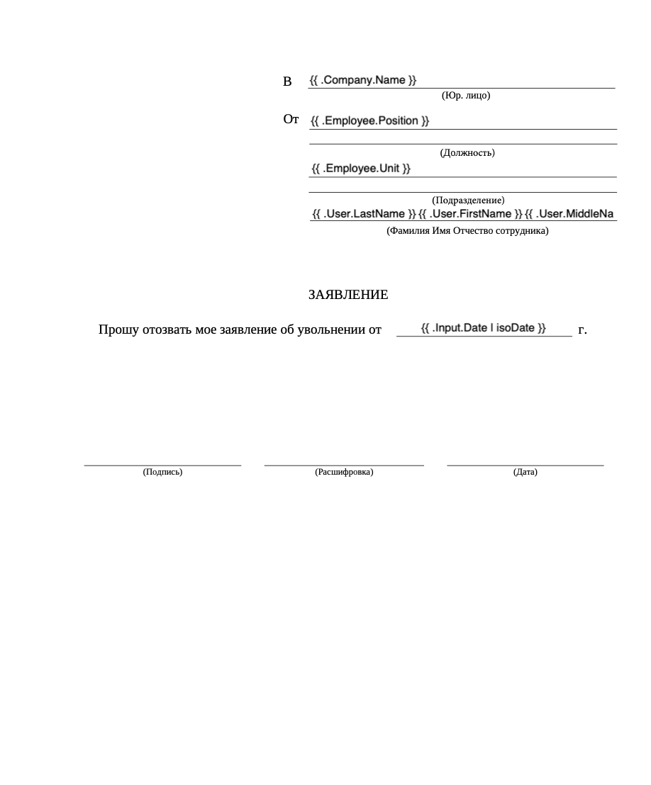
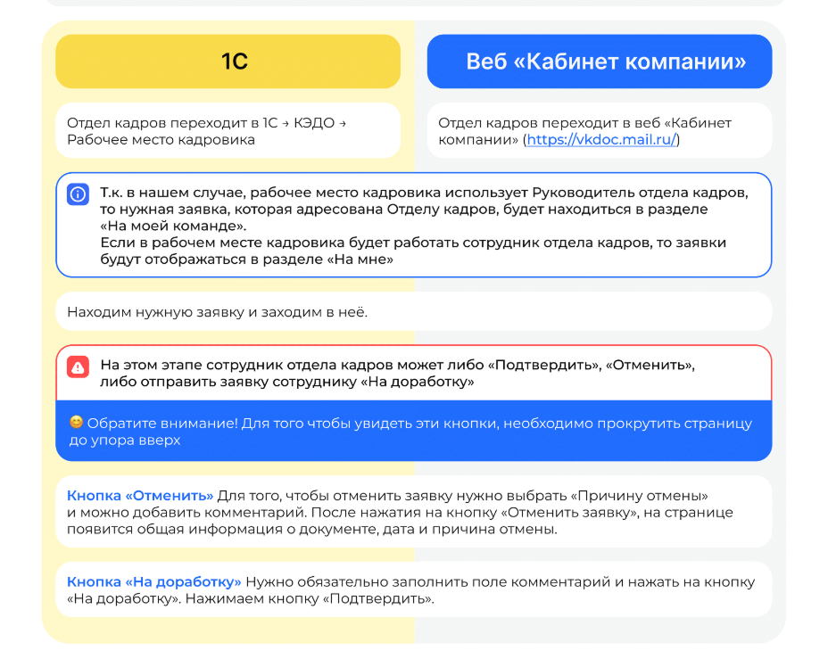
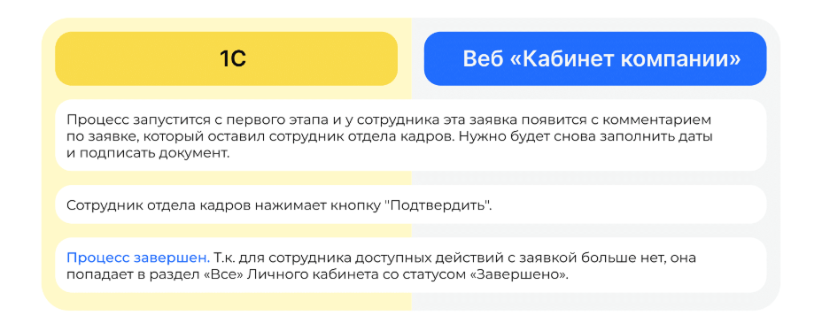

# Процесс «Заявление на отзыв заявления об увольнении»

## Старт процесса

Чтобы подать заявление об отзыве заявления об увольнении:
1. Сотрудник переходит в Личный кабинет веб-сервиса → раздел **Заявки**.
2. Нажимает кнопку **Создать заявку**.
3. Выбирает **Заявление об отзыве заявления об увольнении**.
4. Нажимает **Создать**.

## Этап 1. Формирование Сотрудником заявления

1. Выбирает дату подачи заявления об увольнении и нажимает **Перейти к просмотру**.
2. Ознакомляется со сформированным заявлением (данные о сотруднике заполняются автоматически). Если всё верно, нажимает кнопку **Продолжить**.
3. На этом этапе сотрудник может **Отменить заявку**.

Шаблон заявления
 

## Этап 2. Подписание заявления Сотрудником

1. Нажимает кнопку **Подписать**.
2. Проверяет документ и нажимает **Подписать**. Чтобы подтвердить подписание документа, на телефон поступает СМС-сообщение, код из которого Сотрудник вводит в открывшемся окне и нажимает кнопку **Подписать**.

## Этап 3. Согласование заявления Руководителем

Если по какой-то причине у  сотрудника нет руководителя, то процесс переходит сразу на следующий этап **Проверка заявления Отделом кадров**.

1. Руководитель переходит в **Сервисы компании** веб-сервиса VK HR Tek, в раздел **Заявки**.
2. Открывает нужную заявку.
3. На данном этапе Руководитель может либо **Подтвердить**, либо **Отменить заявку**.
4. В случае отмены заявки процесс стартует с первого этапа формирования заявления сотрудником.

## Этап 4. Проверка заявки сотрудниками Отдела кадров

Отдел кадров может работать с заявкой и в **1С**, и в **Сервисах компании** веб-сервиса.

